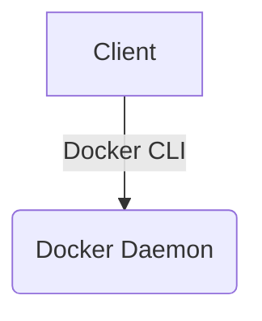

# Handism's Tech Blog

## このブログについて

- **15種類の多彩なデザインテーマ**: デフォルトの個性的な **Neo-Brutalism（ネオ・ブルータリズム）** に加え、Glassmorphism, Minimal, Bento, Blueprint, Steampunk, Chalkboard, Editorial, Synthwave, Terminal, Modern Japanese, Nordic, Claymorphism, Dashboard, 3D Interactive といった幅広いスタイル（全15種）にリアルタイムで切り替え可能
- **豊富なスキンカラー**: Emerald、Ocean、Sunset、Purple、Rose のアクセントカラーとダークモードを組み合わせ、自分好みの外観にカスタマイズできます
- 見出しフォントに **Lexend** および **Space Grotesk** を採用した、テックブログらしい力強いタイポグラフィ
- 触っていて気持ちいい **ダイナミックなアクション**: テーマごとの世界観に合わせて、ホバーやクリック時のインタラクションが最適化されています
- SSG（静的サイト生成）に対応しているので軽快に動作するはず
- サムネイル画像にも対応。比率は 16:9 がおすすめ
- サイドバーありの 2 カラムレイアウトで、レスポンシブレイアウトに対応
- 記事のデータソースは `Markdown ファイル` に対応
- ヘッダーの Tools メニューから利用できるブラウザ完結型の便利ツール（Toolkit形式で全60機能に整理）を内蔵
  - **🎨 画像 ＆ グラフィック (3種・全10機能)**: Image Studio (WebP変換・トリミング・favicon), SVG Toolkit (プレビュー・波形生成・CSS変換・ダミー画像), UI & Graphic Generator (Neo-Brutalism・メンフィス背景・ドット絵)
  - **🔄 データ変換 ＆ テキスト (4種・全18機能)**: Data & JSON Toolkit (JSON/YAML/CSV/SQL変換・整形), Crypto & ID Generator (Base64・ハッシュ・JWT・UUID・パスワード), Text Studio (ケース変換・文字カウント・不可視文字検出・Lorem Ipsum・Diff), Color Utilities (コード変換・コントラスト)
  - **🛠️ 開発者向けツール (12種・全30機能)**: Code Helper (正規表現・Curl・HTML to JSX), Developer Calculator (電卓・進数変換・アスペクト比), CSS & Layout Toolkit (CSS/Flexbox/Gridシミュレーター), AWS Architecture Diagram Generator, Git Utilities, Web & Network Utilities, Time & Schedule Utilities, Markup & Markdown Editor, URL & Web Utilities, QR Code Generator, Keyboard Event Visualizer, Pomodoro Focus Timer
  - **🧖 外部ツール**: Sauna Itta, Sauna Simulator (2種)
- About・プライバシーポリシー・HTML Sitemap・RSS フィードページを提供
- **Scraps**（`/scraps`）：Twitter/Mastodon 感覚で日々の気づきやエラー解決ログを短く残せる技術メモ欄。独立したネオ・ブルータリズム風のカード形式で表示されます。`scraps/` ディレクトリに Markdown を置くだけで公開される
- **学習ガイド**（`/learning`）：Docker、GitHub、Webセキュリティ、API設計、Linux & Bash、ネットワークの基本、CI/CDパイプライン、システムデザイン、Gitアドバンスド、AWSクラウド、フロントエンドテスト、モダンCSS、データベース、Next.js、パフォーマンス、React Hooks、TypeScript などの各種仕組みを順序立てて（タイムライン状のロードマップ形式で）学べる体系的な学習コンテンツ。Mermaid.jsによる動的な図解ダイアグラム表示に対応しているほか、LocalStorageを利用した読了進捗管理（進捗率・完了チェック）や、各チャプターの末尾で挑戦できるインタラクティブな「理解度クイズ」機能を搭載しています。
- **AWS Patterns**（`/patterns`）：AWSのベストプラクティスに沿って設計された、13種類の実践的な CloudFormation テンプレート（IaC）とアーキテクチャ図（Draw.io）のギャラリーカタログ。ShikiによるYAMLコードプレビュー・コピー・ダウンロードや、SVG構成図を画面いっぱいに拡大表示するインタラクティブなライトボックス、デプロブ用CLIコマンド生成機能を備えています。


## 技術スタック

- **フロントエンド**：Next.js 16 + React 19
- **言語**：TypeScript
- **スタイリング**：Tailwind CSS 4
- **マークダウン処理**：Remark + rehype（HTML 変換・見出し自動リンク・スラッグ生成・TOC 生成・Mermaidダイアグラムパース）
- **図解・ダイアグラム描画**：Mermaid.js（クライアント側での動的SVGレンダリングに対応）
- **シンタックスハイライト**：Shiki（github-dark テーマ）
- **テーマ切り替え**：next-themes（ダークモード・16種類のテーマ切り替え対応）
- **検索機能**：kuromoji（日本語形態素解析） + Fuse.js（クライアント側全文検索）
- **バリデーション**：Zod（frontmatter）
- **ホスティング**：GitHub Pages
- **デプロイ**：GitHub Actions（`main` ブランチへのプッシュで自動デプロイ）
- **ユニットテスト**：Vitest

## 使い方

### 導入

- 本リポジトリをクローンすればすぐに導入可能
- ホスティングについては、必要に応じて `GitHub Pages` などの設定を行ってください
  - `GitHub Actions` による自動デプロイには `.github/workflows/static.yml` を使用できます

### 開発方法

ローカルで動作確認する場合は以下コマンドで。終了するなら Ctrl + C。

```bash
bun run dev
```

### ビルド

本番ビルドを実行する場合は以下。

```bash
bun run build
bun run start
```

SSG 出力は `out` ディレクトリに生成されます。

### バンドルサイズ分析

```bash
bun run analyze
```

ブラウザでクライアント・サーバー・エッジのバンドルサイズを可視化するレポートが生成されます。

### テスト

ユニットテスト（Vitest）：

```bash
bun run test:unit
```

テストファイルは `tests/` ディレクトリ以下に配置します。

- `*.test.ts` → Vitest ユニットテスト

### 開発フローと品質保証 (Git Hooks)

コミット時に自動でコード品質をチェックし、CIの破損を未然に防ぐ仕組みとして `simple-git-hooks` と `lint-staged` を導入しています。

* **自動チェックの挙動**:
  * コミット時にステージングされた `.ts`, `.tsx`, `.js`, `.jsx` ファイルに対して自動的に `eslint --fix` (コードスタイルの修正・Prettierによるフォーマット含む) が実行されます。
  * プロジェクト全体に対して `bun run type-check` (`tsc --noEmit`) が実行され、型エラーがある場合はコミットがブロックされます。
* **フックの設定**:
  * `bun install` 時に自動的にフックが Git にインストールされます。
  * 手動で再度フックを設定・更新したい場合は以下のコマンドを実行します：
    ```bash
    bunx simple-git-hooks
    ```

### コンテンツの追加

#### ブログ記事

ブログ記事は `md` ディレクトリに Markdown ファイルとして配置します。
ファイル名の命名規則：`kebab-case.md`

#### Scraps（技術メモ）

日々の気づきやエラー解決ログなど短いメモは `scraps` ディレクトリに Markdown ファイルとして配置します。
ファイル名の命名規則：`kebab-case.md`

#### 学習ガイド

学習コンテンツは `learning` ディレクトリに、コースごとのディレクトリを切って配置します。
各フォルダ内に設定ファイルである `meta.json` と、順序付けされたMarkdownファイルを配置します。
```text
learning/
  └── [course-id]/
        ├── meta.json        # コース設定
        ├── 01-chapter.md    # 第1章
        └── 02-chapter.md    # 第2章
```
ファイル名自体は任意ですが、Frontmatterでソート順を設定します。

#### AWS Patterns（アーキテクチャテンプレート）

AWSのアーキテクチャパターンおよびテンプレートは `patterns` ディレクトリ内で管理します。
1. `patterns/gallery-meta.json` に新しいパターンの設定オブジェクトを追加します。
2. `patterns/iac/` ディレクトリ配下に CloudFormation テンプレート（`.yaml`）を配置します。
3. `patterns/img/` ディレクトリ配下にアーキテクチャ図の画像（`.drawio.svg`。図解画像がない場合は JSON 上で `diagramFile: null` に設定）を配置します。

ビルド時または開発サーバー起動時に、これらのファイルは自動的に `public/patterns/` 配下へ複製・同期されます。

### デプロイメント

`main` ブランチへのプッシュにより、GitHub Actions ワークフローが自動実行され、`out` ディレクトリが GitHub Pages へデプロイされます。

### サイト設定

`src/config/` 配下に関心事ごとに設定ファイルを分割しています。

- `site.ts`: サイト名・URL・著者名・ページネーションなどのサイト全体設定。サイトごとに必要な項目を変更してください
- `themes.ts`: `themeConfig` 配列でデザインテーマ一覧を管理し、`DEFAULT_THEME` でデフォルトテーマを指定します
- `layout.ts`: `layoutConfig` 配列で記事一覧のレイアウト（列数）を管理します
- `tools.ts`: `toolsMenuItems` 配列でヘッダー・`/tools` で表示するツールメニュー項目を管理します

### CSS 設定

- グローバルの CSS は `app/globals.css` にまとめています
- `:focus-visible` スタイルはアクセント色で定義済みです
- テーマは `data-theme` 属性で切り替え、対応するCSS変数がオーバーライドされる仕組みです

### 記事ページ設定

- md ファイルは `md` ディレクトリ内に入れてください
- `md/template` 内に md ファイルのテンプレートが格納されているので、コピーして使用してください
- 下書きは Frontmatter に `draft: true` を設定することで管理できます（後述）。開発環境では表示され、本番環境では自動的に除外されます。
- また、`md/draft` などのサブディレクトリ内に配置した md ファイルもサイトには反映されません。
- 画像は `public/images` ディレクトリ内に入れてください
  - サムネイル画像はアスペクト比 `16:9` がおすすめ

### ブログ記事 Frontmatter

各フィールドは Zod によりバリデーションされます。省略・不正な値はデフォルト値にフォールバックします。

```yaml
---
title: 記事タイトル # 省略時: "No title"
date: YYYY-MM-DD # 省略可
tags: [tag1, tag2] # 省略時: []
category: カテゴリ名 # 省略時: "uncategorized"
image: filename.webp # public/images/ 以下のファイル名（省略可）
draft: true # true の場合、本番ビルド時に除外される（省略可）
---
```

H1 タグは記事タイトルになるので、見出しは H2 から始めてください。

### Scraps Frontmatter

ブログ記事より軽量な構成です。`category` と `image` は不要です。

```yaml
---
title: メモのタイトル # 省略時: "No title"
date: YYYY-MM-DD # 省略可
tags: [tag1, tag2] # 省略時: []
draft: true # true の場合、本番ビルド時に除外される（省略可）
---
```

### 学習ガイド Frontmatter

各コースフォルダ内に `meta.json` を配置してコース全体を設定します：

```json
{
  "title": "コースのタイトル",
  "description": "コースの説明文",
  "emoji": "🐳"
}
```

各チャプター（Markdown）の Frontmatter：

```yaml
---
title: チャプタータイトル # 省略時: "No title"
date: YYYY-MM-DD # 省略可
order: 1 # コース内での並び順 (必須・数値)
draft: true # true の場合、本番ビルド時に除外される（省略可）
quiz: # 確認クイズ (省略可)
  question: "質問文"
  options:
    - "選択肢1"
    - "選択肢2"
  correctIndex: 0
  explanation: "解説文"
---
```


### AWS Patterns メタデータフォーマット (gallery-meta.json)

`patterns/gallery-meta.json` は全パターンの情報をオブジェクト配列として一括管理します。各オブジェクトのフォーマットは以下の通りです：

```json
[
  {
    "slug": "container-orchestration",
    "title": "Amazon ECS コンテナオーケストレーション",
    "description": "Amazon ECS/Fargateを使用した、安全でスケーラブルなコンテナデプロイ環境のテンプレートです。",
    "category": "Containers",
    "templateFile": "container-orchestration.yaml",
    "diagramFile": "container-orchestration.drawio.svg",
    "awsServices": ["ECS", "Fargate", "VPC", "ALB"]
  }
]
```


### Markdown

- **見出し**：`##`、`###`、`####`
- **改行**：`半角スペース 2 つ`
- **段落**：`空行`
- **箇条書き**：`*`、`-`
- **画像表示**：``
- **リンク**：`[リンク文言](https://github.com/handism/)`
- **強調**：`**強調**`
- **区切り線**：`***`、`---`
- **コード**：`` `コード` ``
- **コードブロック**：

````
```言語名
コードブロック
```
````

ファイル名を表示したい場合は言語名の後に `:ファイル名` を付加：

````
```ts:utils.ts
export function example() { }
```
````

- **引用**：

```
> 引用テキスト
```

- **表**：

```
| ヘッダー1 | ヘッダー2 |
| --------- | --------- |
| セル1     | セル2     |
```

- **Mermaidダイアグラム (図解)**：

````

````


## SEO・アクセシビリティ

- OGP / Twitter Card をサイト全体・記事ページ・カテゴリページ・タグページで設定
- 記事ページに JSON-LD（`BlogPosting` スキーマ）を埋め込み
- Sitemap に記事・カテゴリ・タグページと `lastmod` を出力
- RSS フィードに本文要約（先頭 200 文字）を `<description>` として出力
- 検索結果でタイトル・本文スニペットに加え、マッチしたタグ・カテゴリもハイライト表示
- キーボードナビゲーション対応（ドロップダウンメニュー・フォーカスリング）
- `ThemeToggle` に `aria-label` を設定
- `kuromoji` による日本語形態素解析により、日本語の文脈に沿った柔軟かつ高精度な検索ヒットを実現
- SSG（静的サイト生成）環境でありながら、ビルド時に全記事のOGP画像を自動で静的画像ファイル（PNG）として事前生成し、適切なOGPタグを付与
