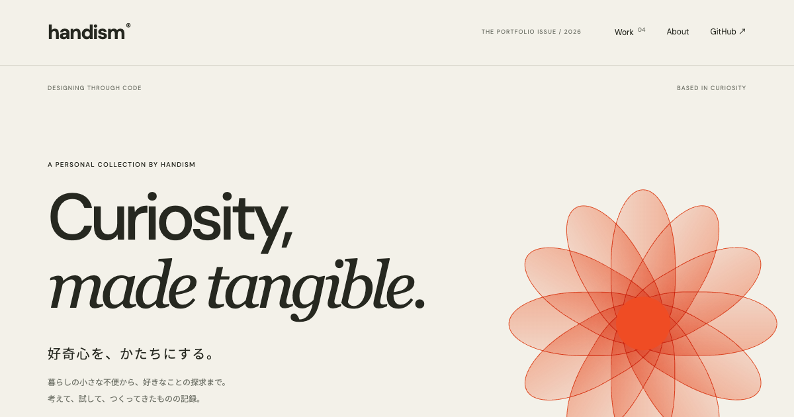

# handism.github.io

handism のポートフォリオサイトです。公開中のリポジトリを紹介しています。

**https://handism.github.io/**



## 特徴

- 作品一覧のカテゴリー絞り込み、詳細ダイアログ、公開デモ・リリースへのリンク
- 使用技術と、それを使ったプロジェクトの対応表示
- スクロール表示やCSSアニメーション。右下のボタンで停止・再開でき、端末のモーション低減設定にも従います
- キーボード操作に対応（Escapeでダイアログを閉じ、開いたボタンへフォーカスを戻します）
- PCからスマートフォン幅までのレスポンシブレイアウト

作品ビジュアルはCSSで描いたイラストで、実際のアプリのスクリーンショットではありません。

## デザイン案

トップページは「The Edit」案を採用しています。検討時の3案も残してあります（検索エンジンからは除外）。

| URL | 内容 |
| --- | --- |
| [`/`](https://handism.github.io/) | 採用版 |
| [`/concepts/`](https://handism.github.io/concepts/) | 3案の比較 |
| [`/lab/`](https://handism.github.io/lab/) | A / Midnight Lab：ダークにライム、動く軌道とカード型の一覧 |
| [`/editorial/`](https://handism.github.io/editorial/) | B / The Edit：紙色の背景と大きなタイポグラフィ |
| [`/gallery/`](https://handism.github.io/gallery/) | C / Elsewhere：紫の光と動くポータル |

## 技術スタック

- [Astro](https://astro.build/)（静的サイト生成）、TypeScript
- [Playwright](https://playwright.dev/)（ブラウザテスト）、Prettier
- GitHub Actions → GitHub Pages

## ローカルで動かす

Node.js 22.12 以上が必要です。

```sh
npm ci
npm run dev        # http://127.0.0.1:4321/
```

| コマンド | 内容 |
| --- | --- |
| `npm run build` | `dist/` に静的サイトを生成 |
| `npm run preview` | ビルド結果をプレビュー |
| `npm run check` | 型チェック |
| `npm run test:browser` | Playwright によるブラウザテスト |
| `npm run format` / `format:check` | Prettier による整形 / 整形チェック |

`main` への push で GitHub Actions が整形・型チェック、ビルド、ブラウザテストを実行し、成功したら GitHub Pages へデプロイします。
