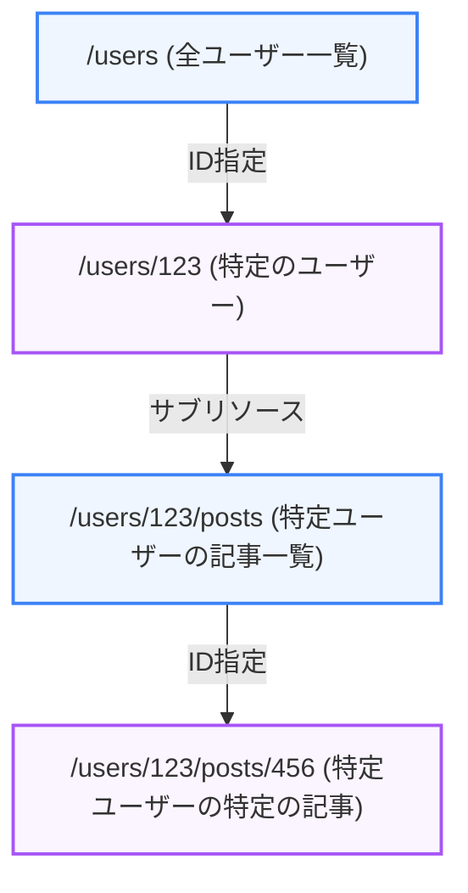

モダンWebシステムにおいて、システム間でデータを受け渡しするための「API」の設計は極めて重要です。本章では、最も広く採用されている **REST（Representational State Transfer）** の考え方と、直感的で使いやすいエンドポイント（URI）の設計手法について解説します。

---

## 1. RESTの基本概念

RESTは、Webの仕組みを最大限に活用するために提唱されたソフトウェアアーキテクチャスタイルです。RESTの原則に則って設計されたAPIを **RESTful API** と呼びます。

### RESTの主要な4原則

1.  **アドレス可能性 (Addressability)**:
    すべての提供される情報（リソース）が、一意のURI（Uniform Resource Identifier）で表現されること。
2.  **統一インターフェース (Uniform Interface)**:
    情報の取得、作成、更新、削除を、HTTPで定義された標準メソッド（GET, POST, PUT, DELETEなど）の組み合わせで行うこと。
3.  **接続性 (Connectability)**:
    返されるリソースの中に、他のリソースへのリンクを含めることができること（HATEOASという概念）。
4.  **ステートレス性 (Stateless)**:
    サーバー側でクライアントのセッション状態（ログイン状態など）を管理せず、各リクエストは独立して処理されること。

---

## 2. リソース指向のエンドポイント設計

RESTful APIでは、エンドポイントのパスを「実行する処理（動詞）」ではなく、**「操作対象のデータ（名詞）」** で表現するのが大原則です。

### リソース表現の構造（図解）

ユーザーがブログ記事を操作するシステムを例に、リソースの親子関係とURIの設計を整理します。

### 良い設計と悪い設計の比較

| 操作内容 | 悪い設計（処理ベース） | 良い設計（リソースベース） |
| :--- | :--- | :--- |
| **ユーザー一覧の取得** | `GET /getAllUsers` | `GET /users` |
| **新規ユーザーの作成** | `POST /createUser` | `POST /users` |
| **特定のユーザー取得** | `GET /getUser?id=123` | `GET /users/123` |
| **ユーザー情報の更新** | `POST /updateUser/123` | `PUT` または `PATCH /users/123` |
| **ユーザーの削除** | `GET /deleteUser?id=123` | `DELETE /users/123` |

### 設計上の重要なルール

*   **リソース名は複数形を使う**: `/user` ではなく `/users` と表現することで、コレクション（集合）であることを明示します。
*   **小文字を使用し、ハイフンで繋ぐ**: URIは大文字小文字を区別する場合があるため、すべて小文字で統一します。単語の区切りにはアンダースコア（`_`）ではなく、ハイフン（`-`）を使用します。
    - `◯`: `/user-profiles`
    - `×`: `/user_profiles` や `/userProfiles`
*   **階層構造はサブリソースで表現する**: `/users/123/orders` のように、親子関係があるリソースは親リソースの下にネストさせます。ただし、ネストの階層は2〜3階層までに留め、深くなりすぎないようにします。

---

## まとめ

*   RESTful APIは、**リソース（名詞）** をURIで示し、**HTTPメソッド（動詞）** で操作する。
*   URIは小文字で統一し、複数形を使用し、動詞を排除してシンプルに保つ。
