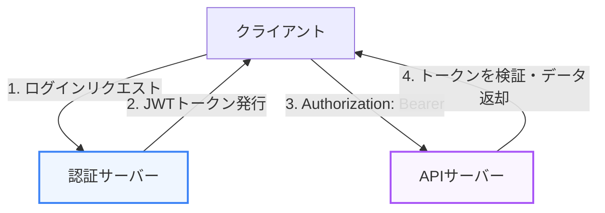

APIを一般に公開し、長期間運用するにあたっては、破壊的変更からクライアントを守る「バージョン管理」と、不正アクセスを防ぐ「セキュリティ対策」の設計が欠かせません。本章では、これらの設計パターンについて解説します。

---

## 1. APIのバージョン管理

APIのデータ構造や仕様を変更する際、既存のクライアントが動作しなくなる「破壊的変更」が発生する場合があります。これを避けるため、複数のバージョンを並行して稼働させる仕組みが必要です。

### 3つのバージョン管理手法

#### 1. パス型 (URI Path Versioning) — 推奨
最も一般的で分かりやすい手法です。URIの先頭付近に `/v1` などの識別子を埋め込みます。

```http:path-example
GET https://api.example.com/v1/users
```

*   **メリット**: ルーティングやプロキシでのキャッシュが非常に容易。
*   **デメリット**: バージョンが変わるたびにベースURIが変更になる。

#### 2. クエリパラメータ型 (Query Parameter Versioning)
リクエストのパラメータとしてバージョンを渡します。

```http:query-example
GET https://api.example.com/users?version=1
```

*   **メリット**: URIのパス自体は変わらない。
*   **デメリット**: キャッシュの制御やルーティングがやや複雑になる場合がある。

#### 3. メディアタイプ型 / ヘッダー型 (Accept Header Versioning)
`Accept` ヘッダー（あるいはカスタムヘッダー）を使って、要求するバージョンを伝えます。

```http:header-example
GET /users
Accept: application/vnd.example.v1+json
```

*   **メリット**: クリーンなURI（同一リソースを表す単一のURI）を維持できる。
*   **デメリット**: ブラウザから直接テストしにくく、プロキシキャッシュが難しい。

---

## 2. APIセキュリティの基本

認証されていないクライアントからのアクセスを防ぎ、誰がリクエストを送信しているのかを特定するための仕組みです。



### 代表的な認証・認可方式

1.  **APIキー (API Key)**:
    サービス登録時に各クライアントに発行される静的な文字列です。主に一般公開されているデータの取得（天気情報、地図情報など）で使われ、ヘッダー（`X-API-Key` など）に入れて送信します。
2.  **トークン認証 (JWT - JSON Web Token)**:
    ユーザーがID/パスワードでログインした後、サーバーが署名付きの暗号化トークン（JWT）を発行します。クライアントはこれ以降のリクエストヘッダーに以下のように含めます。
    ```http:auth-header
    Authorization: Bearer <JWT_TOKEN>
    ```
    サーバー側はセッションデータベースに問い合わせることなく、トークンの署名を検証するだけでユーザーを識別できるため、スケーラビリティに優れています。
3.  **OAuth 2.0 / OIDC (OpenID Connect)**:
    サードパーティアプリに対して、ユーザーのパスワードを開示することなくアクセス権限を与える（認可）ための業界標準プロトコルです。

---

## 3. その他の重要なセキュリティ対策

*   **レート制限 (Rate Limiting)**:
    DoS攻撃やAPIの過剰な呼び出しを防ぐため、IPアドレスやトークン単位で「1分あたり100回まで」といった制限を設けます。制限を超えた場合は **`429 Too Many Requests`** を返します。
*   **入力の厳格なバリデーション**:
    SQLインジェクションやOSコマンドインジェクションなどを防ぐため、すべてのリクエストボディやクエリパラメータをサーバー側で厳格に検証します。

---

## まとめ

*   APIの破壊的変更を防ぐため、**パス型 (URIパスに `/v1/` を含む方式)** によるバージョン管理を優先する。
*   セッション管理がないステートレスなAPIでは、**JWTを用いた Bearer 認証** が広く使われる。
*   過度な負荷や攻撃を防ぐため、**レート制限 (429 Too Many Requests)** を導入する。
