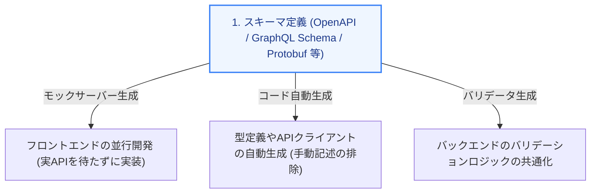

本コースの前半では、従来のデファクトスタンダードである **REST API** の設計方法について学びました。しかし、Webアプリケーションの規模が拡大し、多様なデバイスや複雑なデータ連携が必要となるにつれ、REST API だけでは対応しきれない課題も浮き彫りになってきました。

第4章では、REST の課題を克服するために登場した **GraphQL、gRPC、tRPC** という現代的なAPIプロトコルの概要と、開発効率を最大化する **「スキーマ駆動開発」** の重要性について解説します。

---

## 1. REST API の限界と新たな課題

REST API はシンプルで使いやすい反面、以下のような課題を抱えています。

*   **オーバーフェッチ (Over-fetching)**: 画面の表示に「ユーザー名」だけが必要なのに、APIを叩くと「住所」「履歴」など大量の不要なデータが返ってくる。
*   **アンダーフェッチ (Under-fetching)**: 1つの画面を表示するために、「ユーザー情報」「注文一覧」「おすすめ商品」のように、何回も個別のAPIリクエストを送信しなければならない。
*   **型安全性の不足**: APIの仕様変更（パラメータの変更や削除）が、フロントエンドに静的に伝わらず、ランタイムエラー（画面崩れやバグ）になって初めて気づくことが多い。

---

## 2. 現代のAPIプロトコル三銃士

これらの課題を解決するため、ユースケースに応じて以下のプロトコルが使い分けられます。

### ① GraphQL (グラフQL)
*   **特徴**: クライアントが「必要なデータの構造」をクエリ言語で指定してリクエストする仕様。
*   **メリット**: オーバーフェッチ/アンダーフェッチを完全に解消。1つのエンドポイントで柔軟なデータ取得が可能。
*   **適した用途**: 画面ごとに必要なデータ構造が細かく変わる複雑なフロントエンドアプリ（SNSやダッシュボード）。

### ② gRPC (ジーアールピーシー)
*   **特徴**: Googleが開発した高性能なRPC（遠隔手続き呼び出し）フレームワーク。通信にはJSONの代わりにバイナリ形式の **Protocol Buffers** を使用します。
*   **メリット**: 高速・低遅延、かつ軽量。双方向ストリーミング通信が容易。
*   **適した用途**: マイクロサービス同士の通信や、高頻度で軽量なデータ通信が求められるバックエンド間の連携。

### ③ tRPC (ティーアールピーシー)
*   **特徴**: TypeScript 専用の RPC ライブラリ。バックエンドのルーター型定義を、フロントエンドへ直接インポートして使用します。
*   **メリット**: スキーマファイルの記述やコード生成（Code Generation）を一切行うことなく、完全なフロント・バック間の型安全性を実現。
*   **適した用途**: フロントエンドとバックエンドが同じ TypeScript で開発されているモノレポ（Next.jsなどのフルスタック環境含む）プロジェクト。

### APIプロトコル比較マトリクス

| 項目 | REST API | GraphQL | gRPC | tRPC |
| :--- | :--- | :--- | :--- | :--- |
| **通信フォーマット** | 主に JSON | JSON | **Protocol Buffers (バイナリ)** | JSON |
| **スキーマ定義** | 任意 (OpenAPI 等) | **必須 (GraphQL Schema)** | **必須 (proto ファイル)** | **TypeScriptの型定義 (自動)** |
| **主なメリット** | 標準的、キャッシュしやすい | 必要なデータだけを取得可能 | 高速・高パフォーマンス | スキーマなしで型安全 |
| **主なデメリット** | 通信回数やデータ量が増えやすい | クエリ解析のオーバーヘッド | ブラウザからの直接接続が不便 | TypeScript (JS) 依存 |

---

## 3. スキーマ駆動（スキーマファースト）開発

どのようなAPIプロトコルを採用するにせよ、現代の開発現場では **「スキーマ駆動開発（Schema-driven Development）」** が強力に推奨されています。

これは、プログラムコードを書く前に、まず **APIの仕様書（スキーマファイル）を決定し、それを正（Single Source of Truth）としてフロントエンドとバックエンドが並行して開発を進める手法** です。

### スキーマ駆動開発がもたらすメリット
1.  **パラレル開発の実現**: スキーマが決まれば、フロントエンドはモックデータ（ダミーのAPI応答）を使って、バックエンドの実装完了を待たずに画面開発を進められます。
2.  **型定義の自動生成**: `swagger-typescript-api` や `graphql-codegen` などのツールを用いることで、スキーマからTypeScriptの型やAPIクライアントコードを自動生成できます。これにより、手動での書き写しミスが完全にゼロになります。
3.  **仕様のドキュメント化**: スキーマ定義そのものが常に最新のAPI仕様書（Swagger UIなど）としてレンダリングされるため、ドキュメントの更新漏れが発生しません。

---

## まとめ

*   **REST API** はオーバーフェッチ/アンダーフェッチや型安全性の担保に課題がある。
*   **GraphQL** はクライアントが取得項目を制御し、**gRPC** は高速バイナリ通信、**tRPC** は TypeScript モノレポに最適。
*   **スキーマ駆動開発** は、APIの設計図（スキーマ）を開発の起点とすることで、並行開発の加速、型の自動生成、仕様の乖離防止を実現する現代の開発パラダイム。
