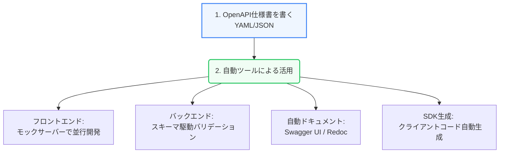
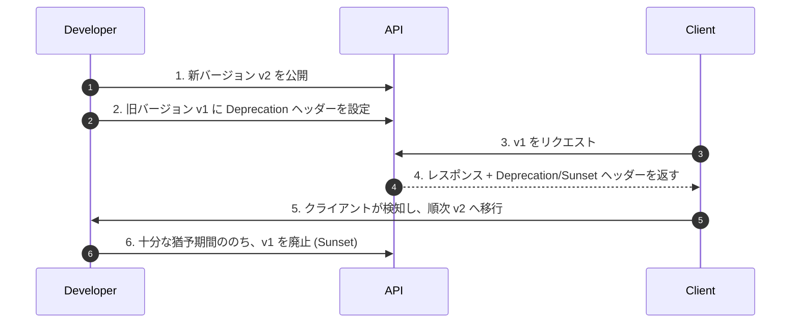

Web APIは作成して終わりではありません。多くの開発者やシステムに利用されるAPIは、正確な「ドキュメンテーション」と、変更に対するルールである「ガバナンス」が不可欠です。

第5章では、OpenAPIを用いた現代的なドキュメント管理手法と、APIを安全に変更・維持するためのガバナンス設計について解説します。

---

## 1. スキーマファースト開発とOpenAPI

現代のAPI開発では、コードを書く前にAPIの仕様を記述する **「スキーマファースト開発（Schema-first Development）」** が主流です。この中心的な標準規格が **OpenAPI Specification (OAS)**（旧Swagger）です。

### スキーマファーストの利点

1. **並行開発の実現**: バックエンドの実装完了を待たずに、定義されたスキーマからモックサーバー（Prism等）を立ち上げてフロントエンドが開発を進められます。
2. **仕様の齟齬の削減**: 仕様が明文化されるため、結合テスト時のパラメータ名の違いなどのイライラが解消されます。
3. **ドキュメントの自動化**: 定義ファイル（YAML/JSON）からインタラクティブなAPIドキュメント（Swagger UIやRedoc）を常に最新の状態で配信できます。

---

## 2. APIのバージョニング管理

APIをアップデートする際、既存のクライアントを壊さないためにバージョニングが必要です。主に以下の3つの手法があります。

| バージョニング手法 | 指定方法の例 | メリット | デメリット |
| :--- | :--- | :--- | :--- |
| **パス（URI）** | `https://api.example.com/v1/users` | 最も直感的でキャッシュしやすい | バージョンごとにURLが変わり、移行コストが高い |
| **クエリパラメータ** | `https://api.example.com/users?version=1` | シンプルに実装できる | ルーティングやキャッシュ管理が複雑になる |
| **カスタムヘッダー** | `Accept: application/vnd.company.v1+json` | URLが常に一定に保たれる | ブラウザでの動作確認やキャッシュが難しくなる |

### セマンティックバージョニングの適用

一般的に、APIのバージョン表現には **セマンティックバージョニング（SemVer）**（例: `vMajor.Minor.Patch`）が参考にされます。

* **Major (破壊的変更)**: 後方互換性のないAPIの変更（エンドポイントの削除、必須パラメータの追加など）。URLの `/v1/` を `/v2/` に変更する。
* **Minor (機能追加)**: 後方互換性がある機能の追加（任意パラメータの追加、新しいエンドポイントの追加）。
* **Patch (バグ修正)**: 後方互換性があるバグ修正（ドキュメントの修正、内部ロジックの改善）。

---

## 3. 後方互換性と非推奨化（Deprecation）

APIをアップグレードする際、古いバージョンを即座に停止することはできません。以下の手順を踏んで安全に移行（ディプリケーション）を進めます。

### 安全な廃止フロー

1. **`Deprecation` ヘッダー**: レスポンスヘッダーに `Deprecation: true` や、廃止予定日を示す `Sunset` ヘッダーを含めることで、クライアントの開発者へ移行を促します。
2. **ドキュメントの更新**: APIドキュメント上に `deprecated` フラグを立て、非推奨であることを視覚的に明示します。

APIドキュメントと適切なバージョニングルールを整備することで、開発者にとって信頼性が高く、長く持続可能なAPIを提供できるようになります。
