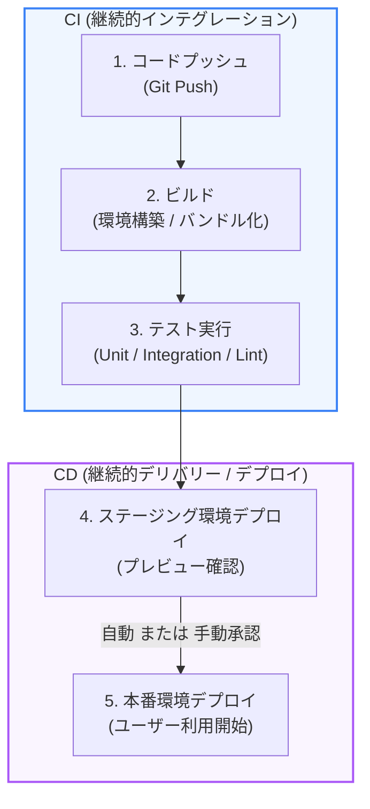

ソフトウェア開発において、コードの変更を安全かつ迅速にユーザーへ届けるための仕組みが **CI/CD（継続的インテグレーション／継続的デリバリー・デプロイ）** です。本章では、CI/CDの基本概念と、それらが開発にもたらす価値について解説します。

---

## 1. CI/CD とは何か？

CI/CD は、コード変更からテスト、本番環境への配置（デプロイ）に至るプロセスを自動化し、リリース頻度と品質を向上させるためのプラクティスです。

### 1. 継続的インテグレーション (CI: Continuous Integration)
開発者がコードを変更（コミット・プッシュ）するたびに、自動的に **ビルド** と **テスト** を実行する仕組みです。
*   **目的**: 複数の開発者が書いたコードを常に統合し、早期にバグを発見して修正すること。

### 2. 継続的デリバリー (CD: Continuous Delivery)
CIによって検証されたコードを、本番環境にリリース可能な状態に保つプロセスです。ステージング環境や本番環境へのビルド生成物を自動で用意しますが、本番デプロイの実行自体は **人間の手（承認ボタンなど）** で行われます。

### 3. 継続的デプロイ (CD: Continuous Deployment)
継続的デリバリーをさらに進め、テストを通過した変更を、人間の介入なしで **自動的に本番環境へデプロイ** する仕組みです。

---

## 2. CI/CD パイプラインの流れ（図解）

一般的なCI/CDパイプラインは、開発者がコードをリポジトリにプッシュしたことをトリガーに、以下のようなフェーズを自動的に駆け抜けます。

---

## 3. CI/CD 導入のメリット

*   **バグの早期発見**:
    手動テストに頼らず、コミットの度に自動テストが走るため、バグを混入させた本人がその場で気づいて修正できます。
*   **リリースの心理的障壁を下げる**:
    「デプロイ手順書」を見ながら手動でコマンドを打つ必要がなくなるため、リリースの作業ミス（オペレーションミス）がなくなり、安全に頻繁なアップデートが行えます。
*   **フィードバックサイクルの高速化**:
    新機能を素早く本番環境へ届けられるため、ユーザーからのフィードバックを迅速に得てプロダクト改善に活かすことができます。

---

## まとめ

*   **CI** はビルドとテストを自動化し、統合時のバグを早期発見する。
*   **CD** はリリースプロセスを自動化し、本番デプロイまでの手間とミスを削減する。
*   CI/CD を導入することで、リリース頻度が高まり、プロダクト開発のサイクルが高速化する。
