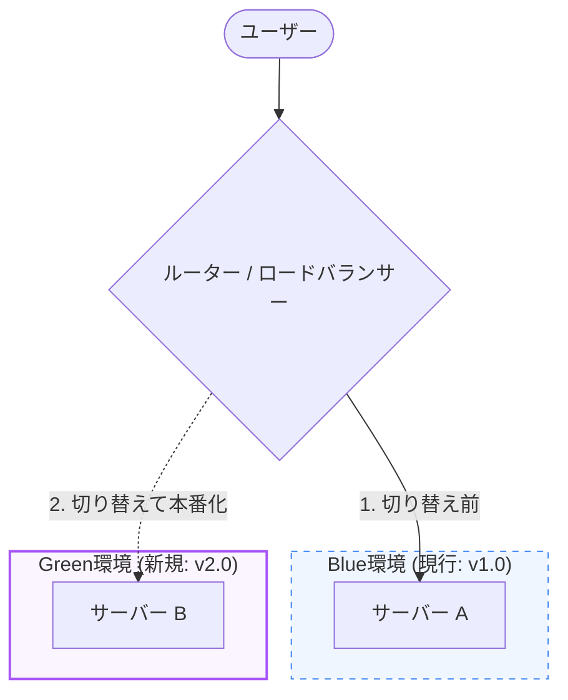
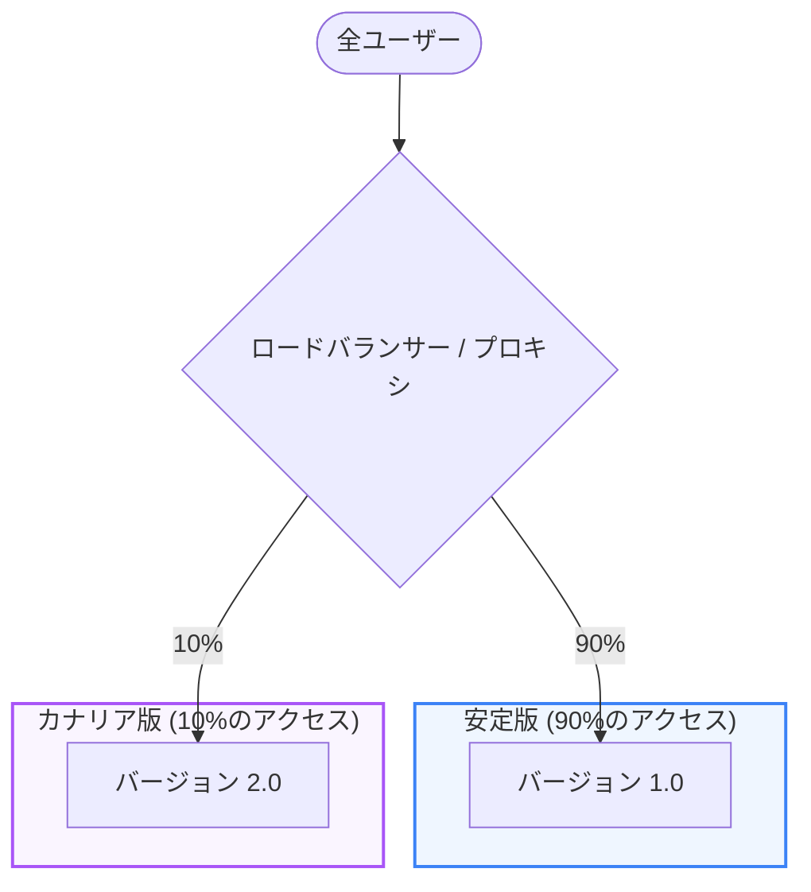

検証済みのアプリケーションを本番環境へ反映する「CD (継続的デリバリー・デプロイ)」において、システムの停止（ダウンタイム）を無くし、障害発生時に即座に切り戻し（ロールバック）ができるような安全な **デプロイ戦略** の設計が求められます。本章では、代表的なデプロイ戦略について学びます。

---

## 1. 代表的なデプロイ戦略

### 1. インプレースデプロイ (In-place Deployment)
稼働しているサーバー上のプログラムを直接上書きする手法です。
*   **特徴**: 最もシンプルで追加のインフラコストがかかりません。
*   **課題**: デプロイ中や再起動中にシステムが一時停止する（ダウンタイムが発生する）可能性が高く、切り戻しにも時間がかかります。

### 2. ローリングアップデート (Rolling Update)
複数のサーバー（インスタンス）がある環境において、1台ずつ順番に新しいバージョンに入れ替えていく手法です。
*   **特徴**: 常に一部のサーバーが稼働しているためダウンタイムが発生しません。
*   **課題**: デプロイ中、新旧バージョンが混在する状態が発生するため、データベースなどの後方互換性を保つ設計が必要です。

---

## 2. 高度で安全なデプロイ戦略（図解）

プロダクション環境で広く利用されている、より安全なデプロイ方式です。

### ブルーグリーンデプロイメント (Blue-Green Deployment)

現在稼働中の環境（Blue）とは別に、全く同じ構成の新しい環境（Green）を構築し、ロードバランサーなどのルーティング（DNS等）を一瞬で切り替えることでデプロイを完了させる手法です。

*   **メリット**:
    - ダウンタイムがゼロ。
    - Green環境で事前に十分テストしてから本番化できる。
    - 障害が発生した場合、ルーターを元のBlue環境に戻すだけで、瞬時にロールバック（切り戻し）ができる。
*   **デメリット**: 一時的にインフラコストが2倍かかる。

---

## 3. カナリアデプロイメント (Canary Deployment)

本番環境のサーバーの一部（例えば 10%）だけに新しいバージョンを適用し、一部のユーザーにだけ先行公開して様子を見る手法です。問題がなければ徐々に新バージョンの割合を増やし、最終的に100%に移行します。

*   **メリット**:
    - バグやパフォーマンスの問題があった場合の影響を、全ユーザーではなくごく一部（10%）に限定できる。
*   **デメリット**: ルーティング設定が複雑になる。

---

## デプロイ戦略の比較

| 戦略 | ダウンタイム | インフラコスト | ロールバック | 難易度 |
| :--- | :---: | :---: | :---: | :---: |
| **インプレース** | あり | 低 | 遅い | 容易 |
| **ローリング** | なし | 低 | 中速 | 中 |
| **ブルーグリーン** | なし | 高 | 瞬時 | 高 |
| **カナリア** | なし | 中〜高 | 瞬時 | 極めて高 |

---

## まとめ

*   **インプレースデプロイ** は簡単だがダウンタイムが発生する。
*   **ブルーグリーンデプロイ** は新旧の環境を丸ごと切り替えることで、ダウンタイムゼロと一瞬でのロールバックを実現する。
*   **カナリアデプロイ** は一部のユーザーに限定公開してエラー率などを監視し、段階的に適用範囲を広げていく。
