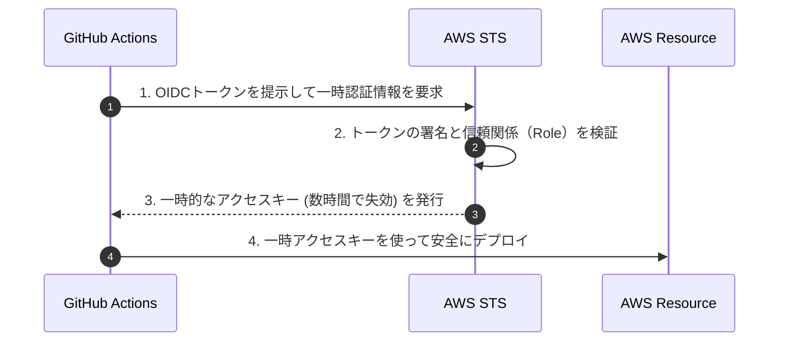

CI/CDパイプラインは非常に強力である一方、リポジトリや本番サーバーへのデプロイ権限を持つため、攻撃者にとって格好の標的になります。ビルドやデプロイを自動化するのと同様に、セキュリティの検証もパイプライン内で自動化する「DevSecOps」の実践が求められます。

第4章では、CI/CDで担保すべき主要なセキュリティ対策について学びます。

---

## 1. シークレット管理とOIDCの活用

データベースのパスワードやクラウドのAPIキーなどの機密情報（シークレット）を、決してコード内に直接記述（ハードコード）してはいけません。



### OIDC (OpenID Connect) 接続の推奨
従来はクラウドへの接続時、CIツールの環境変数（GitHub Secretsなど）に長期アクセストークンを保管していました。しかし、これらは漏洩のリスクがあります。
現在推奨されているのは **OIDC** を用いた一時的な認証方式です。CI/CD実行時に信頼されたプロバイダ（例: GitHub）から一時的な署名付きトークンを発行し、それをクラウド（例: AWS IAM）に提示して、その場で有効期限が短い（例: 1時間）キーを取得して処理を実行します。

---

## 2. 静的解析（SAST）と依存関係スキャン（SCA）

安全なコードを自動で検証するために、CI/CDで以下の2種類のスキャンを実行します。

### SAST (Static Application Security Testing)
ソースコードそのものをスキャンし、SQLインジェクション、XSS、不適切なシークレットのハードコードといった脆弱性を検出します。
* **ツール例**: SonarQube, GitHub CodeQL, Semgrep

### SCA (Software Composition Analysis)
プロジェクトが利用している外部ライブラリ（`npm` や `pip` パッケージなど）を検証し、既知の脆弱性（CVE）が含まれていないかをデータベースと照合してチェックします。
* **ツール例**: Trivy, Dependabot, Snyk

```yaml:example-workflow.yml
# GitHub ActionsでのTrivyによるコンテナイメージ脆弱性スキャンの例
- name: Run Trivy vulnerability scanner
  uses: aquasecurity/trivy-action@master
  with:
    image-ref: 'my-app:${{ github.sha }}'
    format: 'table'
    exit-code: '1' # 深刻な脆弱性があればビルドを失敗させる
    ignore-unfixed: true
    vuln-type: 'os,library'
    severity: 'CRITICAL,HIGH'
```

---

## 3. コンテナとインフラの脆弱性スキャン

アプリケーションコードだけでなく、デプロイされるコンテナイメージやIaCテンプレート（Terraformなど）の設定不備もスキャン対象です。

* **コンテナスキャン**: ベースイメージ（OSパッケージ等）に潜む古いパッケージの脆弱性をビルド直後に検出します。
* **IaC静的解析**: TerraformやCloudFormationの定義ファイルで、S3バケットがパブリック公開されていないか、不要なポートが全開放されていないかを検証します。
  * **ツール例**: tfsec, Checkov

パイプライン内にこれらの自動セキュリティチェックを組み込むことで、問題のあるコードや設定が本番環境へデプロイされるのを防ぐ盾を作ることができます。
