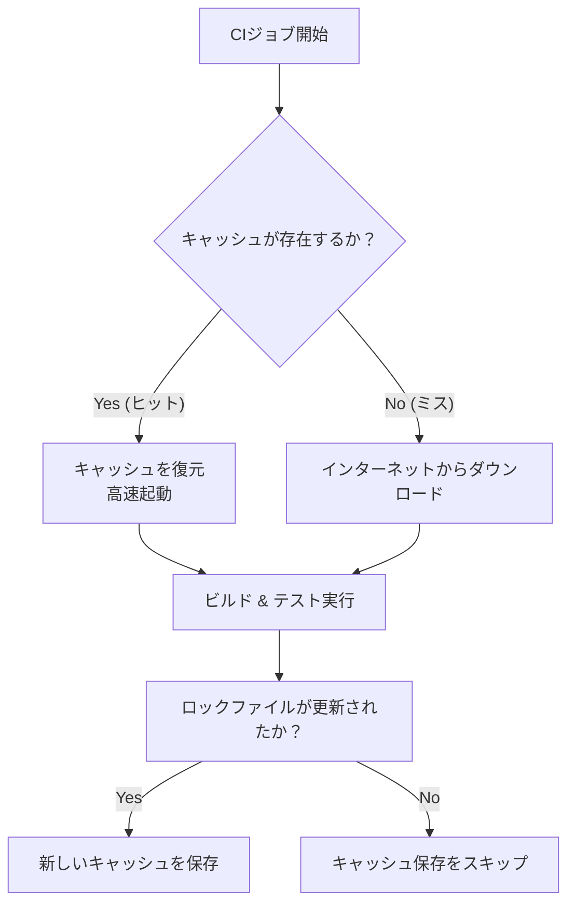

CI/CDパイプラインは開発フローの品質を保証しますが、その実行時間が長すぎると開発者体験（DX）が低下し、フィードバックループが遅れてしまいます。さらに、従量課金制のCIツールでは、実行時間の増加がそのままコストの増加に直結します。

第5章では、CI/CDを高速化し、効率的かつ低コストで運用するための最適化手法とキャッシュ戦略について解説します。

---

## 1. 依存関係のキャッシュ戦略

CIランナー（仮想マシン）は、実行ごとにまっさらな状態で起動します。そのため、そのままでは毎回依存関係パッケージ（例: `node_modules`）をインターネット経由でゼロからダウンロードすることになり、無駄な時間が発生します。

これを防ぐために、**キャッシュアクション**を使用します。



### GitHub Actionsでの設定例

`actions/setup-node` など多くの標準アクションには、キャッシュ機能が統合されています。

```yaml
- name: Set up Node.js
  uses: actions/setup-node@v4
  with:
    node-version: '20'
    cache: 'npm' # 自動的に package-lock.json のハッシュを検知してキャッシュ
```

---

## 2. Dockerレイヤーキャッシュ (GitHub Actions)

DockerイメージをCI内でビルドする場合、Dockerのビルドキャッシュも同様に重要です。
GitHub Actionsでは、GitHub Actions Cacheバックエンド（`gha`）をエクスポート先・インポート先に指定することで、別々のランナー間でもキャッシュを引き継ぐことができます。

```yaml
- name: Build and push Docker image
  uses: docker/build-push-action@v5
  with:
    context: .
    push: true
    tags: my-image:latest
    cache-from: type=gha # gha キャッシュからレイヤーを読み込む
    cache-to: type=gha,mode=max # 新しいレイヤーを gha に保存する
```

これにより、変更のない `Dockerfile` の命令（例: `RUN npm install`）がキャッシュから即座に解決され、イメージのビルド時間を数分から数秒へと劇的に縮小できます。

---

## 3. 並列処理とマトリックスビルド

テスト件数が多い場合、1つのランナーで順次テストを実行すると膨大な時間がかかります。これらを **「並列実行（Parallel Execution）」** させることで解決します。

### マトリックスビルドの活用
複数のNode.jsバージョンや、異なるOS環境、あるいはテストスイートの分割などで複数のテストを同時に並行して走らせる機能です。

```yaml
jobs:
  test:
    runs-on: ubuntu-latest
    strategy:
      matrix:
        node-version: [18.x, 20.x, 22.x]
        os: [ubuntu-latest, windows-latest]
    steps:
      - uses: actions/checkout@v4
      - name: Use Node.js ${{ matrix.node-version }} on ${{ matrix.os }}
        uses: actions/setup-node@v4
        with:
          node-version: ${{ matrix.node-version }}
```

この設定により、3つのバージョン × 2つのOS ＝ 計6個のジョブが独立したランナーで同時に並行実行され、全体の待機時間が最も長いジョブの実行時間（ボトルネック）のみに抑えられます。

キャッシュと並行処理を適切に組み合わせることで、開発チームはバグや変更のテスト結果を即座に受け取ることができ、アジャイルな開発サイクルがより活性化します。
