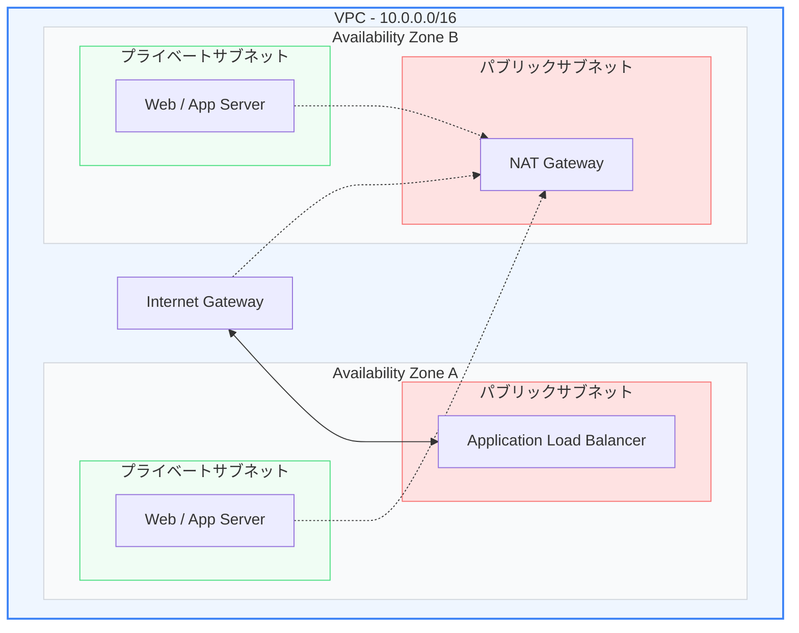

現代のWebアプリケーション開発において、物理的なサーバーを用意してデータセンターに設置する「オンプレミス」から、必要な時に必要なだけサーバーを調達できる「クラウド」への移行はほぼ標準となっています。その代表格である **AWS (Amazon Web Services)** の設計を理解することはエンジニアの必須スキルです。

第1章では、クラウドコンピューティングの基本コンセプトと、インフラの基盤となる仮想ネットワーク **「VPC (Virtual Private Cloud)」** の設計について学びます。

---

## 1. オンプレミスからクラウドへ

オンプレミス（自社所有の設備）と比較したクラウドの主なメリットは以下の通りです。

*   **俊敏性 (Agility)**: サーバーが必要になったら数クリック・数分で立ち上げられ、不要になれば即座に削除できます。
*   **初期費用ゼロと従量課金**: 高価なハードウェアを事前に購入する必要がなく、使った分だけ支払う変動費モデルです。
*   **グローバル展開**: 世界中にあるデータセンター群を使い、数クリックで数秒のうちに世界中にアプリをデプロイできます。

### 共有責任モデル (Shared Responsibility Model)
パブリッククラウドを利用する上で最も重要なセキュリティの原則が「共有責任モデル」です。

*   **AWSの責任（クラウド「の」セキュリティ）**: 物理データセンター、物理サーバー、ハイパーバイザ、ネットワーク回線などの物理的・インフラ的な保護。
*   **利用者の責任（クラウド「内」のセキュリティ）**: ゲストOSのセキュリティパッチ適用、アプリケーションコードの脆弱性対策、データの暗号化、IAMポリシーの設定など。

---

## 2. リージョンとアベイラビリティゾーン (AZ)

AWSのグローバルインフラは、地理的に分かれた「リージョン」と、その内部にある「アベイラビリティゾーン（AZ）」という階層構造を持っています。

*   **リージョン (Region)**: 東京、バージニア北部、アイルランドなど、世界各地の物理的な拠点の集まり。それぞれ完全に独立しています。
*   **アベイラビリティゾーン (AZ)**: 1つのリージョン内に存在する、物理的に隔離された1つ以上のデータセンターの集合体。超高速かつ低遅延な光ファイバーネットワークで相互接続されています。
*   **可用性の設計**: 地震や停電などの大規模災害によって1つのAZが壊れてもシステムが動き続けられるよう、**「マルチAZ（複数のAZにサーバーやDBを分散配置する）」** 設計を行うのが基本です。

---

## 3. VPC (Virtual Private Cloud) のネットワーク設計

VPCは、AWSアカウント専用の論理的に隔離された仮想ネットワーク空間です。この中にIPアドレスの範囲（CIDRブロック）を設定し、さらに細かく分割した **「サブネット（Subnet）」** を作成してリソースを配置します。

### ① パブリックサブネット (Public Subnet)
インターネットと直接双方向で通信ができるサブネットです。
*   **仕組み**: **インターネットゲートウェイ（IGW）** へのルートテーブルが設定されており、配置されるリソースにはパブリックIPが割り当てられます。
*   **配置するもの**: ロードバランサ（ALB）や、外部からの接続を受け入れる踏み台サーバー（Bastion）など。

### ② プライベートサブネット (Private Subnet)
インターネットから直接アクセスできない安全なサブネットです。
*   **仕組み**: インターネットへの直接のルートを持たず、プライベートIPのみが割り当てられます。
*   **配置するもの**: Webアプリケーションサーバー（Node.js, Goなど）や、データベース（RDS）。
*   **アウトバウンド通信（NAT Gateway）**: アプリケーションサーバーがライブラリの更新や外部APIの呼び出しのためにインターネットと通信したい場合、パブリックサブネットに配置した **NATゲートウェイ（Network Address Translation）** を経由して、送信元IPを変換してアウバウンド通信のみを許可します。

---

## まとめ

*   クラウドはオンプレミスに比べ、**俊敏性**や**コスト効率**、**マルチAZ**による高可用性設計が容易である。
*   **共有責任モデル**に基づき、利用者はデータやOS、設定（セキュリティグループなど）の保護に責任を持つ。
*   **VPC**の設計では、インターネットに露出する**パブリックサブネット**と、内部に隠蔽する**プライベートサブネット**を適切に使い分け、**NATゲートウェイ**で安全なアウトバウンド通信を確保する。
