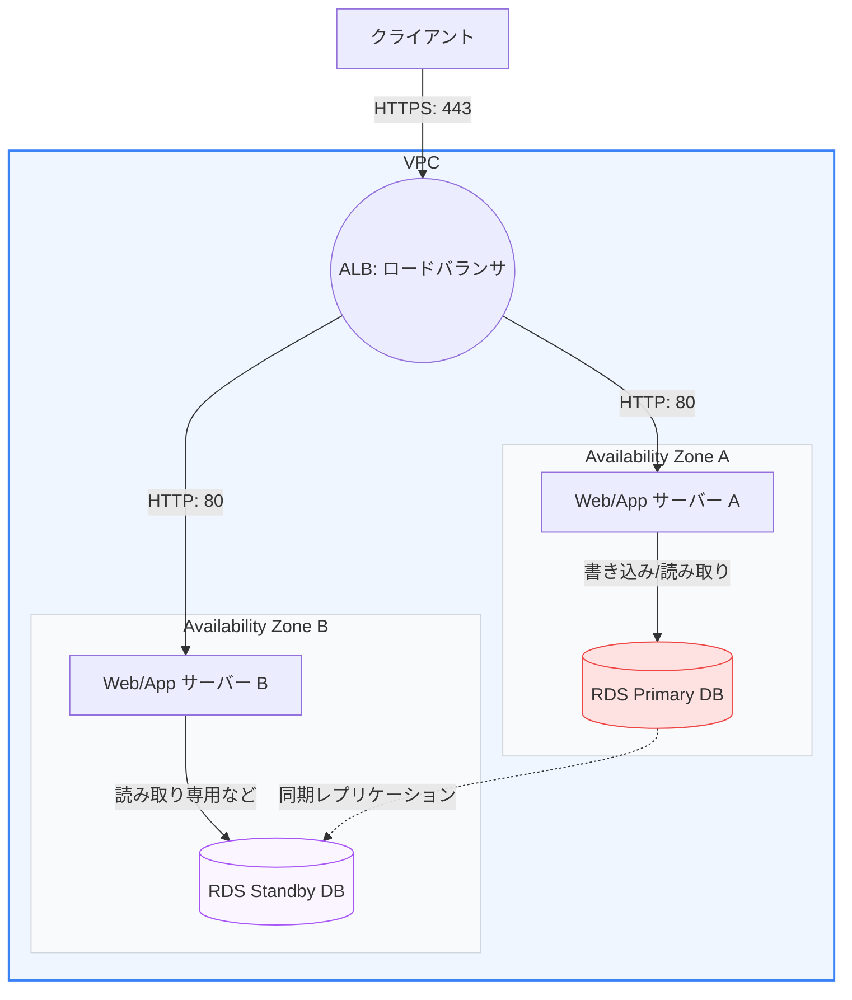

AWSには数多くのサービスが存在しますが、実際にWebシステムを構築する際に中核となるサービスは限定されています。

第2章では、コンピュート、ストレージ、データベース、および認証認可を管理する主要なAWSサービスの特徴と、それらを組み合わせた安全な **「Web3層アーキテクチャ」** の設計パターンについて学びます。

---

## 1. Webインフラを支える4大AWSサービス

### ① Amazon EC2 (Elastic Compute Cloud)
クラウド上の仮想サーバーです。
*   **特徴**: 数秒でインスタンス（サーバー）を起動でき、CPUやメモリの構成（インスタンスタイプ）を自由に変更できます。
*   **セキュリティグループ (Security Group)**: インスタンスレベルで動作する仮想ファイアウォールです。デフォルトはすべてのアウトバウンド（送信）を許可し、すべてのインバウンド（受信）を拒否します。「どのIPアドレスやプロトコル、あるいは別のセキュリティグループからの通信を許可するか」をホワイトリスト形式で厳密に設定します。

### ② Amazon S3 (Simple Storage Service)
容量無制限で使える、極めて堅牢なオブジェクトストレージです。
*   **特徴**: データを「バケット」と呼ばれるコンテナ内に「オブジェクト（ファイル）」として保存します。
*   **堅牢性**: 年間のデータ耐久性は **`99.999999999%`（イレブンナイン）** を誇り、データは自動的に3つ以上のAZに複製して保管されます。静的ウェブサイトのホスティングや、ユーザー画像・動画アセットの保管場所として多用されます。

### ③ Amazon RDS (Relational Database Service)
セットアップやバックアップが自動化された、マネージドなリレーショナルデータベースサービスです。
*   **特徴**: MySQL, PostgreSQL, Oracleなどをサポート。OSのパッチ適用や定期バックアップをAWSが代行します。
*   **マルチAZ配置**: プライマリー（書き込み用）DBのデータを別AZのセカンダリーDBへ同期レプリケーションします。プライマリーが故障した際は、DNSの切り替えにより数分以内に **自動フェイルオーバー（切り替え）** が発生し、システムが継続稼働します。

### ④ AWS IAM (Identity and Access Management)
AWSリソースへのアクセスを安全に制御するための認証・認可システムです。
*   **基本コンポーネント**:
    *   **IAMユーザー**: 個々のユーザー（人やアプリケーション）。
    *   **IAMグループ**: 複数のユーザーをまとめ、共通の権限を与えるコンテナ。
    *   **IAMポリシー**: JSON形式で記述された「どのアクションをどのリソースに対して許可/拒否するか」の定義ドキュメント。
    *   **IAMロール**: ユーザーではなく「EC2インスタンス」や「Lambda関数」などのリソースに一時的なアクセス権を与えるための仕組み。
*   **ベストプラクティス**: 必要最低限のアクセス権限のみを付与する **「最小権限の原則（Least Privilege）」** を徹底します。

---

## 2. 伝統的かつ堅牢な「Web3層アーキテクチャ」

これまでの技術を組み合わせた、AWSにおける最も標準的なWeb3層アーキテクチャの設計です。

### 設計のポイント
1.  **プレゼンテーション層 (ALB)**: パブリックサブネットに配置され、SSL終端（証明書の管理）を行い、バックエンドのWebサーバーへ負荷分散します。
2.  **アプリケーション層 (EC2)**: プライベートサブネットにマルチAZで配置され、インターネットから直接アクセスできない安全な状態にします。
3.  **データレイヤー層 (RDS)**: 最も保護すべきデータストアとして、プライベートサブネットのさらに奥深くに配置し、マルチAZで自動バックアップと冗長化を確保します。

---

## まとめ

*   **EC2**は仮想サーバーであり、**セキュリティグループ**を用いて不要なポートへの通信を遮断する。
*   **S3**は非常に高い耐久性を持ち、静的コンテンツのホスティングやファイル保管に適している。
*   **RDSのマルチAZ**機能は、データ複製と自動フェイルオーバーによってデータベースの可用性を劇的に向上させる。
*   **IAM**では**最小権限の原則**を維持し、リソースに対しては**IAMロール**を適用してアクセスキーの漏洩を防ぐ。
