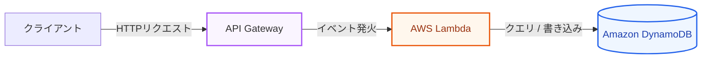

仮想サーバー（EC2）を利用したWeb3層アーキテクチャは柔軟ですが、OSのパッチ適用、スケールアウトのしきい値設定、アイドル時（アクセスがない時間帯）もサーバーの起動コストが発生し続けるといった運用管理コストが伴います。これらを解消するのが **「サーバーレス（Serverless）」** 設計です。

第3章では、サーバーレスの基礎概念、AWSの主要サービス（API Gateway, Lambda, DynamoDB）、および従来システムとの特性比較について学びます。

---

## 1. サーバーレスコンピューティングの本質

「サーバーレス」とは、物理的なサーバーが存在しないという意味ではありません。**「開発者がサーバーのプロビジョニング、管理、スケーリング、パッチ適用について一切考える必要がないモデル」** を指します。

### サーバーレスの4大特徴
1.  **サーバー管理が不要**: OSの管理やハードウェアの保守はすべてクラウドプロバイダーが担当します。
2.  **自動で柔軟にスケーリング**: リクエストの増加に応じて、システムが自動的かつ瞬時にスケールアウト（並列実行）します。
3.  **高い可用性の内包**: サーバーレスサービスは、デフォルトで複数のAZにまたがって動作するよう設計されており、ユーザーが冗長化を組む必要がありません。
4.  **アイドル時のコストはゼロ**: サーバーを「起動している時間」ではなく、「リクエストが実行された回数と時間」に対してのみ課金されます。アクセスが全くない時間帯のコストは完全に $0$ になります。

---

## 2. サーバーレスWeb APIを構成する主要サービス

最も代表的な「API Gateway $\rightarrow$ Lambda $\rightarrow$ DynamoDB」の三種の神器によるサーバーレスWeb API構成です。

### ① Amazon API Gateway
外部からのHTTP/HTTPSリクエストを受け取るフルマネージドなAPIフロントエンドです。
*   **機能**: ルーティング、CORS設定、APIキー検証、アクセス制限（レート制限/スロットリング）、リクエストデータのバリデーションなどを担当し、後続のLambda関数にリクエストをイベントとして渡します。

### ② AWS Lambda
イベント駆動型でコードを実行するサーバーレスコンピュートサービス（FaaS）です。
*   **仕組み**: API GatewayやS3などの「イベント（トリガー）」が発生した瞬間にのみコンテナが立ち上がり、ユーザーが書いたコード（Node.js, Python, Goなど）を実行してレスポンスを返します。処理が終われば自動で消滅します。

### ③ Amazon DynamoDB
フルマネージドなNoSQLデータベースサービスです。
*   **特徴**: キーバリュー型データベースとして機能し、アクセス規模がどれだけ大きくなっても「一桁ミリ秒台」の超高速な応答性能を維持します。テーブル定義のスキーマが不要（スキーマレス）で、自動スケーリングによって書き込み・読み込み容量を調節します。

---

## 3. EC2（仮想サーバー） vs Lambda（サーバーレス）の比較

| 比較項目 | EC2ベース (仮想サーバー) | Lambdaベース (サーバーレス) |
| :--- | :--- | :--- |
| **起動時間** | 数分（OS起動・初期化が必要） | 数ミリ秒〜数百ミリ秒（コンテナ起動） |
| **課金モデル** | 起動時間（秒/時間）に対する定額 | リクエスト回数 ＋ 実行時間（ミリ秒単位） |
| **スケーリング** | オートスケーリング設定が必要（緩慢） | リクエスト数に応じてミリ秒単位で即座に並列スケール |
| **コールドスタート** | なし（常時起動しているため） | あり（初回起動時やスケールアウト時のコンテナ作成で遅延が発生） |
| **運用の負担** | 高い（OSアップデート、監視、パッチ） | 極めて低い（コードのデプロイと権限設定のみ） |

> [!WARNING]
> **コールドスタート（Cold Start）**
> しばらくアクセスがない状態からLambda関数を呼び出すと、AWS側で実行環境（コンテナ）を起動し、ランタイムやコードをロードするための待機時間（数百ミリ秒〜数秒）が発生します。これを「コールドスタート」と呼びます。対策として、JavaやC#などの重いランタイムを避け、Node.jsやPython、Goを使用することや、あらかじめ環境を温めておく「プロビジョニングされた並列性（Provisioned Concurrency）」機能を使用することが推奨されます。

---

## まとめ

*   **サーバーレス**は、インフラのプロビジョニングやパッチ適用、スケーリングをAWSが完全に自動化する仕組みである。
*   **API Gateway - Lambda - DynamoDB** は、サーバーレスAPI構築における最も標準的な構成である。
*   **アイドル時コストゼロ**のため、アクセス頻度が低い、または不定期なAPIでは抜群のコストパフォーマンスを発揮するが、**コールドスタート**による初回アクセス遅延の可能性を理解しておく必要がある。
