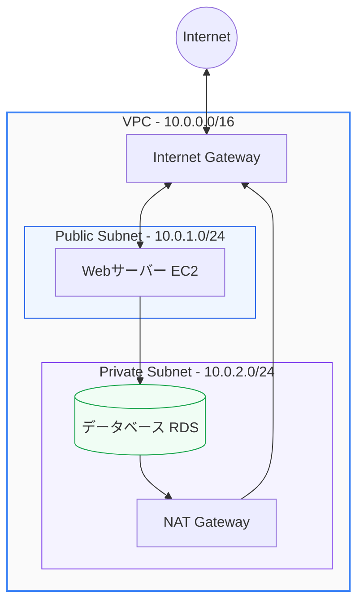

クラウドサービスを利用する最大のメリットの一つは俊敏性ですが、適切なセキュリティ設定が行われていなければ、情報漏洩や不正アクセスの甚大なリスクに直面します。

AWSにおけるセキュリティの基本は、**「誰がどのリソースにアクセスできるか（ID管理）」** と **「どのようにネットワークへの経路を制限するか（ネットワーク制御）」** の2つの軸に集約されます。

第4章では、ID・アクセス権限を管理する **IAM** と、安全な仮想ネットワーク空間を構築する **VPC** の基本と設計アプローチを学びます。

---

## 1. AWSのセキュリティ基本理念

AWSでインフラを設計する際、まず理解しなければならないのが **「責任共有モデル (Shared Responsibility Model)」** です。

*   **AWSの責任（クラウド「の」セキュリティ）**: 物理データセンターのセキュリティ、ハードウェア、仮想化ハイパーバイザー、グローバルインフラ（リージョンやアベイラビリティゾーン）の維持・管理。
*   **利用者の責任（クラウド「内」のセキュリティ）**: ゲストOS、ネットワークトラフィックの制御（セキュリティグループ）、アプリケーションコード、IDおよびアクセス管理（IAM）、データの暗号化など。

AWSが安全なインフラを提供しても、利用者がアクセス権限やネットワークの口を開放したままにしておけばシステムは簡単に突破されてしまいます。

---

## 2. IAM（Identity and Access Management）

IAMは、AWSリソースへのアクセスを安全に制御するためのサービスです。**「認証（誰が）」** と **「認可（何をしてもよいか）」** を一元的に管理します。

### IAMの4つの主要要素

1.  **IAMユーザー (User)**: AWSとやり取りする特定の個人やアプリケーションを表す実体。ログイン用のパスワードや、API呼び出し用のアクセスキーを保持します。
2.  **IAMユーザーグループ (Group)**: 複数のIAMユーザーの集合。同じ職能（例: `Developers`, `SystemAdmins`）のメンバーに対して、一括でアクセス権限を付与するために使用します。
3.  **IAMロール (Role)**: 特定の個人ではなく、**AWSリソース（EC2インスタンスやLambda関数など）や一時的にアクセスを許可したい外部のアイデンティティ**に権限を貸し出すための仕組み。永続的なキーを持たず、一時的なセキュリティ認証情報を発行します。
4.  **IAMポリシー (Policy)**: 許可または拒否するアクションを定義したJSON形式のドキュメント。これをユーザー、グループ、ロールに「アタッチ（紐付け）」することで権限を決定します。

### JSONポリシーの例（S3への読み込み専用許可）
```json
{
  "Version": "2012-10-17",
  "Statement": [
    {
      "Effect": "Allow",
      "Action": [
        "s3:GetObject",
        "s3:ListBucket"
      ],
      "Resource": [
        "arn:aws:s3:::my-secure-bucket",
        "arn:aws:s3:::my-secure-bucket/*"
      ]
    }
  ]
}
```

> [!IMPORTANT]
> **最小権限の原則 (Principle of Least Privilege)**
> セキュリティ上のベストプラクティスとして、ユーザーやリソースには「業務を遂行する上で必要最低限の権限」のみを付与します。過剰な権限（特に管理者権限 `AdministratorAccess` や、リソース `*` に対する全アクションの許可）の常用は避けてください。

---

## 3. VPC（Virtual Private Cloud）

VPCは、AWS上に構築する**論理的に隔離されたプライベートな仮想ネットワーク**です。オンプレミスの物理的なデータセンターのネットワーク構成に酷似した環境をクラウド上で再現できます。



### VPCの構成要素

*   **CIDRブロック (Classless Inter-Domain Routing)**: VPC全体のIPアドレス範囲（例: `10.0.0.0/16`）。
*   **サブネット (Subnet)**: VPCを細分化したIPアドレスの範囲（例: `10.0.1.0/24`）。
    *   **パブリックサブネット**: インターネットゲートウェイへのルートが存在し、インターネットから直接アクセス可能なサブネット（Webサーバーなどを配置）。
    *   **プライベートサブネット**: インターネットから直接アクセスできず、隔離された安全なサブネット（データベースやバックエンド処理サーバーを配置）。
*   **インターネットゲートウェイ (IGW)**: VPCとインターネットの間で双方向通信を行うためのコンポーネント。
*   **ルートテーブル (Route Table)**: サブネットまたはゲートウェイからのネットワークトラフィックの送信先を決定するためのルーティングルールのセット。
*   **NATゲートウェイ (Network Address Translation)**: プライベートサブネットにあるリソースが、インターネット上のサービス（OSのパッチ適用や外部APIの呼び出しなど）と通信できるようにする一方、インターネットからそれらのリソースへの着信接続はブロックするデバイス。

---

## 4. ネットワークの保護：セキュリティグループ vs ネットワークACL

VPC内のリソースをトラフィックの脅威から守るため、AWSでは2つの異なるファイアウォール機能を提供しています。

| 項目 | セキュリティグループ (Security Group) | ネットワークACL (Network ACL) |
| :--- | :--- | :--- |
| **適用範囲** | **インスタンスレベル** (EC2, RDS などに直接付与) | **サブネットレベル** (サブネット全体のバリア) |
| **評価対象** | 許可ルールのみ（すべてデフォルト拒否） | 許可ルールと拒否ルールの両方 |
| **評価順序** | すべてのルールを評価して適用 | ルール番号順に順次評価（マッチしたら終了） |
| **状態管理** | **ステートフル** (戻りトラフィックは自動許可) | **ステートレス** (戻りトラフィックも明示的に許可が必要) |

> [!TIP]
> **ステートフルとステートレスの違い**
> セキュリティグループ（ステートフル）では、Webサーバーへのポート80 (HTTP) インバウンド接続を許可すれば、それに対するアウトバウンドのレスポンス（戻りのパケット）は自動的に許可されます。一方、ネットワークACL（ステートレス）では、インバウンドを許可しただけではレスポンスは通らず、アウトバウンドルール（エフェメラルポートなど）も明示的に設定する必要があります。

---

## まとめ

*   **責任共有モデル**に基づき、利用者はデータの保護、アクセス権限の設定、OSやアプリケーションレイヤーのネットワークセキュリティを担保する。
*   **IAM**でIDと権限を管理し、**最小権限の原則**に則り不要なアクションの実行を防ぐ。
*   **VPC**を用いて仮想ネットワークを構築し、Webサーバー（パブリック）とDBサーバー（プライベート）を適切に分離して設計する。
*   **セキュリティグループ（インスタンス単位・ステートフル）**と**ネットワークACL（サブネット単位・ステートレス）**を組み合わせて多層防御を構築する。
