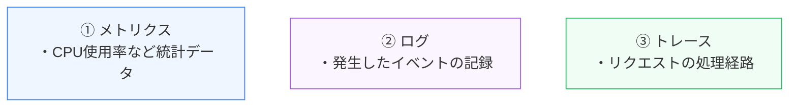
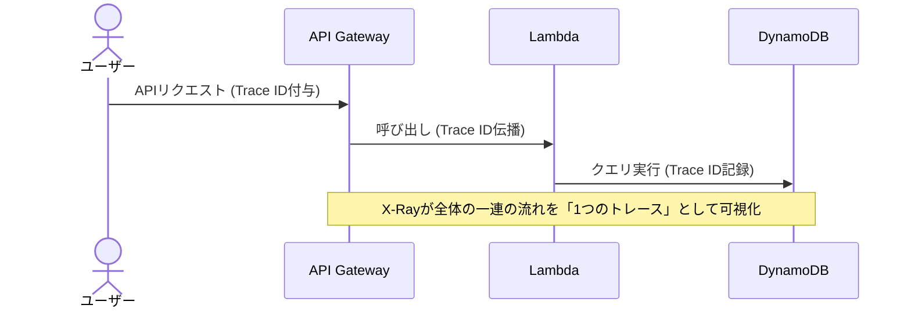

アプリケーションが稼働し始めると、システムが正常に動作しているか、パフォーマンスに問題がないかをリアルタイムで監視する必要があります。

第5章では、AWSにおけるシステム監視の基本となる **Amazon CloudWatch** と、トラブルシューティングを強力に支援する **AWS X-Ray** によるオブザーバビリティ（可観測性）について学びます。

---

## 1. オブザーバビリティと3大要素

従来の「監視」は、サーバーがダウンしたかなどの死活監視が主でした。対して **「オブザーバビリティ（可観測性）」** は、「システムの内部状態を、外部から出力される情報に基づいてどれだけ詳細に推測できるか」という概念です。

オブザーバビリティは、以下の **3つの柱（Telemetry Data）** で構成されます。

---

## 2. Amazon CloudWatch

Amazon CloudWatch は、AWS リソースと AWS 上で実行するアプリケーションの監視・管理サービスです。

*   **CloudWatch Metrics (メトリクス)**:
    AWSリソース（EC2やRDSなど）から1分〜5分間隔で自動収集される数値データ。CPU使用率、ネットワーク流量、ディスクI/Oなど。
*   **CloudWatch Logs (ログの統合)**:
    アプリケーションログやシステムログをエージェント経由で収集・集約し、検索やフィルタリング（CloudWatch Logs Insights）を可能にします。
*   **CloudWatch Alarms (アラーム)**:
    メトリクスが閾値を超えた場合に、自動的に管理者にメール通知（Amazon SNS経由）したり、EC2のAuto Scalingを発火させてインスタンスを自動増減したりします。

---

## 3. 分散トレーシングと AWS X-Ray

マイクロサービスアーキテクチャやサーバーレス設計（API Gateway -> Lambda -> DynamoDB）では、1つのユーザーリクエストが多数のサービスを経由するため、**「どの処理のせいでレスポンスが遅くなっているのか」** を見つけるのが困難です。

これを追跡するのが **AWS X-Ray** です。

AWS X-Rayは、最初のリクエストに一意の **「Trace ID」** を付与し、各サービス間でこのIDを伝播させることで、サービスマップ（トポロジー図）を描画し、どのコンポーネントで遅延やエラーが発生したかを一目瞭然にします。

---

## まとめ

*   **CloudWatch** を使うことで、システムの統計データ（メトリクス）や詳細な履歴（ログ）を一元管理し、アラームによる自動復旧を設定できる。
*   **AWS X-Ray** による分散トレーシングは、サービス間を跨ぐリクエストのパフォーマンスを可視化し、ボトルネックの特定を迅速化する。
*   これらを組み合わせることで、複雑なクラウドネイティブアプリの **オブザーバビリティ（可観測性）** を高めることができる。
