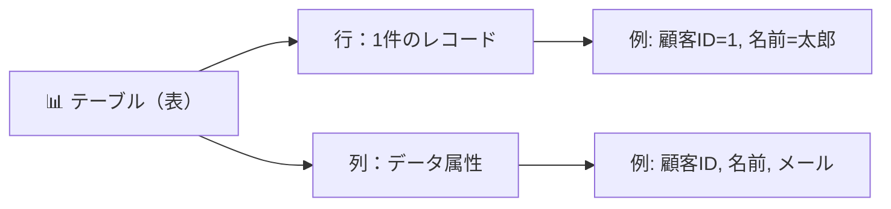
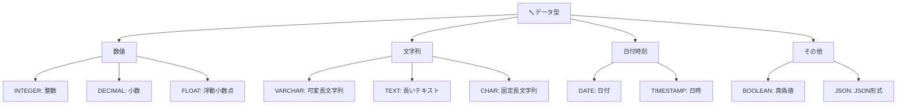
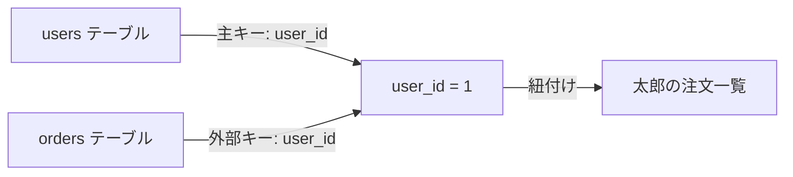
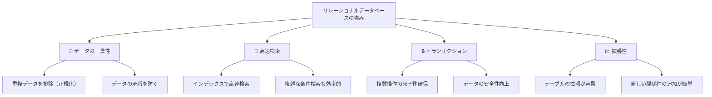

## データベースとは

データベース（DB）は、**体系的に整理された大量のデータを効率よく保存・管理・検索するためのシステム**です。ブログ、SNS、Eコマース、銀行システムなど、現代のほぼすべてのアプリケーションはデータベースを活用しています。

## リレーショナルデータベース（RDB）とは

**リレーショナルデータベース**は、データを「表（テーブル）」形式で管理するデータベースの標準的なモデルです。Excelのスプレッドシートのような構造で、行と列にデータが整理されます。



### テーブルの基本用語

| 用語               | 説明                             | 例                 |
| ------------------ | -------------------------------- | ------------------ |
| **テーブル**       | データを行と列で管理する表       | `users`テーブル    |
| **行（レコード）** | 1件のデータ                      | 太郎さんの情報     |
| **列（カラム）**   | 特定の属性を表す                 | `name`、`email`    |
| **主キー（PK）**   | 各レコードを一意に識別するカラム | `user_id`          |
| **スキーマ**       | テーブルの構造定義               | 各カラムの型・制約 |

```
users テーブル
┌─────────┬────────┬──────────────────┬─────────────────┐
│ user_id │  name  │      email       │   created_at    │
├─────────┼────────┼──────────────────┼─────────────────┤
│    1    │  太郎  │ taro@example.com │ 2026-01-15      │
│    2    │  花子  │ hanako@ex.com    │ 2026-02-10      │
│    3    │  次郎  │ jiro@example.com │ 2026-03-05      │
└─────────┴────────┴──────────────────┴─────────────────┘
```

## データ型（型付け）

データベースは各カラムに「どんな形式のデータが入るか」を事前に定義します。主なデータ型は以下の通りです：



## リレーション（関連性）

リレーショナルデータベースの名称の由来は、**複数のテーブル間に関連性（リレーション）を作れる** ことにあります。

### 例：ユーザーと注文の関係

```
users テーブル
┌─────────┬────────┐
│ user_id │  name  │
├─────────┼────────┤
│    1    │  太郎  │
│    2    │  花子  │
└─────────┴────────┘

orders テーブル
┌──────────┬─────────┬──────────────┐
│ order_id │ user_id │ product_name │
├──────────┼─────────┼──────────────┤
│   101    │    1    │   りんご     │
│   102    │    1    │   みかん     │
│   103    │    2    │   バナナ     │
└──────────┴─────────┴──────────────┘
```

`orders.user_id` と `users.user_id` を紐付けることで、**「どのユーザーがどの商品を注文したか」を効率的に管理** できます。このリレーションが、複雑なビジネスロジックを支える強力な機能です。



## 主要なRDBMS（データベース管理システム）

Excelと同じように、RDBMSも複数のソフトウェアから選べます：

| DBMS                     | 特徴                               | 用途                      |
| ------------------------ | ---------------------------------- | ------------------------- |
| **PostgreSQL**           | オープンソース、高機能、信頼性高   | 中～大規模システム        |
| **MySQL**                | 高速、軽量、シンプル               | Webアプリ、スタートアップ |
| **SQLite**               | ファイルベース、セットアップ不要   | モバイルアプリ、組込      |
| **Oracle Database**      | エンタープライズ向け、超大規模対応 | 金融機関、大企業          |
| **Microsoft SQL Server** | Windows統合、ビジネス向け          | Windowsサーバー環境       |

## なぜリレーショナルデータベースなのか？



## まとめ

- **リレーショナルデータベース**は、行と列からなるテーブルでデータを管理します
- **複数テーブル間のリレーション**により、複雑なデータ関係を効率的に表現できます
- **スキーマ**でデータ型と構造を事前に定義し、データの一貫性を保ちます
- **高速検索**と**トランザクション**により、大規模システムでも信頼できる運用が可能です

次の章では、効率的で一貫性のあるテーブル設計に不可欠な **正規化** について学びます。
