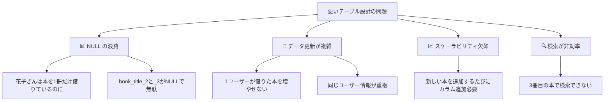
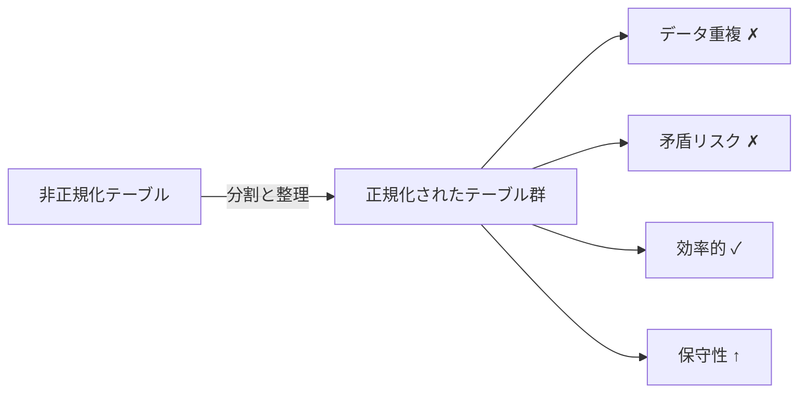
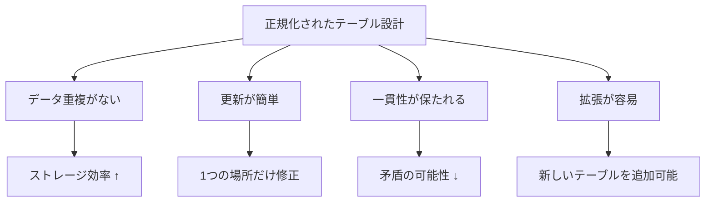

## 悪いテーブル設計の例

以下のテーブルを見てください。ユーザーと彼らが借りている本の情報が混在しています：

```
user_books テーブル（悪い例）
┌─────────┬────────┬──────────────────┬──────────────────┬──────────────────┐
│ user_id │  name  │    book_title    │   book_title_2   │   book_title_3   │
├─────────┼────────┼──────────────────┼──────────────────┼──────────────────┤
│    1    │  太郎  │  徒然草           │  源氏物語        │  古事記           │
│    2    │  花子  │  賢治全集        │  NULL            │  NULL            │
│    3    │  次郎  │  昭和史           │  平成の政治      │  令和へ          │
└─────────┴────────┴──────────────────┴──────────────────┴──────────────────┘
```

### このテーブルの問題点



## 正規化とは

**正規化（Normalization）**は、データベース設計の最重要概念です。テーブルを複数に分割することで、以下を実現します：

- ✅ **データの重複排除**
- ✅ **データ更新時の矛盾防止**
- ✅ **ストレージ効率の向上**
- ✅ **クエリの高速化**



## 正規化の段階

正規化には複数のレベル（正規形）があります。ほとんどの実務では **第3正規形（3NF）** まで進めれば十分です。

### 第1正規形（1NF）：原子性

**各セルは1つの値のみ保有する** という原則です。

```
❌ 非正規形の例
┌─────────┬────────┬──────────────────────────────┐
│ user_id │  name  │        book_titles           │
├─────────┼────────┼──────────────────────────────┤
│    1    │  太郎  │ 徒然草、源氏物語、古事記     │← 複数値が1セル
└─────────┴────────┴──────────────────────────────┘

✅ 第1正規形
┌─────────┬────────┐          ┌─────────┬──────────────┐
│ user_id │  name  │          │ user_id │  book_title  │
├─────────┼────────┤          ├─────────┼──────────────┤
│    1    │  太郎  │          │    1    │   徒然草     │
│    2    │  花子  │          │    1    │   源氏物語   │
└─────────┴────────┘          │    1    │   古事記     │
                               └─────────┴──────────────┘
```

### 第2正規形（2NF）：部分関数従属の排除

**主キーの一部に従属するカラムは分離する** という原則です。複合主キーの場合に重要です。

```
❌ 非正規形の例
┌──────────────┬─────────┬─────────┬────────────┐
│ user_id, day │ user_id │  day    │ sales($)   │
├──────────────┼─────────┼─────────┼────────────┤
│   (1, 2026年6月20日)   │    1    │ 2026年6月20日 │ 5000 │
│   (1, 2026年6月21日)   │    1    │ 2026年6月21日 │ 3000 │
└──────────────┴─────────┴─────────┴────────────┘
               ↑ user_idだけで決まるので、dayに従属していない

✅ 第2正規形
users テーブル        sales テーブル
┌─────────┐          ┌─────────┬────────────┬──────────┐
│ user_id │          │ user_id │    day     │ sales($) │
├─────────┤          ├─────────┼────────────┼──────────┤
│    1    │          │    1    │ 2026-06-20 │  5000    │
└─────────┘          │    1    │ 2026-06-21 │  3000    │
                     └─────────┴────────────┴──────────┘
```

### 第3正規形（3NF）：推移関数従属の排除

**主キー以外のカラム間に従属関係がないようにする** という原則です。

```
❌ 非正規形の例
┌──────────┬────────┬───────────┬───────────┐
│ book_id  │ title  │ author_id │ author    │
├──────────┼────────┼───────────┼───────────┤
│   101    │ 古事記 │     A     │   太郎    │
│   102    │ 源氏物語│     B     │   花子    │
└──────────┴────────┴───────────┴───────────┘
                       ↓ author_id → author の従属性

✅ 第3正規形
books テーブル              authors テーブル
┌──────────┬────────┬───────────┐  ┌───────────┬────────┐
│ book_id  │ title  │ author_id │  │ author_id │ author │
├──────────┼────────┼───────────┤  ├───────────┼────────┤
│   101    │ 古事記 │     A     │  │     A     │  太郎  │
│   102    │ 源氏物語│     B     │  │     B     │  花子  │
└──────────┴────────┴───────────┘  └───────────┴────────┘
```

## 正規化されたテーブル設計の例

ユーザー・注文・商品の関係を適切に設計したモデル：

```
users テーブル
┌─────────┬────────┬──────────────────┐
│ user_id │  name  │      email       │
├─────────┼────────┼──────────────────┤
│    1    │  太郎  │ taro@example.com │
│    2    │  花子  │ hanako@ex.com    │
└─────────┴────────┴──────────────────┘

orders テーブル
┌──────────┬─────────┬─────────────┐
│ order_id │ user_id │ order_date  │
├──────────┼─────────┼─────────────┤
│   101    │    1    │ 2026-06-20  │
│   102    │    1    │ 2026-06-21  │
│   103    │    2    │ 2026-06-22  │
└──────────┴─────────┴─────────────┘

order_items テーブル
┌──────────┬────────────┬──────────┐
│ order_id │ product_id │ quantity │
├──────────┼────────────┼──────────┤
│   101    │     10     │    2     │
│   101    │     20     │    1     │
│   102    │     10     │    3     │
└──────────┴────────────┴──────────┘

products テーブル
┌────────────┬──────────────┬───────┐
│ product_id │ product_name │ price │
├────────────┼──────────────┼───────┤
│     10     │    りんご    │  150  │
│     20     │    みかん    │  120  │
└────────────┴──────────────┴───────┘
```

### メリット



## 正規化のバランス

正規化は重要ですが、**過度な正規化はパフォーマンス低下につながります**。実務では、**第3正規形と実装バランス** を取ることが重要です。

```
┌─────────────────────────────────┐
│  正規化レベル vs パフォーマンス │
│                                 │
│  正規化レベル  ↑                 │
│              │      /           │
│              │     /   ← 最適点 │
│              │   /\             │
│              │ /  \             │
│            ─────────────         │
│  パフォーマンス                   │
│                                 │
│  結論：第3正規形 + 必要に応じ    │
│       てデータキャッシュ          │
└─────────────────────────────────┘
```

## まとめ

- **正規化**はデータベース設計の根本原則です
- **第1～第3正規形**の段階的なプロセスで、データの一貫性と効率性を両立します
- ほとんどの実務では **第3正規形（3NF）** で十分です
- **過度な正規化は避け、実装バランスを考慮** することが大切です

次の章では、正規化されたテーブルに対して **SQL** を使ってデータを操作する方法を学びます。
