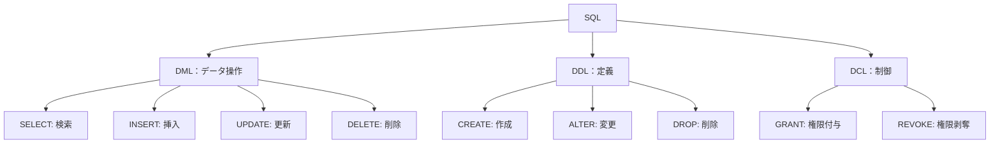
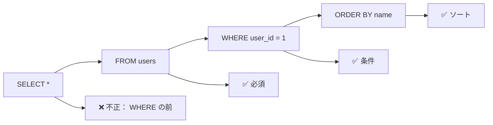
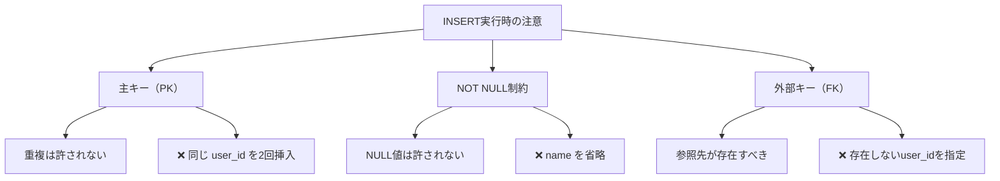
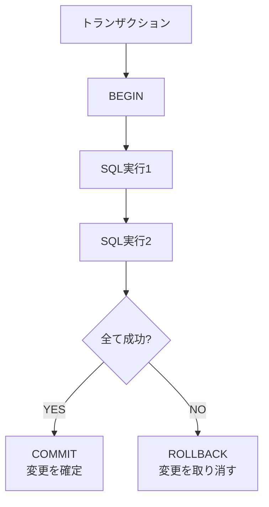

## SQLとは

**SQL（Structured Query Language）**は、リレーショナルデータベースにデータを問い合わせ、操作するための標準言語です。ほぼすべてのRDBMSで同じ文法が使われており、世界中で最も使われています。



## SELECT：データ検索

データベースから情報を取得する最も基本的な操作です。

### 基本的な書き方

```sql
SELECT column1, column2, ...
FROM table_name
WHERE condition
ORDER BY column1;
```

### 例：ユーザーの一覧を取得

```sql
-- すべてのカラムを取得
SELECT * FROM users;

-- 特定のカラムのみ取得
SELECT user_id, name, email FROM users;

-- 条件を指定して取得（WHERE句）
SELECT name, email FROM users WHERE user_id = 1;

-- 複数条件（AND/OR）
SELECT * FROM users
WHERE name = '太郎' AND email LIKE '%example.com%';

-- ソート（ORDER BY句）
SELECT * FROM users ORDER BY user_id DESC;
```



### JOINで複数テーブルを結合

```sql
-- INNER JOIN：両方のテーブルに存在する行のみ
SELECT users.name, orders.order_id, orders.order_date
FROM users
INNER JOIN orders ON users.user_id = orders.user_id
WHERE users.user_id = 1;

-- LEFT JOIN：左側テーブルのすべての行 + 右側との一致行
SELECT users.name, orders.order_id
FROM users
LEFT JOIN orders ON users.user_id = orders.user_id;
```

```
INNER JOIN の結果
┌──────┬──────────┐
│ name │ order_id │
├──────┼──────────┤
│ 太郎 │   101    │
│ 太郎 │   102    │
└──────┴──────────┘

LEFT JOIN の結果
┌──────┬──────────┐
│ name │ order_id │
├──────┼──────────┤
│ 太郎 │   101    │
│ 太郎 │   102    │
│ 花子 │   103    │
│ 次郎 │  NULL    │  ← 次郎に注文がない
└──────┴──────────┘
```

## INSERT：データ挿入

新しいレコードをテーブルに追加します。

```sql
-- 1行のデータを挿入
INSERT INTO users (user_id, name, email)
VALUES (4, '次郎', 'jiro@example.com');

-- 複数行をまとめて挿入
INSERT INTO users (user_id, name, email) VALUES
(5, 'さとし', 'satoshi@example.com'),
(6, 'あこ', 'ako@example.com');
```

### 重要なポイント



## UPDATE：データ更新

既存のレコードを修正します。

```sql
-- 1つのカラムを更新
UPDATE users
SET email = 'newemail@example.com'
WHERE user_id = 1;

-- 複数のカラムを同時に更新
UPDATE users
SET name = '太郎改', email = 'taro2@example.com'
WHERE user_id = 1;

-- 計算式で更新
UPDATE products
SET price = price * 1.1
WHERE category = 'food';  -- 食料品を10%値上げ
```

### ⚠️ 危険な操作

```sql
-- ❌ WHERE句がない場合、すべてのレコードが更新される！
UPDATE users SET email = 'oops@example.com';
-- 結果：全ユーザーのメールアドレスが変わってしまう

-- ✅ 必ずWHERE句で条件を指定
UPDATE users
SET email = 'taro@example.com'
WHERE user_id = 1;
```

## DELETE：データ削除

不要なレコードを削除します。

```sql
-- 特定の行を削除
DELETE FROM users
WHERE user_id = 1;

-- 複数条件で削除
DELETE FROM orders
WHERE user_id = 1 AND order_date < '2026-01-01';
```

### ⚠️ 危険な操作

```sql
-- ❌ WHERE句がない場合、テーブル全体が削除される！
DELETE FROM users;
-- 結果：全ユーザーが削除される（取り返しがつかない可能性）

-- ✅ 必ずWHERE句で条件を指定
DELETE FROM users WHERE user_id = 5;
```

## 集計関数

複数行のデータから統計情報を計算します。

```sql
-- COUNT：行数をカウント
SELECT COUNT(*) FROM users;  -- 全ユーザー数

-- SUM：合計を計算
SELECT SUM(price) FROM order_items;  -- 注文総額

-- AVG：平均を計算
SELECT AVG(price) FROM products;  -- 商品の平均価格

-- MAX/MIN：最大値・最小値
SELECT MAX(price), MIN(price) FROM products;

-- GROUP BY：グループごとに集計
SELECT user_id, COUNT(*) as order_count
FROM orders
GROUP BY user_id;  -- ユーザーごとの注文数
```

結果例：

```
user_id | order_count
--------|-------------
   1    |      3
   2    |      1
   3    |      2
```

## トランザクション（複数操作の一貫性）

複数のSQL操作をまとめて「全て成功か全て失敗か」で扱う仕組みです。

```sql
BEGIN;  -- トランザクション開始

UPDATE accounts SET balance = balance - 100 WHERE account_id = 1;
UPDATE accounts SET balance = balance + 100 WHERE account_id = 2;

COMMIT;  -- すべての変更を確定
-- または
ROLLBACK;  -- すべての変更を取り消す
```



## まとめ：DML操作の流れ

```
1. SELECT   → データを「読む」
2. INSERT   → データを「追加」
3. UPDATE   → データを「変更」
4. DELETE   → データを「削除」
5. COMMIT   → 変更を「確定」
```

次の章では、これらのクエリを **高速化するためのインデックス** について学びます。
