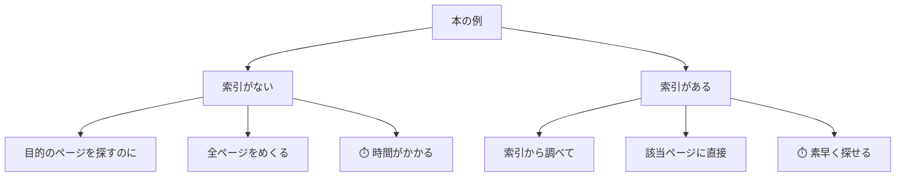
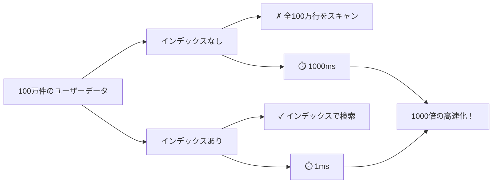
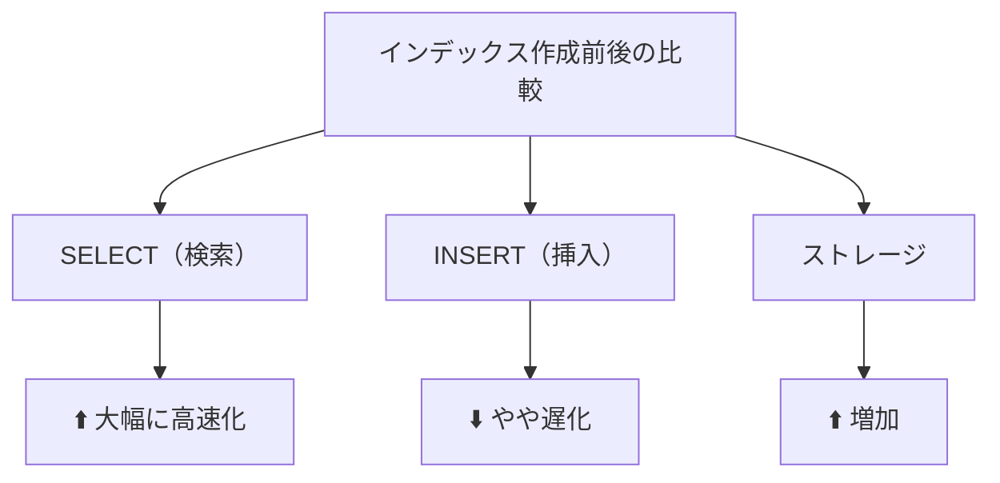
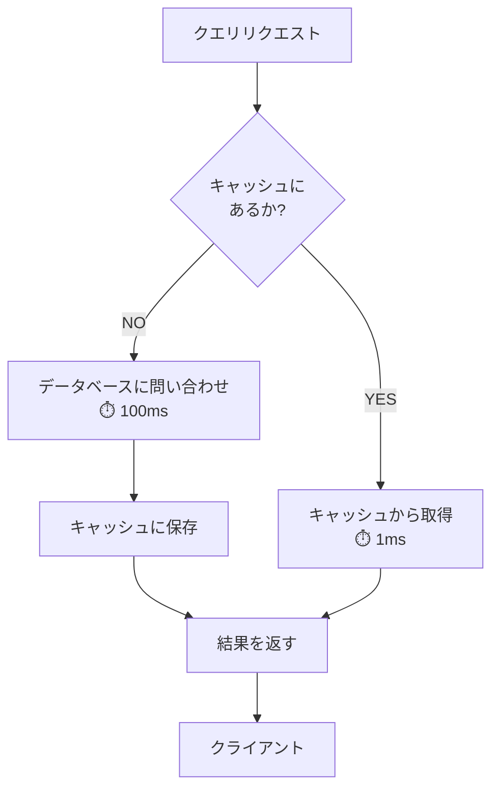

## インデックスとは

**インデックス（索引）**は、本の巻末にある「索引」と同じ役割です。データを高速に検索するためのデータ構造です。



### 例：ユーザーテーブルでのデータ検索

```sql
-- インデックスがない場合
SELECT * FROM users WHERE email = 'taro@example.com';
-- → テーブルのすべての行をスキャン（遅い）

-- インデックスがある場合
SELECT * FROM users WHERE email = 'taro@example.com';
-- → インデックスから直接検索（高速）
```

## インデックスの種類

### 主キーインデックス（PRIMARY KEY）

各レコードを一意に識別するカラムに自動的に作成されます。

```sql
CREATE TABLE users (
    user_id INT PRIMARY KEY,  -- 自動的にインデックスが作成される
    name VARCHAR(100),
    email VARCHAR(100)
);
```

### ユニークインデックス（UNIQUE）

重複を許さないカラムに対して作成します。

```sql
CREATE TABLE users (
    user_id INT PRIMARY KEY,
    name VARCHAR(100),
    email VARCHAR(100) UNIQUE  -- メールアドレスの重複を防ぐ
);
```

### 通常のインデックス（INDEX）

よく検索に使われるカラムに対して作成します。

```sql
CREATE TABLE users (
    user_id INT PRIMARY KEY,
    name VARCHAR(100),
    email VARCHAR(100),
    created_at TIMESTAMP
);

-- よく検索されるカラムにインデックスを作成
CREATE INDEX idx_users_email ON users(email);
CREATE INDEX idx_users_name ON users(name);
CREATE INDEX idx_users_created_at ON users(created_at);
```

### 複合インデックス（複数カラム）

複数カラムを組み合わせて検索する場合に有効です。

```sql
CREATE INDEX idx_orders_user_date
ON orders(user_id, order_date);

-- このクエリが高速化される
SELECT * FROM orders
WHERE user_id = 1 AND order_date > '2026-06-01';
```

## インデックスの効果

データ量が多い場合、インデックスの効果は劇的です：



## インデックスのデメリット

インデックスは万能ではありません。

| デメリット             | 説明                                                   |
| ---------------------- | ------------------------------------------------------ |
| **ストレージ使用量 ↑** | インデックスは追加のディスク領域を消費                 |
| **書き込み速度 ↓**     | INSERT/UPDATE/DELETEのたびにインデックスも更新（遅化） |
| **メモリ消費 ↑**       | 頻繁に使われるインデックスはメモリに読み込まれる       |



## クエリ最適化の原則

### 1. インデックスが使われているか確認

```sql
-- クエリ実行計画を確認（PostgreSQL）
EXPLAIN SELECT * FROM users WHERE email = 'taro@example.com';

-- 結果
--  Seq Scan on users  ← インデックスが使われていない（全スキャン）
--    Filter: (email = 'taro@example.com')

-- インデックスを作成
CREATE INDEX idx_users_email ON users(email);

-- 再度確認
EXPLAIN SELECT * FROM users WHERE email = 'taro@example.com';
--  Index Scan using idx_users_email on users  ← インデックスが使われている
```

### 2. 不要なカラムを取得しない

```sql
-- ❌ 不要なカラムを取得（遅い）
SELECT * FROM orders;

-- ✅ 必要なカラムのみ取得（高速）
SELECT order_id, user_id, order_date FROM orders;
```

### 3. WHERE句で範囲を限定

```sql
-- ❌ 大量のデータを取得後にアプリで絞る（遅い）
SELECT * FROM orders;  -- 100万件
// アプリケーションで u_id = 1 でフィルタ

-- ✅ データベースで絞る（高速）
SELECT * FROM orders WHERE user_id = 1;  -- 最小限のデータ
```

### 4. 関数はWHERE句では避ける

```sql
-- ❌ インデックスが使われない（関数はインデックスを無視）
SELECT * FROM users
WHERE YEAR(created_at) = 2026;

-- ✅ インデックスが使われる
SELECT * FROM users
WHERE created_at >= '2026-01-01'
  AND created_at < '2027-01-01';
```

## N+1クエリ問題

アプリケーション開発でよくある落とし穴です：

```sql
-- ❌ N+1問題：1つのクエリ + N個の追加クエリ
SELECT * FROM users;  -- 1番目のクエリ：100ユーザーを取得

-- そしてアプリケーション側で
for each user:
    SELECT * FROM orders WHERE user_id = user.id;
    -- 100番目のクエリ：各ユーザーの注文を取得
    -- 合計101クエリ！

-- ✅ JOINで一度に取得
SELECT users.*, orders.*
FROM users
LEFT JOIN orders ON users.user_id = orders.user_id;
-- 1つのクエリで完了
```

## キャッシングの活用

頻繁にアクセスされるデータをキャッシュすることで、さらに高速化できます：



## まとめ：パフォーマンス最適化のチェックリスト

```
□ SELECT * を避ける → 必要なカラムのみ取得
□ WHERE句で条件を指定 → データベース側で絞る
□ インデックスを活用 → よく検索するカラムにインデックスを作成
□ JOINを活用 → N+1クエリを避ける
□ EXPLAIN で実行計画を確認 → インデックスが使われているか確認
□ キャッシングを検討 → 頻繁にアクセスされるデータはキャッシュ
```

次の章では、複数の更新操作を安全に実行するための **トランザクション** について詳しく学びます。
