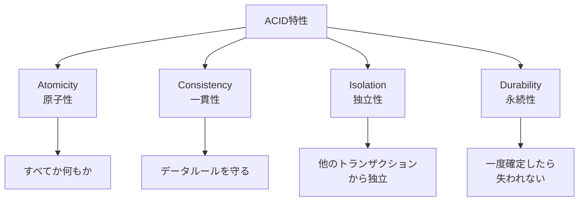
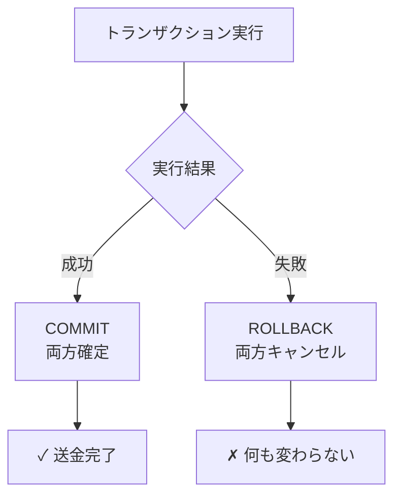
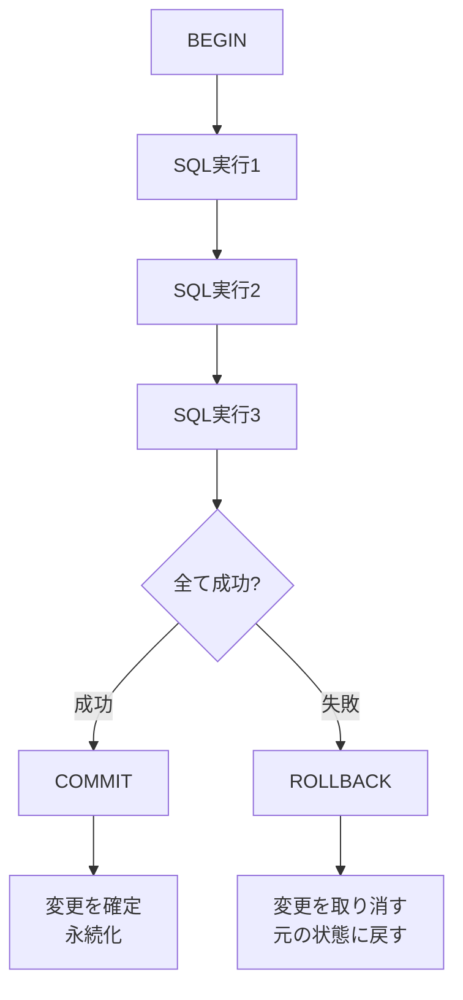

## トランザクションとは

**トランザクション**は、複数のデータベース操作を「1つの単位」として実行する仕組みです。銀行の送金を例にすると、この概念が明確になります。

### 例：銀行送金

太郎さんのアカウントから花子さんのアカウントへ1000円を送金する場合：

```
❌ トランザクションなし
1. 太郎のアカウントから1000円を引く ← ここで問題が発生
2. 花子のアカウントに1000円を加える ← 実行されない

結果：太郎は1000円失い、花子は受け取れない（大損害！）

✅ トランザクションあり
BEGIN TRANSACTION
1. 太郎のアカウントから1000円を引く
2. 花子のアカウントに1000円を加える
COMMIT（両方成功したら確定）
または
ROLLBACK（どちらか1つが失敗したら全部キャンセル）
```

## ACID特性

トランザクションが信頼できる理由は、**ACID特性** という4つの特性を保証しているからです：



### 1. 原子性（Atomicity）

**「すべてか何もか」の原則** です。トランザクション内のすべてのSQL文が成功するか、すべて失敗するかのいずれかです。

```sql
BEGIN;
UPDATE accounts SET balance = balance - 1000 WHERE account_id = 1;
UPDATE accounts SET balance = balance + 1000 WHERE account_id = 2;
COMMIT;  -- 両方成功したら確定
```



### 2. 一貫性（Consistency）

**データベースのルール（制約）が常に守られる** という特性です。

```sql
-- 制約の例
CREATE TABLE accounts (
    account_id INT PRIMARY KEY,
    name VARCHAR(100),
    balance INT CHECK (balance >= 0)  ← 残高は0以上
);

-- ❌ 一貫性を破る操作
UPDATE accounts SET balance = -1000 WHERE account_id = 1;
-- エラー：CHECK制約違反

-- ✅ トランザクションは失敗し、ロールバック
BEGIN;
UPDATE accounts SET balance = balance - 10000 WHERE account_id = 1;
UPDATE accounts SET balance = balance + 10000 WHERE account_id = 2;
COMMIT;  -- balance < 0になったら自動的にロールバック
```

### 3. 独立性（Isolation）

**同時に実行されている複数のトランザクションが互いに干渉しない** という特性です。

```
時間経過 →

User A:  BEGIN
         UPDATE accounts SET balance = balance - 1000


         COMMIT

User B:          BEGIN
                 SELECT * FROM accounts  ← 一部のデータ見えないか、見える


                 COMMIT

↓

User A と User B のトランザクションは独立している
```

#### 分離レベル（Isolation Level）

独立性のレベルは調整可能です：

| レベル               | 説明                                     | 速度    | 一貫性  |
| -------------------- | ---------------------------------------- | ------- | ------- |
| **READ UNCOMMITTED** | 他トランザクションの未確定データも見える | 🚀 最速 | ❌ 低   |
| **READ COMMITTED**   | 確定したデータのみ見える                 | 🟡 中速 | 🟡 中   |
| **REPEATABLE READ**  | 同じデータを何度読んでも同じ結果         | 🐢 遅い | 🟢 高   |
| **SERIALIZABLE**     | トランザクション完全分離                 | 🐌 最遅 | ✅ 最高 |

### 4. 永続性（Durability）

**一度COMMITされたデータは、障害が起きても失われない** という特性です。

```
時間経過 →

トランザクション 1
  BEGIN
  INSERT data
  COMMIT  ← ここでディスクに書き込み確定

     停電発生！💥

システム再起動後
  → データはそのまま存在（失われていない）
```

## トランザクション実行の流れ



### 実装例

```sql
-- 例：商品の販売と在庫の更新
BEGIN;

-- 1. 販売レコードを作成
INSERT INTO sales (product_id, quantity, sale_date)
VALUES (10, 5, NOW());

-- 2. 在庫を減らす
UPDATE products SET stock = stock - 5 WHERE product_id = 10;

-- 3. 在庫が0未満になっていないか確認
-- （自動的にチェック制約が確認される）

COMMIT;  -- 両方成功したら確定
-- または
ROLLBACK;  -- どちらか失敗したら全部キャンセル
```

## デッドロック

複数のトランザクションが互いにロックを待つ状況です：

```
時間経過 →

User A:  BEGIN
         UPDATE accounts SET balance = ... WHERE account_id = 1
         ロック：account_id = 1
                                  待機: account_id = 2のロック取得待ち

User B:               BEGIN
                      UPDATE accounts SET balance = ...
                      WHERE account_id = 2
                      ロック：account_id = 2
         待機: account_id = 2のロック取得待ち 💥 デッドロック！
                      待機: account_id = 1のロック取得待ち
```

### デッドロック回避策

```sql
-- ✅ アカウントIDの順序を統一
-- User A と User B が同じ順序でロック取得
BEGIN;
UPDATE accounts SET balance = ... WHERE account_id = 1;
UPDATE accounts SET balance = ... WHERE account_id = 2;
COMMIT;
```

## トランザクションのベストプラクティス

```
1. トランザクションは短く保つ
   ❌ BEGIN → 複雑な処理 → COMMIT
   ✅ BEGIN → 最小限の操作 → COMMIT

2. エラーハンドリング
   BEGIN
   実行
   IF エラー THEN
     ROLLBACK
   ELSE
     COMMIT
   END IF

3. ロック時間を最小化
   ❌ ユーザー入力待ち中にトランザクション開始
   ✅ ユーザー入力後にトランザクション開始

4. デッドロックを考慮
   → 複数テーブルは同じ順序でアクセス
```

## まとめ：ACID特性による信頼性

```
ACID特性がなかったら

銀行システム
 ↓
送金途中のデータ消失
 ↓
顧客がお金を失う（訴訟！）

ACID特性があるから

銀行システム
 ↓
安心して送金できる ✓
 ↓
信頼できるシステム
```

ACID特性により、データベースは **複雑で多くのユーザーが同時アクセスする環境でも、データの一貫性と安全性を保証** できます。これがリレーショナルデータベースが世界中で使われている大きな理由です。

次の章では、これらの知識を活かして、**実際のパフォーマンスチューニング戦略** を学びます。
