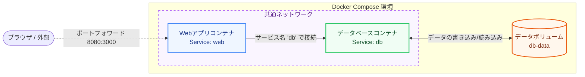

実際のWebシステム開発では、Webサーバー、アプリケーション（API）、データベースなど、複数のコンテナを協調させて動かすことがほとんどです。

これらを `docker run` コマンドで1つずつ立ち上げて接続するのは非常に大変です。そこで登場するのが、複数のコンテナをまとめて定義・管理できるツール **Docker Compose（ドッカーコンポーズ）** です。

第4章では、Docker Composeの使い方と、重要な概念である「ネットワーク」と「ボリューム」について解説します。

---

## 1. Docker Composeとは？

Docker Composeは、`docker-compose.yml` というYAMLファイルにコンテナの構成を記述し、1つのコマンドでまとめて起動・停止できるツールです。

*   **一発起動**: `docker compose up -d` で、設定されたすべてのコンテナが立ち上がります。
*   **一発停止**: `docker compose down` で、コンテナやネットワークを綺麗に一括削除できます。

---

## 2. 構成図（Webアプリ + DBの連携）

Docker Composeは、デフォルトでサービスごとに共通の仮想ネットワークを自動作成します。これにより、コンテナ同士の名前解決（サービス名でのアクセス）が可能になります。



---

## 3. `docker-compose.yml` の基本例

以下は、Node.jsのWebアプリとPostgreSQLデータベースを連携させる標準的な設定ファイルです。

```yaml:docker-compose.yml
version: '3.8'

services:
  # Webアプリケーションのコンテナ設定
  web:
    build: . # カレントディレクトリのDockerfileを使ってビルド
    ports:
      - "8080:3000" # ホストの8080番ポートをコンテナの3000番にマップ
    environment:
      - DB_HOST=db # データベースコンテナのサービス名（名前解決される）
      - DB_USER=postgres
      - DB_PASSWORD=secret_password
    depends_on:
      - db # dbサービスが起動した後にこのサービスを起動する

  # データベースのコンテナ設定
  db:
    image: postgres:15-alpine # 公式イメージを使用
    environment:
      - POSTGRES_PASSWORD=secret_password
    volumes:
      - db-data:/var/lib/postgresql/data # ボリュームをマウントしてデータを永続化
    ports:
      - "5432:5432"

# 永続化用のボリューム定義
volumes:
  db-data:
```

---

## 4. データの永続化（Volumes）の重要性

コンテナは基本的に **「使い捨て（エフェメラル）」** な設計になっています。コンテナを削除すると、その内部で作成されたファイルやデータベースのデータはすべて消えてしまいます。

データを永続化するためには、ホストPCのストレージ領域をコンテナにマウント（紐付け）する **Volumes（ボリューム）** という仕組みを利用します。

### マウントの種類

1.  **Named Volumes (名前付きボリューム)**（推奨）
    *   Dockerが管理する領域内に専用のストレージエリアを作成し、コンテナにマウントします。データベースのデータ保存などに最適です。
    *   例: `- db-data:/var/lib/postgresql/data`
2.  **Bind Mounts (バインドマウント)**
    *   ホストPC上の特定のフォルダ（例：自分のプロジェクトフォルダ）を直接コンテナ内にマウントします。開発中にソースコードを書き換えて、コンテナ内に即座に反映（ホットリロード）させたい場合に使われます。
    *   例: `- .:/app`

---

## 5. よく使うコマンド集

Docker Composeを使うときは、プロジェクトのルート（`docker-compose.yml` がある場所）でコマンドを実行します。

| コマンド | 役割 |
| :--- | :--- |
| `docker compose up -d` | 設定ファイルに基づいてコンテナをビルド・作成し、バックグラウンドで起動する |
| `docker compose down` | コンテナ、ネットワークを停止し、削除する（データボリュームは残る） |
| `docker compose ps` | 現在動いているサービスのコンテナ一覧を表示する |
| `docker compose logs -f` | コンテナの出力ログをリアルタイムで監視（フォロー）する |
| `docker compose exec [service] [cmd]` | 起動中のコンテナ内でコマンドを実行する（例: `docker compose exec db psql`） |

---

## まとめ

*   **Docker Compose** は、`docker-compose.yml` を使って複数コンテナの構成を一元管理するツール。
*   自動生成される **共通ネットワーク** により、コンテナ間でサービス名を使った通信ができる。
*   コンテナ削除でデータが消えないようにするため、**Volumes** を使用してデータを永続化する。

これで、Dockerの基本概念から複数コンテナの管理までの入門ロードマップは完了です！コンテナ技術を活用して、より快適な開発環境を構築していきましょう。
