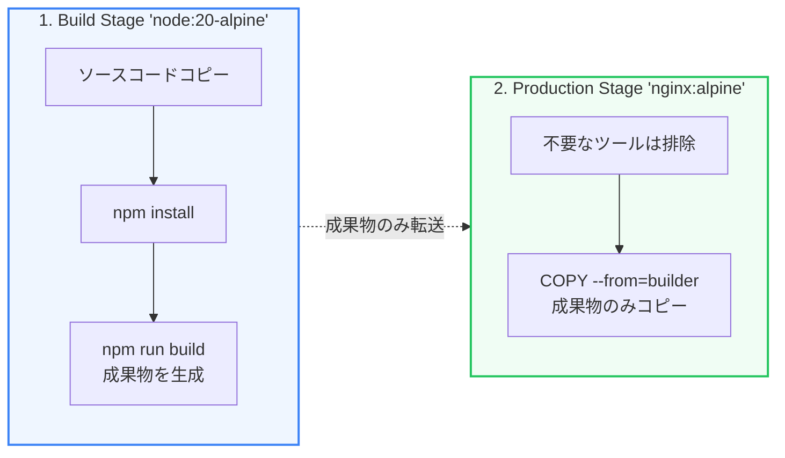

本番環境でDockerを利用するにあたり、作成したコンテナイメージの「サイズ」と「セキュリティ」は極めて重要な要素です。不要なファイルや開発用SDKがイメージに含まれていると、イメージの読み込み（プル）が遅くなるだけでなく、セキュリティホール（脆弱性）の温床になってしまいます。

第5章では、イメージの極小化と安全なコンテナ設計について学びます。

---

## 1. マルチステージビルド (Multi-stage Builds)

通常、プログラムのビルドにはコンパイラやパッケージマネージャーが必要ですが、実行時にはビルド済みの成果物（コンパイルされたバイナリや最小限の `dist` ファイル）だけがあれば十分です。

**マルチステージビルド**は、1つの `Dockerfile` 内で複数の `FROM` 命令を使用して、ビルド環境と実行環境を切り離す技術です。



### Dockerfileの実装例

以下は、ReactなどのSPAをビルドし、Nginxで配信するマルチステージビルドの例です。

```dockerfile:Dockerfile
# --- ステージ1: ビルド環境 ---
FROM node:20-alpine AS builder
WORKDIR /app
COPY package*.json ./
RUN npm ci
COPY . .
RUN npm run build  # /app/dist が生成される

# --- ステージ2: 実行環境 ---
FROM nginx:alpine
# 前のステージ (builder) からビルド成果物だけをコピー
COPY --from=builder /app/dist /usr/share/nginx/html
EXPOSE 80
CMD ["nginx", "-g", "daemon off;"]
```

このアプローチにより、本番用のコンテナイメージには `node` 本体や `node_modules` は一切含まれず、高速かつ超軽量な `nginx` イメージのみが出力されます。

---

## 2. ベースイメージの選定 (Alpine / Distroless)

コンテナイメージを軽量化・安全にするためのもう一つの鍵は、**ベースイメージの選定**です。

1. **Alpine Linux (`-alpine`)**:
   * 標準的なLinuxイメージ（Debian等）が数百MBあるのに対し、Alpineはわずか5MB程度です。軽量パッケージマネージャー（`apk`）を搭載しており、最も一般的です。
2. **Distroless (Google)**:
   * パッケージマネージャーやシェル（`/bin/sh` など）すら含まない、プログラム実行に必要最小限の依存ライブラリだけを含む超セキュアなイメージです。シェルがないため、コンテナ内に侵入された場合でも攻撃の手段をほとんど与えません。

---

## 3. 非ルート（Non-root）ユーザーでのコンテナ実行

デフォルトでは、コンテナ内のプロセスは `root` ユーザー権限で動作します。万が一、コンテナ内のアプリケーションに脆弱性があり乗っ取られた場合、ホストOS（物理サーバー）まで被害が及ぶ「コンテナエスケープ」のリスクが高まります。

安全のため、Dockerfile内で一般ユーザーを作成し、その権限で実行するように指定します。

```dockerfile:Dockerfile
FROM node:20-alpine
WORKDIR /app
COPY --from=builder /app/dist ./dist

# 一般ユーザー 'node' (Alpineノードイメージにプリセット済み) に切り替え
USER node

CMD ["node", "dist/index.js"]
```

非ルートユーザーで動作させることで、仮に侵入されたとしてもシステム全体の権限奪取を防ぐ強力なセキュリティ境界が形成されます。
