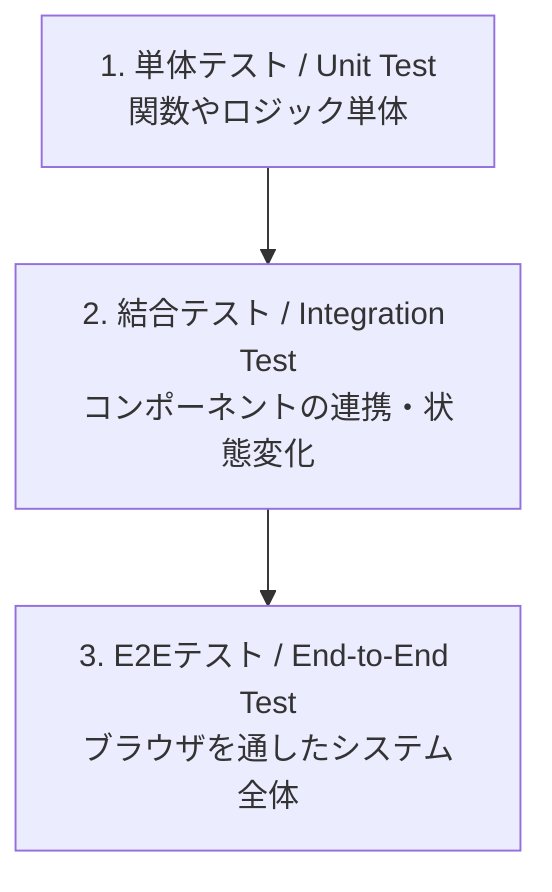
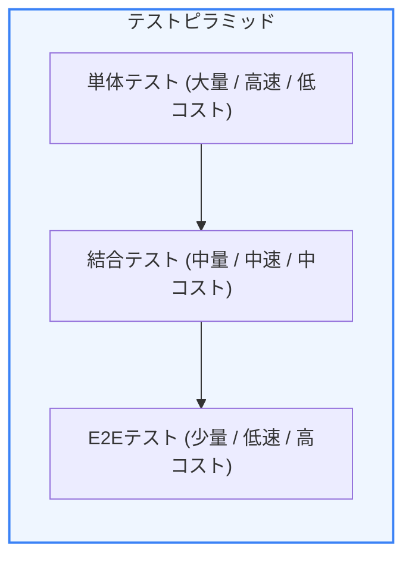
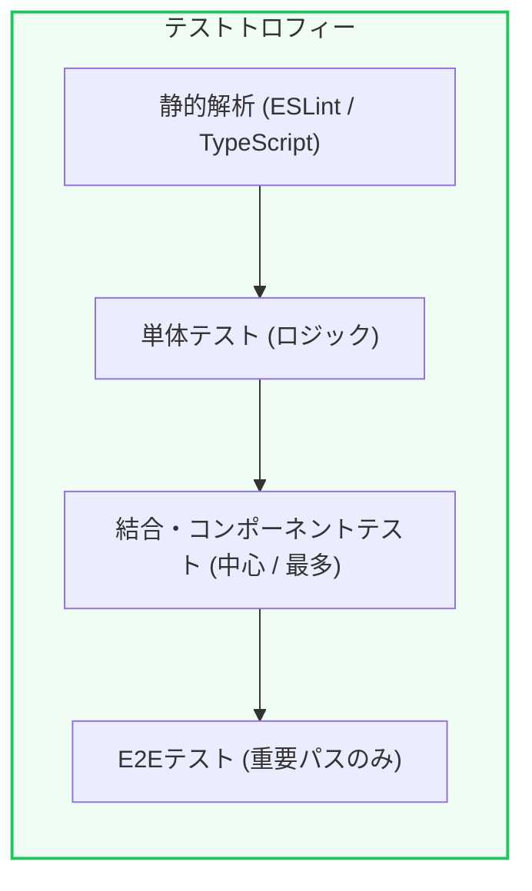

モダンなWebアプリケーション開発において、コードが正しく動くことを保証し、機能追加やリファクタリングを迅速に行うためには自動テストが欠かせません。フロントエンド開発でも、UIの複雑化や多様な状態変化に伴い、テストの重要性が高まっています。

第1章では、フロントエンドにおけるテストの重要性、主要な3つのテストレイヤー、そして効果的なテスト戦略のモデルである「テストピラミッド」と「テストトロフィー」について学びます。

---

## 1. なぜフロントエンドでテストが必要なのか？

「コードを書いて、ブラウザで動作確認すれば十分ではないか？」と考えるかもしれません。しかし、手動の動作確認にはいくつかの限界があります：

* **リグレッション（デグレード）の検知漏れ**：ある箇所を修正した結果、全く関係のない別のページや機能が壊れてしまう問題。手動で全ページを毎回チェックするのは不可能です。
* **リファクタリングへの恐怖**：コードをきれいに整理したいが、「動いているものを壊したくない」ために改善を躊躇してしまう。
* **動作仕様のドキュメント化**：「テストコード」は常に最新の状態で動く仕様書（ドキュメント）として機能します。

自動テストが整備されていると、コマンドを1つ実行するだけで数秒から数分で全体の健康状態が確認できるため、開発の生産性が劇的に向上します。

---

## 2. フロントエンドテストの3つのレイヤー

フロントエンドにおけるテストは、主に以下の3つの異なるレベルに分かれています。

### 2-1. 単体テスト (Unit Test)
ユーティリティ関数や独立した計算ロジック、カスタムフック単体を検証します。外部へのアクセス（APIなど）はすべてダミー（モック）に置き換えます。
* **例**: 日付フォーマット関数、フォームバリデーションロジックの検証

### 2-2. 結合テスト (Integration Test)
複数のコンポーネントが組み合わさった時の挙動や、ユーザーの入力（クリックや文字入力）に対するDOMの更新を検証します。
* **例**: カートへの追加ボタンを押したときに、カート内のアイテム数が「1」増え、合計金額が正しく計算されるかの検証

### 2-3. E2E テスト (End-to-End Test)
実際のブラウザをバックグラウンドで起動し、データベースや本物のAPIサーバーと接続して、ユーザーが実際に操作するのと同様の挙動（ログイン、決済など）を検証します。
* **例**: ログイン画面で正しい情報を入力し、ダッシュボードへ遷移してデータが表示される一連の流れの検証

---

## 3. テストピラミッドとテストトロフィー

テストをどのように組み合わせるべきかについては、2つの代表的な設計思想があります。

### 3-1. テストピラミッド (Testing Pyramid)
古くからソフトウェアテストで提唱されているモデルで、**「実行速度が早くコストの低い単体テストを土台として最も多く書き、実行が遅く高コストなE2Eテストは少なく抑える」** という構成です。

### 3-2. テストトロフィー (Testing Trophy)
フロントエンドの権威 Kent C. Dodds 氏などが提唱する、モダンフロントエンドにより適したモデルです。
フロントエンドはUIコンポーネントの集合体であり、単体でロジックをテストするよりも、**「コンポーネントの組み合わせ（結合テスト）を最も手厚くテストするべき」** という考え方です。

### コストと信頼性のトレードオフ

テストレベルごとの性質は以下のように対照的です：

| テストの種類 | 実行スピード | 壊れにくさ（保守性） | 本物らしさ（信頼性） | コスト |
| :--- | :--- | :--- | :--- | :--- |
| **単体テスト** | 🚀 1ミリ秒未満 | 🟢 高（影響範囲が狭い） | 🔴 低（ブラウザの挙動とは異なる） | 💸 安い |
| **結合テスト** | 🟡 数十ミリ秒 | 🟢 高（詳細の実装変更に強い）| 🟡 中（DOMを模倣して実行） | 💸 中程度 |
| **E2Eテスト** | 🐌 数秒〜数十秒 | 🔴 低（ネットワークや実行環境で崩れやすい）| 🟢 最高（本物のブラウザと本物の環境） | 💸 高い |

---

## 4. フロントエンドでのテスト戦略の立て方

効果的なテストスイートを構築するための戦略は以下の通りです：

1. **静的チェックの徹底**
   * TypeScript の型チェックや ESLint、Prettier を活用し、構文エラーや型不整合といった最も単純なバグをコードを書いている段階で自動排除します（トロフィーの土台）。
2. **結合テスト（コンポーネントテスト）を主軸にする**
   * UIパーツが意図通りに相互作用するかどうかを、Vitest や React Testing Library などのツールで最も多く記述します。これにより、コードの内部設計（リファクタリング）を変えてもテストが壊れず、ユーザーから見た挙動が変わらない限りテストが通り続けます。
3. **極めて重要なユーザー体験のみをE2Eテストで保護する**
   * 「ログイン」「新規登録」「チェックアウト（決済）」といった、ビジネス上絶対に失敗してはならないコアルートのみを Playwright などでカバーします。

---

## まとめ

* **手動確認から自動テストへの移行**が、デグレードを防ぎチームの生産性を最大化するための鍵。
* フロントエンド開発では、ロジックのみの単体テストに偏りすぎず、UIとイベントハンドリングを検証する **「結合テスト（コンポーネントテスト）」を最も重視する（テストトロフィーモデル）**。
* プロダクトの重要パス（決済やログイン）は、信頼性の高い **E2Eテスト** でカバーする。

次のチャプターでは、テストトロフィーの中心である **Vitest と React Testing Library を使用したコンポーネントテストの書き方** を具体的に学びます！
