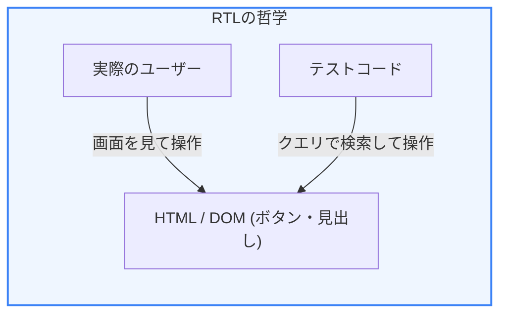
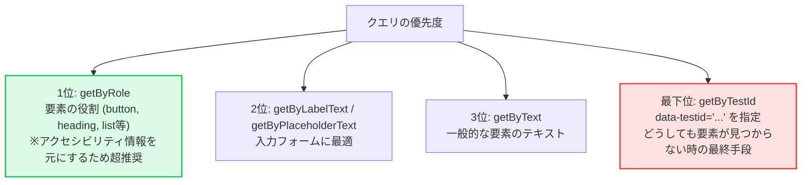

前章で学んだ「テストトロフィー」モデルにおいて、最も重要とされるのが **コンポーネント結合テスト** です。Reactにおけるデファクトスタンダードである **Vitest** と **React Testing Library (RTL)** を用いることで、ユーザーに近い視点でUIの振る舞いを検証できます。

第2章では、これらのツールを使った具体的なテストの書き方と、アクセシビリティを意識した要素の検索方法について学びます。

---

## 1. ツールスタックの紹介

### 1-1. Vitest とは？
Vite をベースにした次世代の非常に高速なテストランナーです。従来の Jest と互換性のある API を持ちつつ、ESモジュールや TypeScript を標準でサポートし、Vite のビルド設定と連動するためモダンフロントエンド開発で圧倒的な人気を博しています。

### 1-2. React Testing Library (RTL)
「ソフトウェアがユーザーによってどのように使用されるか（振る舞い）」をテストすることに焦点を当てたライブラリです。

* **従来のテスト（Enzymeなど）**: `state` やコンポーネントの内部構造（実装詳細）をテストするため、コードを書き直すとテストが崩れやすかった。
* **React Testing Library**: HTMLとして出力されたDOM構造やアクセシビリティ情報をテストするため、リファクタリングに極めて強い。



「**実装の詳細ではなく、ユーザーが見るものと操作するものに基づいてテストする**」ことが重要です。

---

## 2. 初めてのコンポーネントテスト：Counterコンポーネント

シンプルな「カウントアップボタン」を例に、テストの実装方法を見ていきます。

### 対象コンポーネント

```tsx:Counter.tsx
import { useState } from 'react';

export function Counter() {
  const [count, setCount] = useState(0);
  return (
    <div>
      <p>カウント: {count}</p>
      <button onClick={() => setCount((c) => c + 1)}>増加</button>
    </div>
  );
}
```

### テストコード

```tsx:Counter.test.tsx
import { render, screen } from '@testing-library/react';
import userEvent from '@testing-library/user-event';
import { Counter } from './Counter';

describe('Counter Component', () => {
  test('初期状態でカウントが0であり、ボタンを押すと1増える', async () => {
    // 1. コンポーネントを仮想DOMにレンダリングする
    render(<Counter />);

    // 2. 画面上の初期表示をアサーション（確認）する
    expect(screen.getByText('カウント: 0')).toBeInTheDocument();

    // 3. 画面上の「ボタン」を取得する（roleを指定）
    const button = screen.getByRole('button', { name: '増加' });

    // 4. ユーザー操作（クリック）をシミュレートする
    await userEvent.click(button);

    // 5. クリック後の表示が正しく更新されたか確認する
    expect(screen.getByText('カウント: 1')).toBeInTheDocument();
  });
});
```

---

## 3. 適切な要素の取得方法（Query Priority）

RTLで要素を見つけるためのクエリには優先順位があります。これは、テストをアクセシブルなものにし、ユーザーに近い方法でテストするためです。



### クエリの使い分け例：

```html
<!-- ❌ getByText('ボタン') で探すより -->
<!-- ❌ getByTestId('submit-btn') で探すより -->
<!-- ✅ getByRole('button', { name: '保存' }) で探す方が圧倒的に良い -->
<button data-testid="submit-btn">保存</button>
```

`getByRole` を使うことで、「画面上に正しくボタンがレンダリングされており、スクリーンリーダーなどの補助技術でも検知可能であるか」を同時に検証することができます。

---

## 4. 非同期処理とAPI通信のテスト

コンポーネントがAPIからデータをフェッチして後から描画される場合、同期的な `getByText` では要素がまだ存在しないためエラーになります。この場合は `findBy...` や `waitFor` を使用します。

### 非同期コンポーネント

```tsx:UserList.tsx
import { useEffect, useState } from 'react';

export function UserList() {
  const [users, setUsers] = useState<string[]>([]);

  useEffect(() => {
    // 仮想のAPI通信を100ms後に模倣
    setTimeout(() => {
      setUsers(['太郎', '花子']);
    }, 100);
  }, []);

  if (users.length === 0) return <div>読み込み中...</div>;

  return (
    <ul>
      {users.map((user) => <li key={user}>{user}</li>)}
    </ul>
  );
}
```

### 非同期テストの書き方

```tsx:UserList.test.tsx
import { render, screen } from '@testing-library/react';
import { UserList } from './UserList';

test('APIロード後にユーザーリストが表示される', async () => {
  render(<UserList />);

  // 初期段階ではローディングが表示されていることを確認
  expect(screen.getByText('読み込み中...')).toBeInTheDocument();

  // findByは、要素が出現するまで（デフォルトで最大1秒000ms）待つ非同期クエリ
  const firstUser = await screen.findByText('太郎');
  expect(firstUser).toBeInTheDocument();

  // リスト項目が正しく表示されているか確認
  expect(screen.getByText('花子')).toBeInTheDocument();
  // ローディングが非表示になったか確認
  expect(screen.queryByText('読み込み中...')).not.toBeInTheDocument();
});
```

---

## まとめ

* **`Vitest`**：Vite統合の極めて高速なテスト実行エンジン。
* **`React Testing Library (RTL)`**：「ユーザーのようにテストする」ためのライブラリ。内部実装の書き換えに強く、リファクタリングが楽になる。
* **`getByRole` を最優先で使う**：アクセシビリティを保証し、画面の要素を安全に取得するためのベストプラクティス。
* **非同期要素には `findBy...` や `waitFor` を使う**：ローディングやAPIのフェッチ後の結果をテストする際は、待機処理が必要。

次のチャプターでは、より広範囲で実際のシステム全体の動作を確認する **Playwright を用いた E2E テスト** について学びます！
