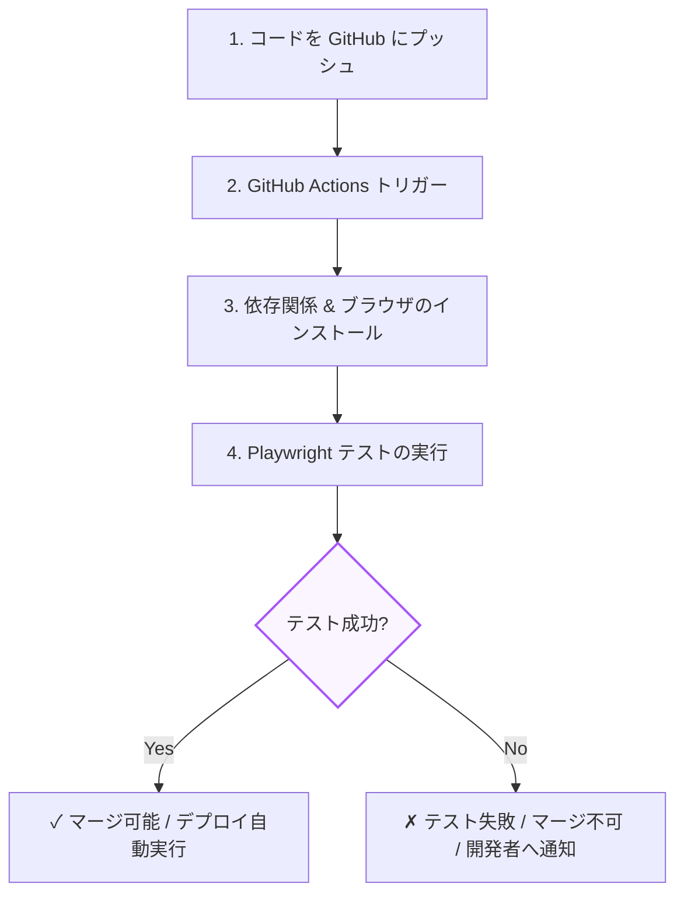

前章までで、ロジックの単体テストやコンポーネントテストについて学びました。しかし、コンポーネントが単体で動作していても、「ブラウザ全体でのルーティングが崩れている」「本物のAPIサーバーとの連携が切れている」といったシステム全体での致命的な欠陥は防ぎきれません。

これを防ぐのが、本物のブラウザ環境でシナリオテストを実行する **E2E（End-to-End）テスト** です。
第3章では、モダンE2Eテストツールである **Playwright** の基本操作と、継続的インテグレーション（CI）パイプラインとの連携について学びます。

---

## 1. Playwright とは？

Playwright は Microsoft が開発する、モダンWebアプリケーション向けの高速かつ信頼性の高いE2Eテストフレームワークです。

* **マルチブラウザ対応**：Chromium (Chrome/Edge), WebKit (Safari), Firefox の3大ブラウザエンジンをネイティブサポートし、並列でテストを実行できます。
* **自動待機 (Auto-waiting)**：クリックや入力を実行する前に、要素が画面に表示され、クリック可能になるのを自動的に待機します。これにより、「テストが時々落ちる（Flaky Test）」というE2Eテスト最大の課題を解決します。
* **強力なデバッグツール**：テスト実行過程をビデオや画像、ネットワークログとして保存する Trace Viewer などの便利な機能が標準装備されています。

---

## 2. Playwright テストの書き方

以下は、ログイン画面を開いてユーザー名とパスワードを入力し、ログイン成功後にマイページに遷移できているかを検証する典型的なE2Eテストコードです。

```typescript:login.spec.ts
import { test, expect } from '@playwright/test';

test.describe('ログインフローの検証', () => {
  test('正しい資格情報を入力するとログインし、ダッシュボードへ遷移する', async ({ page }) => {
    // 1. ログインページへ遷移
    await page.goto('https://example.com/login');

    // 2. ユーザー名とパスワードを入力
    // Playwrightのロケーターはアクセシビリティラベルやプレースホルダーを優先します
    await page.getByPlaceholder('ユーザー名を入力').fill('test_user');
    await page.getByPlaceholder('パスワードを入力').fill('secret_pass');

    // 3. ログインボタンをクリック
    // 自動待機機能があるため、ボタンが読み込まれ有効になるまで自動で待ちます
    await page.getByRole('button', { name: 'ログイン' }).click();

    // 4. 遷移先URLのアサーション
    await expect(page).toHaveURL('https://example.com/dashboard');

    // 5. ダッシュボード上の歓迎テキストを確認
    const welcomeText = page.getByRole('heading', { name: 'ようこそ、test_userさん' });
    await expect(welcomeText).toBeVisible();
  });
});
```

---

## 3. Playwright のコア機能

### 3-1. ロケーター（Locator）とアサーション
Playwright は、操作対象の要素を定義する `Locator` オブジェクトを介して操作を行います。アサーションは `expect(locator).toHaveText()` などの形で記述します。

```typescript
// テキスト入力のロケーターを作成（この時点ではDOMアクセスは発生しない）
const input = page.getByLabel('メールアドレス');

// 操作を実行（ここで初めてDOMから要素を探し、自動待機した上で実行する）
await input.fill('user@example.com');
```

### 3-2. 自動待機（Auto-waiting）
Playwright は、操作（`click`, `fill`, `check` など）を実行する直前に、対象の要素に対して以下の条件を自動的にチェックし、満たすまで（デフォルト最大30秒）待機します。

* 要素が DOM に存在しているか
* 画面に表示されているか（CSSで非表示になっていないか）
* アニメーションが停止しているか
* 他の要素に遮られていないか
* 有効状態（Disabledでない）か

これにより、`page.waitForTimeout(3000)` のような「不安定なスリープ処理」を書く必要が一切なくなります。

---

## 4. GitHub Actions による CI パイプライン連携

作成したテストコードは、ローカル環境だけで動かすのではなく、**「コードが GitHub にプッシュされたとき」** や **「プルリクエストが作成されたとき」** にクラウド上で自動実行させることで最大の効果を発揮します。

以下は、GitHub Actions を使用して、コード変更の度に Playwright のテストを走らせ、失敗した場合はマージできないように保護するためのCIワークフロー定義です。



### ワークフロー設定例

```yaml:.github/workflows/playwright.yml
name: Playwright Tests
on:
  push:
    branches: [ main, master ]
  pull_request:
    branches: [ main, master ]
jobs:
  test:
    timeout-minutes: 60
    runs-on: ubuntu-latest
    steps:
    - uses: actions/checkout@v4
    
    - uses: actions/setup-node@v4
      with:
        node-version: 20
        cache: 'npm'

    - name: Install dependencies
      run: npm ci

    - name: Install Playwright Browsers
      run: npx playwright install --with-deps

    - name: Run Playwright tests
      run: npx playwright test

    - uses: actions/upload-artifact@v4
      if: ${{ !cancelled() }}
      with:
        name: playwright-report
        path: playwright-report/
        retention-days: 30
```

---

## まとめ

* **E2Eテスト** は、本物のブラウザを用いてアプリ全体の連携を検証する、最上位の品質保証手段。
* **Playwright** は、マルチブラウザ対応や自動待機（Auto-waiting）により、高い開発効率と安定したテスト環境を提供する。
* テストを **GitHub Actions 等の CI/CD に組み込む** ことで、破壊的なバグが本番環境（ユーザー）に届くのを未然に防ぎ、リファクタリングを継続して行える環境を整える。

これで「Webフロントエンドテスト入門」コースの全チャプターは完了です！
静的チェック（TypeScript, ESLint）、結合テスト（Vitest & RTL）、そしてE2Eテスト（Playwright）の3本柱を適切に組み合わせ、バグのない強固なフロントエンドアプリケーションを構築していきましょう。
