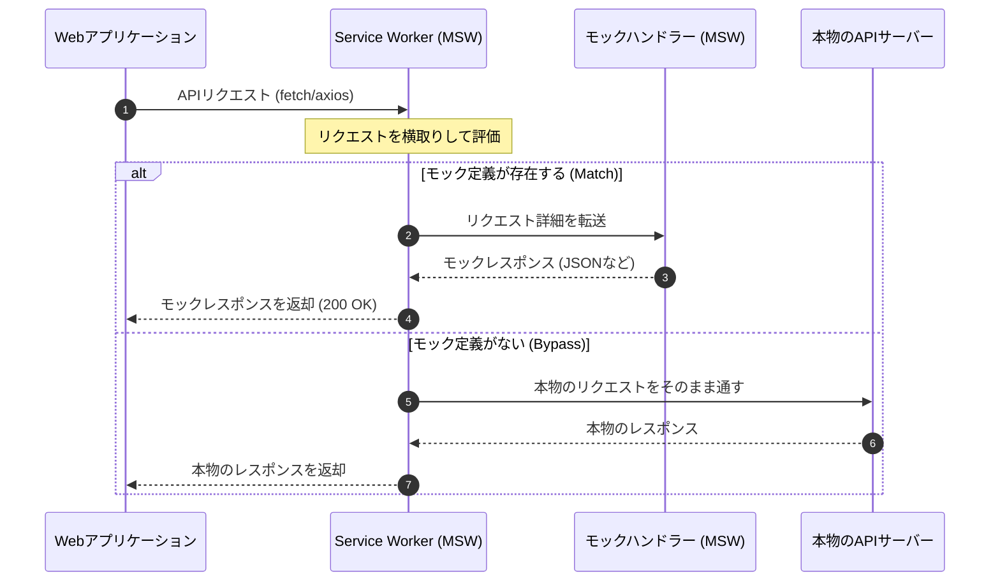

コンポーネントテストやE2Eテストを実行する際、本番や開発用のAPIサーバーに直接依存すると、「通信速度の低下」「データの変更によるテストの不安定化（フラッキーテスト）」「サーバー停止時のテスト失敗」などの問題が発生します。

また、UIの見た目の正確性（レイアウト崩れやCSSの適用漏れ）を通常のコードベースのテスト（`expect(...).toBeVisible()` など）だけで網羅するのは極めて困難です。

第4章では、これらの問題を解決する **MSW (Mock Service Worker)** によるAPIモックと、視覚的バグを自動検知する **VRT (Visual Regression Testing)** の仕組みを学びます。

---

## 1. MSW (Mock Service Worker) によるAPIモック

従来のテストモック（`jest.mock` や `global.fetch = jest.fn()` など）は、JavaScript実行環境内の関数やグローバルオブジェクトを書き換える「モンキーパッチ」と呼ばれる手法でした。

これに対して **MSW** は、ブラウザの標準機能である **Service Worker** を使用して、**ネットワークの物理層レベルでHTTPリクエストをインターセプト（横取り）** します。

### MSWの動作フロー



### MSWのメリット
*   **コードの変更が不要**: アプリケーションコード内のAPIリクエスト送信処理を一切モック用に変更することなく、テストやローカル開発を実行できます。
*   **モック定義の共通化**: テスト（Node.js環境）とローカル開発環境（ブラウザ環境）で、同一のモックコードを再利用できます。
*   **例外のシミュレーションが容易**: 500サーバーエラー、ネットワーク切断、タイムアウトなどの異常系テストが簡単に書けます。

### モックハンドラーの実装例
```typescript:src/mocks/handlers.ts
import { http, HttpResponse } from 'msw';

export const handlers = [
  // GET /api/users に対するモック定義
  http.get('/api/users', () => {
    return HttpResponse.json([
      { id: 1, name: 'Alice' },
      { id: 2, name: 'Bob' }
    ]);
  }),

  // エラー系の検証用モック
  http.get('/api/users/error', () => {
    return new HttpResponse(null, {
      status: 500,
      statusText: 'Internal Server Error',
    });
  })
];
```

---

## 2. VRT (Visual Regression Testing / ビジュアル回帰テスト)

コードに変更を加えた際、DOMの構造自体は変わらなくても、**「マージンがズレた」「色が意図せず変更された」「モバイル幅で文字が重なって読めなくなった」** といった表示の崩れ（デグレーション）が発生することがあります。

これを防ぐのが **VRT (ビジュアル回帰テスト)** です。

### VRTの仕組み
1.  **基準画像の作成 (Golden Image / Baseline)**: バグがない状態のコンポーネントまたはページのスクリーンショットを撮影し、Gitなどにコミットしておきます。
2.  **比較画像の撮影 (Target Image)**: コード修正後のテスト実行時に、同じ画面のスクリーンショットを再び撮影します。
3.  **ピクセル差分（Diff）の検出**: 特殊なライブラリを用いて2つの画像をピクセル単位で重ね合わせ、変更箇所をハイライト（通常はマゼンタや赤で色付け）した差分画像を生成します。差分が許容値（スレッショルド）を超えるとテストが失敗します。

```text
  [ 基準画像 ]    v.s.   [ 変更後画像 ]
 (ボタンが青色)         (ボタンが緑色)
        \                  /
         [ 差分画像 (Diff) ]
     (ボタン位置が赤くハイライト) -> テスト失敗！
```

### VRT のワークフローとツール

VRTは、単体でスクリプトを書くよりも、既存のフロントエンドエコシステムと統合して運用するのが一般的です。

#### Playwright を使ったVRTの例
ブラウザテストツール Playwright には、標準でスクリーンショットのピクセル比較機能が備わっています。

```typescript:tests/vrt.spec.ts
import { test, expect } from '@playwright/test';

test('ホームページのビジュアルテスト', async ({ page }) => {
  await page.goto('/');
  // 初回実行時は基準画像が作成され、2回目以降は比較が行われます
  await expect(page).toHaveScreenshot('homepage.png', {
    maxDiffPixels: 100, // 許容する最大差分ピクセル数
  });
});
```

#### Storybook × Reg-suit (または Chromatic)
コンポーネントカタログである **Storybook** の各ストーリー（コンポーネント単体の表示パターン）を巡回してスクリーンショットを自動撮影し、OSSツールの **reg-suit** や、Storybook公式のマネージドサービス **Chromatic** などを用いてCI上でビジュアルテストを実行する手法が、現在の大規模Web開発で広く採用されています。

> [!TIP]
> **フォントや日付のゆらぎ対策**
> VRTを導入すると、フォントレンダリングの微妙なOS差（MacとLinux CIなど）や、動的に変化するシステム日時（`2026-06-22` など）の表示によってテストが失敗（偽陽性）しやすくなります。
> これを防ぐために、**「日付を固定モックにする」「CSSでカーソル点滅を停止する」「Playwrightの `mask` オプションで動的エリアを黒塗りにする」** などのノウハウが必要です。

---

## まとめ

*   **MSW** は、Service Worker を用いることで、テストコードにモンキーパッチを当てることなく、ネットワークレベルでAPIをモック化する。
*   MSWのモック定義は、Vitestなどのユニットテスト、PlaywrightなどのE2Eテスト、さらにはローカル開発用の環境まで幅広く共通利用できる。
*   **VRT (ビジュアル回帰テスト)** は、修正前後でページやコンポーネントのスクリーンショットをピクセル単位で比較し、レイアウト崩れを自動的に検知する。
*   Playwright や Storybook (reg-suit / Chromatic) と組み合わせることで、開発効率と視覚的品質保証を劇的に向上できる。
