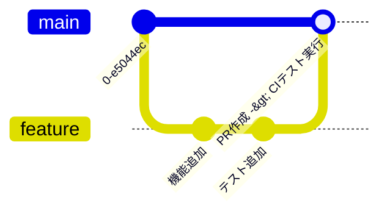
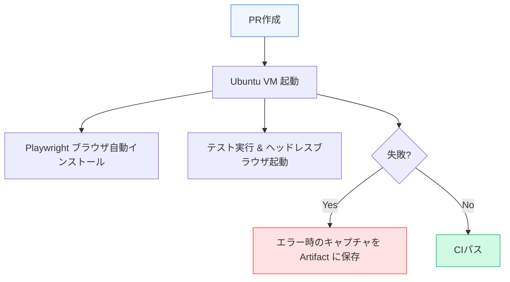

テストを書くだけでは十分ではありません。テストが「開発プロセスの一部」として機能し、壊れたコードが本番環境へデプロイされるのを未然に防ぐ仕組みが必要です。

第5章では、GitHub ActionsなどのCIツールを使い、プルリクエストの作成時に自動でフロントエンドテストを実行する環境づくりについて学びます。

---

## 1. 継続的インテグレーション (CI) とは？

継続的インテグレーション（CI）とは、開発者がコードの変更を共有リポジトリに頻繁に統合し、その都度 **「自動ビルド」と「自動テスト」** を実行してエラーを早期に発見するプラクティスです。



フロントエンド開発において、CIパイプラインの主な目的は以下の通りです。
1.  コードがTypeScriptの型検査をパスするか確認する
2.  ESLint/Prettierなどによる静的チェックやフォーマットを検証する
3.  Unitテスト・E2Eテストがすべて正常に動作するか確認する

---

## 2. GitHub Actions による基本的なワークフロー

GitHub Actions を利用すると、`.github/workflows/test.yml` という定義ファイルを置くだけで簡単にテストを自動化できます。

```yaml:test.yml
name: Frontend Testing CI

on:
  push:
    branches: [ main ]
  pull_request:
    branches: [ main ]

jobs:
  test:
    runs-on: ubuntu-latest
    steps:
      - name: Checkout repository
        uses: actions/checkout@v4

      - name: Setup Node.js
        uses: actions/setup-node@v4
        with:
          node-version: '20'
          cache: 'npm'

      - name: Install dependencies
        run: npm ci

      - name: Run lint and typecheck
        run: |
          npm run lint
          npm run type-check

      - name: Run unit tests
        run: npm run test:unit
```

### 高速化のためのポイント
*   **`npm ci` の使用**: `npm install` より高速で、`package-lock.json` と完全に一致する依存関係を厳格にインストールします。
*   **依存関係のキャッシュ (`cache: 'npm'`)**: `node_modules` の生成元であるキャッシュを再利用することで、セットアップ時間を数十秒から数分短縮できます。

---

## 3. CIでのE2Eテストとスクリーンショットの管理

PlaywrightなどのE2EテストをCI上で動かす場合、ブラウザを実行するための重い環境が必要になります。



E2Eテストが失敗した際、**ブラウザのスクリーンショットや動画、トレースビューアーデータ（Trace Archive）をアーティファクトとして保存・アップロードする設定** を行うことで、ローカル環境との差異（フォントの違い、画面サイズ、読み込みラグなど）によるデバッグを容易にします。

---

## まとめ

*   **継続的インテグレーション (CI)** により、プルリクエスト単位で型検査や単体・統合テストを強制し、バグの混入を極限まで減らせる。
*   GitHub Actions などの環境で **キャッシュ戦略** や並列テストを取り入れることで、CIのフィードバックループを高速化できる。
*   E2EテストのCI実行時は、失敗時の **スクリーンショット・動画の保存設定** がトラブルシューティングで決定的に重要となる。
