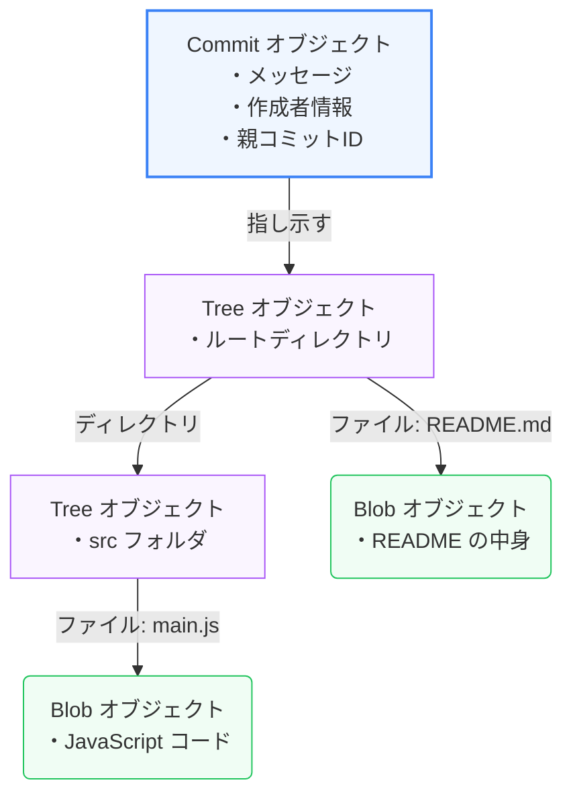

普段私たちが `git add` や `git commit` を実行するとき、裏側で何が起きているでしょうか？
Gitは単なる「ファイルの差分を記録するツール」ではありません。その正体は、高度に最適化された **「コンテンツアドレス可能なファイルシステム（キーバリューストア）」** です。

第1章では、`.git` ディレクトリの構造と、Gitデータを構成する「4つの基本オブジェクト」について学びます。

---

## 1. コンテンツアドレス可能とは？

Gitにファイルや履歴を保存すると、その内容はすべて暗号学的ハッシュ関数（主に **SHA-1**。最近はSHA-256への移行も進行中）によって **「40文字の16進数ハッシュ値」** に変換されます。

ハッシュ値はデータの内容から一意に決定されるため、Gitはデータを「ファイルパス」ではなく **「ハッシュ値（コンテンツ）」をキーにして管理** します。これが「コンテンツアドレス可能」と呼ばれる理由です。

> [!TIP]
> **ハッシュの一意性のメリット**
> ファイルの内容が1文字でも変わればハッシュ値は完全に異なるものになります。逆に、ファイル名が違っても中身が全く同じであれば、Gitの内部では同じハッシュ値（同一のデータ実体）として扱われ、ディスク容量を節約できます。

---

## 2. Gitの4つの基本オブジェクト

Gitの内部データベース（`.git/objects/`）に保存されるオブジェクトは、以下の4つのタイプしかありません。

### ① Blob (Binary Large Object)
ファイルの内容（データ）そのものを保存するオブジェクトです。
*   **特徴**: **ファイル名やディレクトリ構造、パーミッション情報などは一切含みません。** 純粋な「ファイルの中身のテキストやバイナリ」のみが圧縮されて保存されます。

### ② Tree
ファイルシステムにおける「ディレクトリ（フォルダ）」に対応するオブジェクトです。
*   **特徴**: ディレクトリ配下にあるファイル名、パーミッション、およびそれに対応する **Blobのハッシュ値** または **別のTreeのハッシュ値** のリストを保持します。これによって、ファイルシステム全体の階層構造が再現されます。

### ③ Commit
リポジトリの「ある時点の状態（スナップショット）」を表現するオブジェクトです。
*   **特徴**:
    *   その時点のプロジェクトのルートディレクトリを表す **Treeオブジェクトのハッシュ値**
    *   直前のコミットを示す **親（Parent）コミットオブジェクトのハッシュ値**（最初のコミットには親がありません。マージコミットには複数の親があります）
    *   作成者（Author）とコミッター（Committer）の名前、メールアドレス、日時
    *   コミットメッセージ

### ④ Tag (Annotated Tag)
特定のコミットに固定の目印を付けるためのオブジェクトです。
*   **特徴**: 指し示す先のコミットハッシュ、タグ名、タグ作成者、作成日時、およびタグメッセージを含みます（※ `git tag -a` で作成される「注釈付きタグ」のみがオブジェクトとして作成されます。署名のない軽量タグは、単なる参照ファイルです）。

---

## 3. `.git` の中をのぞいてみる

Gitリポジトリを初期化すると、プロジェクトルートに `.git/` という隠しディレクトリが作られます。

*   **`HEAD`**: 現在チェックアウトしているブランチ（またはコミット）を指すファイル。通常は `ref: refs/heads/main` のように記述されています。
*   **`refs/`**: ブランチ（`refs/heads/`）やタグ（`refs/tags/`）の情報を格納するディレクトリ。中身は単純なテキストファイルで、コミットオブジェクトのハッシュ値が1行だけ書かれています。つまり、**ブランチとは「特定のコミットハッシュが書かれたテキストファイル」に過ぎず、きわめて軽量** です。
*   **`objects/`**: 上記で紹介した4つの基本オブジェクトが格納されるデータベース。ハッシュ値の最初の2文字がフォルダ名になり、残りの38文字がファイル名になります。

---

## まとめ

*   Gitは、データを内容に応じたハッシュ値で管理する **コンテンツアドレス可能** なシステムである。
*   Gitオブジェクトは、中身を保持する **Blob**、名前と構成を保持する **Tree**、履歴を繋ぐ **Commit**、目印となる **Tag** の4つだけ。
*   ブランチは特定のコミットを指し示す「単なるポインタ（テキストファイル）」であるため、作成や削除が極めて高速に行える。
