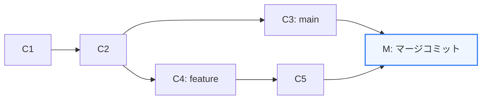
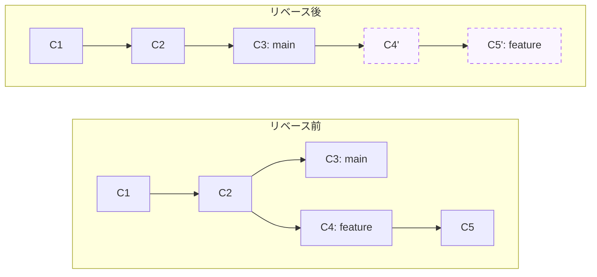

チーム開発を進める中で、複数の開発者が異なるブランチで作業し、それらを最終的に統合する必要があります。統合の手法として代表的なのが **「Merge（マージ）」** と **「Rebase（リベース）」** です。

第2章では、これら2つの統合アプローチの内部的な違い、コンフリクト（衝突）が発生するメカニズム、および競合をスムーズに解消するための基礎知識を学びます。

---

## 1. Merge と Rebase の本質的な違い

マージもリベースも「別々のブランチでの開発成果を統合する」目的は同じですが、履歴の作り方が大きく異なります。

### ① Merge (マージ)
2つの異なるブランチの最新コミットを組み合わせ、新しい **「マージコミット（マージノード）」** を作成して結合します。



*   **メリット**: 歴史的事実がそのまま残ります。どのブランチでいつ誰が作業し、どのタイミングで合流したかが完璧に記録されます。
*   **デメリット**: チーム規模が大きくなると、マージコミットが乱立し、コミットグラフが複雑に交差して見づらくなります（スパゲッティ履歴）。

### ② Rebase (リベース)
ブランチの分岐点（ベース）を、ターゲットとなるブランチの最新コミットへ **「付け替える（Re-base）」** 操作です。



*   **内部の動き**: 分岐点（C2）から先で作られた `feature` ブランチのコミット（C4, C5）を一時的にパッチとして退避させ、`main` ブランチの先端（C3）を新しい土台として、退避させたコミットを **1つずつ順番に適用（再作成）** します。
*   **メリット**: コミット履歴が完全に一本の直線（一本道）になり、ログの追跡やコードレビューが非常にスムーズになります。
*   **デメリット**: コミットを再作成するため、**コミットハッシュ値が変化** します。既に共有リモートリポジトリにプッシュした公開ブランチでリベースを行うと、他の開発者の履歴と整合しなくなるため、**「共有ブランチでのリベースは厳禁」** という大原則があります。

---

## 2. 3-way merge（3方向マージ）の仕組み

Gitがコンフリクトを検出したり、自動でマージを行ったりする際、単に2つのファイルを比べるのではなく、**「3-way merge（3方向マージ）」** というアルゴリズムを使用します。

比較するスナップショットは以下の3つです：
1.  **共通の祖先 (Merge Base)**: 2つのブランチが分岐する前の共通の最新コミット。
2.  **自分のブランチ (Ours / Mine)**: マージを実行している現在のブランチの状態。
3.  **相手のブランチ (Theirs)**: マージ対象となるブランチの状態。

### 自動マージの判断基準
*   **祖先から「自分」だけが変更し、「相手」は変更していない場合** $\rightarrow$ 「自分」の変更を採用（自動マージ）。
*   **祖先から「相手」だけが変更し、「自分」は変更していない場合** $\rightarrow$ 「相手」の変更を採用（自動マージ）。
*   **祖先から「自分」も「相手」も同じ箇所を異なる内容に変更した場合** $\rightarrow$ Gitはどちらを優先すべきか自動判断できず、**「コンフリクト（競合）」** となります。

---

## 3. コンフリクト（競合）の解読と解決

コンフリクトが発生すると、Gitは該当ファイルの中に以下のような **コンフリクトマーカー** を挿入します。

```text
<<<<<<< HEAD
const dbUrl = 'mongodb://localhost:27017/prod_db';
=======
const dbUrl = process.env.DATABASE_URL || 'mongodb://localhost/dev';
>>>>>>> feature/env-config
```

*   **`<<<<<<< HEAD` から `=======` まで**: 現在チェックアウトしているブランチ（マージ先、Ours）のコードです。
*   **`=======` から `>>>>>>> feature/env-config` まで**: 取り込もうとしているブランチ（マージ元、Theirs）のコードです。

### 解決のステップ
1.  **エディタで競合ファイルを特定する**: `git status` を実行して、`both modified` になっているファイルを確認します。
2.  **マーカーを基準にどちらのコードを残すか決定する**: チームメンバーと相談し、コードの意図を汲み取って正しい状態にエディタで書き換えます。
3.  **マーカー（`<<<<<<<`, `=======`, `>>>>>>>`）をすべて削除する**。
4.  **変更をステージする**: `git add <ファイル名>` を実行して「解決済み」であることをGitに通知します。
5.  **マージコミットを作成する**: `git commit`（リベース中の場合は `git rebase --continue`）を実行します。

---

## 4. `git cherry-pick`（チェリーピック）の活用

ブランチ全体をマージするのではなく、「別のブランチにある特定のコミット（例えばバグ修正コミットなど）だけを、現在のブランチにコピーして適用したい」という場合に役立つのが **`git cherry-pick <コミットハッシュ>`** です。

*   **仕組み**: 指定したコミットが持つ「差分（パッチ）」を算出し、現在のブランチの先端に適用して、全く新しいコミットハッシュを持つコミットとして作成します。

---

## まとめ

*   **Merge** はブランチの合流地点を示すマージコミットを作る。歴史を残すのに適しているが、履歴が複雑になる。
*   **Rebase** はコミットの土台を付け替え、履歴を直線にする。ただし、共有ブランチに対して適用すると履歴崩壊の原因になる。
*   **3-way merge** は「共通の祖先」「自分の先端」「相手の先端」の3点を比較して、自動マージや競合の判定を行う。
*   コンフリクトが発生した場合は、**コンフリクトマーカー** を手がかりに手動でコードをマージし、`git add` で解決を記録する。
