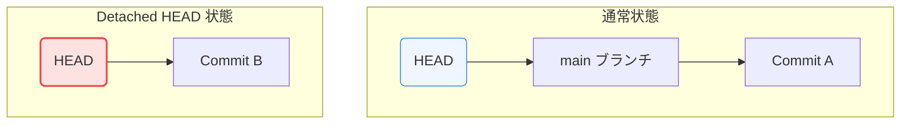

「誤って `git reset --hard` を実行し、未プッシュのコミットを消してしまった」「作業中のブランチを削除してしまった」
Gitを使っていると、このような絶望的な状況に直面することがあります。しかし、安心してください。Gitは裏側でデータを非常に大切に保持しており、ローカルでのほとんどのミスは復元可能です。

第3章では、Gitのセーフティネットである **「Reflog（参照ログ）」** の仕組みと、失われたデータを救出する手順、および「Detached HEAD」の正体について学びます。

---

## 1. Gitはデータを簡単には捨てない

Gitでコミットを作成すると、第1章で学んだ通り、`.git/objects/` にオブジェクトファイルとして書き込まれます。
たとえブランチを削除したり、`git reset` で履歴を上書きしたりしても、コミットオブジェクトそのものはディスク上から即座に消えるわけではありません。

どのブランチやタグからも参照されなくなったコミットは **「孤立した（Dangling）コミット」** と呼ばれます。これらは、数週間〜数ヶ月後にGitの自動ガベージコレクション（`git gc`）が実行されるまで、リポジトリ内に残り続けます。つまり、ハッシュ値さえ分かればいつでも元に戻すことができます。

---

## 2. Reflog（参照ログ）とは？

孤立したコミットのハッシュ値を見つけるための最も強力なツールが **`git reflog`** です。

Reflog（Reference Log）は、ローカルリポジトリにおいて **「HEAD（およびブランチのポインタ）が過去にどのコミットを指していたか」の移動履歴** をすべて記録しているログです。

*   コミットの作成 (`commit`)
*   ブランチの切り替え (`checkout` / `switch`)
*   履歴の巻き戻し (`reset`)
*   マージやリベース (`merge` / `rebase`)

これらすべての操作によってHEADが移動するたびに、Reflogにその履歴が追加されます。このログは完全にローカル限定であり、リモートリポジトリにプッシュされることはありません。

### `git reflog` の出力例
```text
8a9b2c3 HEAD@{0}: reset: moving to HEAD~1
c7d8e9f HEAD@{1}: commit: Add database scaling chapter
a1b2c3d HEAD@{2}: commit: Update network configuration
e5f6g7h HEAD@{3}: checkout: moving from main to feature/design
```
*   `HEAD@{0}`: 現在のHEADの位置（最新）。
*   `HEAD@{1}`: 1つ前のHEADの位置。
*   左端の `8a9b2c3` などの文字列が、その時点のコミットハッシュです。

---

## 3. 失われたコミットの救出手順

### シナリオ：`git reset --hard` で消したコミットを戻したい
誤って `git reset --hard HEAD~1` を実行し、直前の重要なコミット `c7d8e9f` が消えてしまったとします。

#### ステップ 1: Reflogを確認する
ターミナルで `git reflog` を実行し、消してしまったコミットのハッシュ値を探します。
上記の出力例であれば、`c7d8e9f HEAD@{1}: commit: Add database scaling chapter` が該当します。

#### ステップ 2: 状態を復旧する
以下のいずれかの方法で復旧します。

##### 方法 A: そのコミットの位置まで強制的に戻す（現在のブランチを移動する）
```bash
git reset --hard c7d8e9f
```
これで、ブランチの先端が元の正しい位置に戻り、ワークツリー（ファイル）も復元されます。

##### 方法 B: 救出用の新しいブランチを作成してチェックアウトする
安全を期して、現在の状態を残したまま別ブランチとして復元したい場合に適しています。
```bash
git checkout -b recovery-branch c7d8e9f
```

---

## 4. Detached HEAD（離れ小島）状態の理解

`git checkout <コミットハッシュ>` を実行したときに表示される **「You are in 'detached HEAD' state.」** という警告メッセージの正体を説明します。

通常、`HEAD` はブランチ（例: `main`）を指し、ブランチが特定のコミットを指しています（間接参照）。
しかし、ブランチ名ではなくコミットハッシュを直接チェックアウトすると、`HEAD` はコミットオブジェクトを直接指すようになります。この状態を「Detached HEAD（分離されたHEAD）」と呼びます。



### なぜ注意が必要なのか？
Detached HEAD状態のままコードを変更してコミットを作ると、それらのコミットはどのブランチにも属さない状態になります。そのまま別のブランチ（`git checkout main`など）に切り替えると、新しく作ったコミットを指し示すポインタがなくなるため、履歴から見失ってしまいます。

### もし見失ってしまったら？
慌てずに `git reflog` を実行すれば、Detached HEAD状態で作ったコミットのハッシュ値が記録されています。そこからブランチ（`git checkout -b new-feature-branch <ハッシュ値>`）を作成すれば、無事に復元できます。

> [!NOTE]
> **Git 2.23以降の新コマンド**
> 近年のGitでは、役割が肥大化していた `git checkout` の代わりに、ブランチ切り替え用の **`git switch`** と、ファイルの復元用の **`git restore`** コマンドが推奨されています。

---

## まとめ

*   `git reset --hard` などで履歴から見えなくなったコミットも、`.git/objects` にオブジェクトとして実体が残っている。
*   **`git reflog`** はローカルでのHEADポインタの全移動履歴を記録しているため、失われたコミットハッシュを突き止めることができる。
*   **Detached HEAD** 状態は、HEADがブランチを経由せずコミットを直接指している状態。この状態でのコミット切り替え時も見失いやすいが、Reflogから復元可能である。
