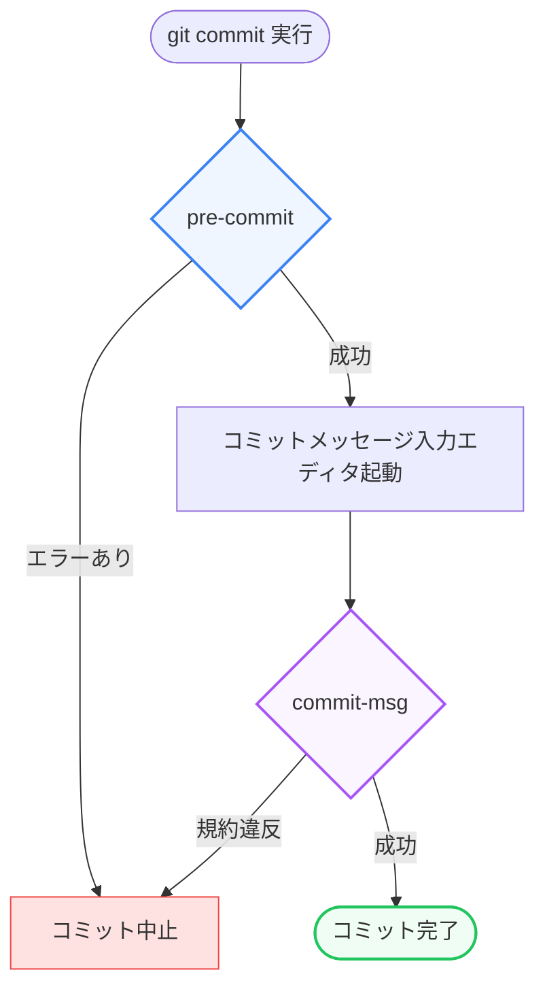

プロジェクトが拡大し、チームメンバーが増えるにつれて、「コードスタイルの乱れ」「コンパイルエラーのあるコードのコミット」「不適切なコミットメッセージ」などが問題になりやすくなります。

これらを人間がコードレビューで手動で指摘するのは非効率的であり、レビューのコストも増加します。そこで役立つのが、特定のGit操作をトリガーにしてスクリプトを自動実行する **「Gitフック（Git Hooks）」** です。

第4章では、Gitフックの内部的な仕組みから、プロジェクトでのチーム共有方法、そして自動テストと連携したデバッグ手法である `git bisect` の自動化について詳しく学びます。

---

## 1. Gitフックの仕組みと基本

Gitフックは、`git commit` や `git push` などの特定のライフサイクルイベントの前後で、独自のスクリプトを自動的に実行させる仕組みです。

特別なツールのインストールは不要で、Gitリポジトリを初期化した時点で標準機能として組み込まれています。

### フックの格納場所
Gitフックの実体は、リポジトリの隠しディレクトリである `.git/hooks/` の中に格納されている **実行可能ファイル（スクリプト）** です。

`.git/hooks/` の中身をのぞくと、いくつかのサンプルスクリプトが用意されています。

*   `pre-commit.sample`
*   `commit-msg.sample`
*   `pre-push.sample`

これらは `.sample` という拡張子が付いているため無効化されています。フックを有効化するには、**拡張子を取り除き（例: `pre-commit`）、実行権限（`chmod +x`）を付与** するだけです。

### フックの言語
フック用のスクリプトは、シェルスクリプト（Bashなど）で書かれることが多いですが、インタプリタが指定されていれば、Node.js (JavaScript/TypeScript)、Python、Ruby など、どのような言語で記述しても動作します。

```bash:pre-commit
#!/bin/sh
# コミット前に実行されるシェルスクリプトの例
echo "Running pre-commit check..."
npm run lint
```

---

## 2. 主要なクライアントサイドフック

開発者のローカル環境で実行される「クライアントサイドフック」のうち、特に実務でよく使われる3つのフックを紹介します。



### ① `pre-commit`
`git commit` を実行した直後、コミットメッセージを入力するエディタが起動する前に実行されます。
*   **用途**: コードの静的解析（Linter/Formatter）の実行、単体テストの実行、コミットファイル内に不要なデバッグコード（`console.log` やパスワードなどの機密情報）が含まれていないかの検証。
*   **挙動**: このスクリプトが **「0以外のステータス（エラー）」** で終了すると、コミット処理全体が即座に中断（Abort）されます。

### ② `commit-msg`
コミットメッセージが決定された後、コミットが確定する直前に実行されます。
*   **用途**: コミットメッセージが特定の規約（例: `feat: ...`, `fix: ...` のような Conventional Commits）に準拠しているかのチェック。
*   **挙動**: メッセージが書かれた一時ファイルへのパスがスクリプトの第1引数として渡されます。チェックに失敗し、0以外のステータスを返すとコミットが中止されます。

### ③ `pre-push`
`git push` を実行した際、リモートへのデータ転送が始まる前に実行されます。
*   **用途**: プッシュ前のビルド確認、結合テストの実行。
*   **挙動**: ここでテストが失敗すると、プッシュが中断されるため、壊れたビルドが共有ブランチへプッシュされるのをローカルで未然に防ぐことができます。

---

## 3. Gitフックのチーム共有と自動化

Gitフックの大きな課題は、**`.git` ディレクトリ配下（`.git/hooks/`）はGitの追跡対象外** である点です。そのため、自分が作成したフック用スクリプトをそのまま `git push` して他のメンバーと共有することができません。

この課題を解決するために、モダンな開発では以下のツールを用いてフック管理を自動化します。

### simple-git-hooks / husky の仕組み
これらのパッケージマネージャー対応ツールは、以下のような方法で追跡対象外の課題をクリアします。

1.  Gitの設定 `core.hooksPath` を変更し、フックの読み込み先を `.git/hooks` からリポジトリ内の通常の追跡対象ディレクトリ（例: `.husky/` や `.share-hooks/`）に変更する。
2.  `npm install` や `bun install` 時に、インストール後のフック設定を自動で走らせる。

#### 設定例：`simple-git-hooks` (本プロジェクトでも採用)
`package.json` に実行したいコマンドを設定します。

```json:package.json
{
  "simple-git-hooks": {
    "pre-commit": "npx lint-staged"
  }
}
```

コミット時には、ステージングされたファイルに対してのみ Linter を走らせる `lint-staged` などと組み合わせて実行時間を短縮し、効率的にチェックを行います。

> [!WARNING]
> **フックのバイパス（強制コミット）**
> 緊急の修正などでフックの実行を一時的にスキップしたい場合は、`git commit --no-verify` (または `-n` オプション) を使用してフックを回避できます。ただし、これを乱用するとフックを導入した意味が薄れるため、使用は必要最低限にとどめましょう。

---

## 4. `git bisect` と自動テストを組み合わせたバグ特定

開発が自動化されたら、バグ発生時の特定プロセスも自動化できます。
**`git bisect`（二分探索）** を自動テストスクリプトと連携させることで、過去数千件のコミットの中から「バグが混入した最初のコミット」を数秒で自動特定できます。

### 自動特定の手順
バグを検知できるテストコード（例: 実行するとバグがあるときはエラーになり、ないときは成功するテスト）がある場合、`git bisect run` コマンドで全自動探索を実行できます。

1.  探索の開始を宣言します。
    ```bash
    git bisect start
    ```
2.  現在（バグが出ている最新コミット）を「悪い (bad)」と宣言します。
    ```bash
    git bisect bad
    ```
3.  確実にバグがなかった過去のコミットハッシュを指定し、「良い (good)」と宣言します。
    ```bash
    git bisect good v1.0.0
    ```
4.  **【自動化の肝】** テストを実行するコマンド（バグありなら終了ステータス非ゼロ、バグなしならゼロ）を指定して実行します。
    ```bash
    git bisect run bun test:unit tests/bug-repro.test.ts
    ```

Gitは自動的にコミット履歴を二分探索し、指定されたテストコマンドを各コミットで実行していきます。探索が完了すると、コンソールにバグを混入させたコミットのハッシュと作成者情報がピンポイントで出力されます。

---

## まとめ

*   **Gitフック** は、Git操作のライフサイクルに割り込んで自動処理を実行する仕組み。
*   実体は `.git/hooks/` 内のスクリプトであり、拡張子を除去して実行権限を与えることで有効化される。
*   `pre-commit`, `commit-msg`, `pre-push` などを使い分けることで、バグや規約違反のコードがリポジトリに入るのを防ぐ。
*   チーム共有には `simple-git-hooks` や `husky` を利用し、`core.hooksPath` を書き換えて管理する。
*   `git bisect run <テストコマンド>` を用いることで、バグが混入したコミットの特定を全自動で行える。
