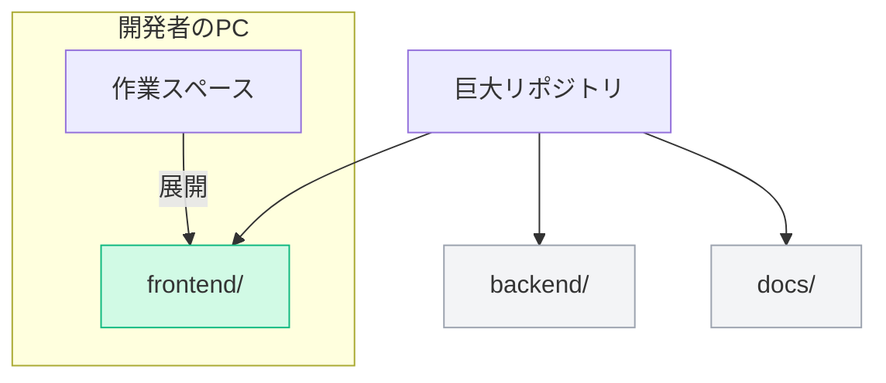

プロジェクトの規模が大きくなり、何年にもわたってコミットが積み重なると、Gitリポジトリの容量は数十GBにまで肥大化することがあります。

第5章では、肥大化したGitリポジトリを整理する仕組みと、モノレポなどの大規模開発でGitを快適に使うための最適化技術について学びます。

---

## 1. Gitのガベージコレクション (GC)

Gitはファイルを削除したり、コミットを上書き（`commit --amend` や `rebase`）したりしても、古いデータオブジェクトをすぐにはディスクから削除しません。これらは一時的に **「ルーズオブジェクト（参照されない浮いたオブジェクト）」** として残ります。

これらのゴミデータを掃除し、リポジトリを最適化するのが `git gc` コマンドです。


### `git gc` が行うこと
*   **パックファイル (Packfile) への圧縮**: 数千、数万個に分かれたルーズオブジェクトを、1つのバイナリファイル（`.pack`）にまとめます。この際、ファイル間の類似性をもとに「差分（デルタ）圧縮」を行うため、サイズが劇的に縮小します。
*   **到達不能オブジェクトの削除**: reflog の期限（デフォルトで30日前後）も切れ、どのブランチやタグからも完全に辿れなくなったオブジェクトをシステムから消去します。

---

## 2. 大規模開発向けのクローン最適化

巨大なリポジトリで `git clone` を行うと、何時間も待たされることがあります。この問題を回避するために、必要なデータだけをダウンロードする手法があります。

### ① シャロークローン (Shallow Clone)
履歴のすべてではなく、最新の指定した数コミット分だけを取得します。
```bash
git clone --depth 1 <URL>
```
*   **用途**: CI/CD環境など、ビルドするだけで過去の全履歴が不要な場合に効果的です。

### ② パーシャルクローン (Partial Clone)
コミット履歴はすべて取得しますが、ファイルの実体（Blobオブジェクト）は必要になった時点で動的にダウンロードします。
```bash
git clone --filter=blob:none <URL>
```
*   **用途**: コミット数やブランチ数は多いが、個々のファイルサイズが大きいリポジトリで、開発者の手元ですばやく clone するために使用されます。

---

## 3. スパースチェックアウト (Sparse Checkout)

大規模なリポジトリ（特に複数のサブシステムが1つにまとまった「モノレポ」）において、**「特定のフォルダだけを作業ディレクトリに展開したい」** という場合に使う機能です。



### 設定方法
```bash
# スパースチェックアウトの有効化
git sparse-checkout init --cone

# 展開したいフォルダを指定
git sparse-checkout set frontend
```
これによって、リポジトリの全データを裏で保持しつつも、自分のエディタ上には `frontend/` ディレクトリだけが見える状態になり、ビルドや検索のパフォーマンスが大幅に向上します。

---

## まとめ

*   `git gc` は、不要な古いデータを削除し、オブジェクトをデルタ圧縮してリポジトリのパフォーマンスを維持する。
*   巨大リポジトリ対策として、履歴を制限する **シャロークローン** や、Blobを制限する **パーシャルクローン** が有効。
*   展開するディレクトリを限定する **スパースチェックアウト** を使うことで、モノレポなどの作業環境を軽量化できる。
