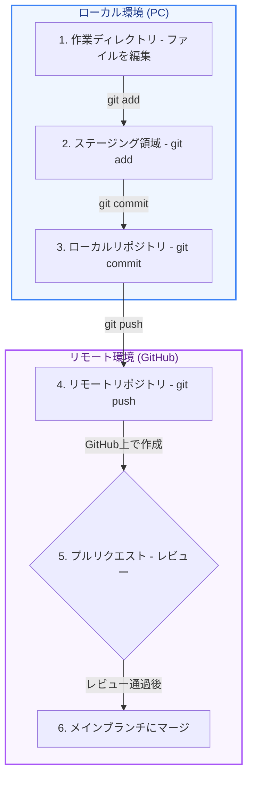

GitHubは、Gitを利用したソースコードの管理や、チーム開発を円滑に行うためのWebサービスです。

第1章では、GitとGitHubの役割の違いを整理し、現場で最もよく使われている「GitHubを用いたチーム開発の基本的な流れ（ワークフロー）」を図解します。

---

## 1. Git と GitHub の違い

よく混同されますが、この2つの役割は明確に異なります。

* **Git**: ファイルの変更履歴をローカル（自分のパソコン内）で管理するための **ツール（プログラム）**。
* **GitHub**: 複数人でコードを共有し、レビューやマージを行うための **Webサービス（プラットフォーム）**。

---

## 2. 開発全体のワークフロー（図解）

ローカルPCでの作業から、GitHubにコードをアップロードし、メインのコードへ統合（マージ）するまでの全体の流れを可視化した図です。



---

## 3. 各ステップの詳細解説

実際の開発現場では、以下の手順（GitHub Flowと呼ばれるシンプルな手順）に沿って進めます。

### Step 1. ブランチを切る（作成する）
新しくコードを追加したりバグを修正したりするときは、いきなりメインのブランチ（`main` / `master`）を書き換えず、専用の「作業用ブランチ（例: `feature-login-page`）」を作成します。

```bash
git checkout -b feature-login-page
```

### Step 2. コードを編集してコミットする
作業ディレクトリでコードを書き終えたら、変更したファイルを履歴に登録（コミット）します。

```bash
git add .
git commit -m "Add login form UI"
```

### Step 3. GitHubへプッシュする
ローカルの変更履歴を、GitHub上にあるリモートリポジトリへ送信（アップロード）します。

```bash
git push origin feature-login-page
```

### Step 4. プルリクエスト（PR）を作成する
GitHub上で「このブランチの変更を、メインのコード（`main`）に合流させてもいいですか？」という提案を作成します。これを **プルリクエスト（Pull Request）** と呼びます。

### Step 5. レビュー ＆ 修正
チームのメンバーがあなたのコードを読み、問題がないか、もっと良い書き方がないかをチェック（コードレビュー）します。指摘があれば修正し、再度プッシュします。

### Step 6. マージする
レビューが通り、安全であることが確認されたら、プルリクエストを承認（マージ）してメインのコードに統合します。これであなたのコードが正式に本番環境に反映されます！

---

## まとめ

GitHubでの開発は、**「ブランチを作成し、コミットしてプッシュ、プルリクエストでレビューを受け、最後にマージする」** というサイクルを繰り返すことで、安全かつスピーディにチーム開発を進めることができます。

次のステップに進んで、実際のGitコマンドや競合（コンフリクト）の解決方法について学んでいきましょう！
