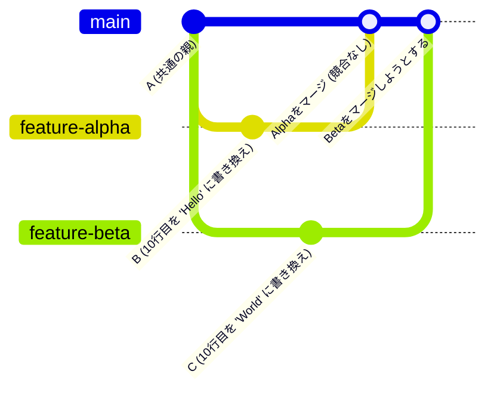

複数人で同じリポジトリを使って開発を進めていると、必ず遭遇するのが **「コンフリクト（Conflict：衝突）」** です。

コンフリクトが発生すると「壊してしまったのでは？」と焦るかもしれませんが、Gitが安全にマージを行うためのごく自然な仕組みです。

第2章では、コンフリクトがなぜ起きるのか、その仕組みと安全な解決方法を図解します。

---

## 1. コンフリクトとは？

Gitは通常、別々のファイルへの変更や、同じファイルであっても異なる行への変更であれば、自動的に1つに統合（マージ）してくれます。

しかし、**「同じファイルの、全く同じ行」に対して、別々の変更が同時に行われた場合**、Gitはどちらの変更を採用すべきか判断できません。この時、Gitは自動マージをストップし、ユーザーに「どちらを残すか決めてください」と指示を出します。これがコンフリクトです。

---

## 2. コンフリクトが発生する流れ（図解）

コンフリクトがどのようなプロセスで発生するのか、時系列で表した図です。



1.  共通のコミット `A` から、開発者A（`feature-alpha`）と開発者B（`feature-beta`）がブランチを切ります。
2.  それぞれ同じファイルの同じ行（例：10行目）を、異なるテキストに書き換えてコミットします。
3.  先に `feature-alpha` が `main` ブランチにマージされます（この時点ではまだ競合はありません）。
4.  次に `feature-beta` を `main` にマージしようとした際、Gitは「10行目がすでに `Hello` になっているのに、`World` に上書きしようとしている」と検知し、マージを中断してコンフリクトを報告します。

---

## 3. コンフリクトマーカーの読み方

コンフリクトが発生したファイルを開くと、Gitによって以下のような特殊な記号（コンフリクトマーカー）が挿入されています。

```text
<<<<<<< HEAD
const message = "Hello";  // 現在マージ先ブランチ（mainなど）にあるコード
=======
const message = "World";  // マージしようとしているブランチ（作業ブランチ）にあるコード
>>>>>>> feature-beta
```

*   `<<<<<<< HEAD` から `=======` まで：
    現在自分がいるブランチ（またはマージ先）の変更内容。
*   `=======` から `>>>>>>> [ブランチ名]` まで：
    取り込もうとしているブランチ（競合した相手）の変更内容。

---

## 4. コンフリクトの解決ステップ

コンフリクトの解決は、エディタでファイルを修正して「正しい状態」にし、再度コミットする流れで行います。

### Step 1. 競合箇所を確認し、不要なコードと記号を削除する
VS Codeなどのモダンなエディタを使用している場合、UI上で「現在の変更を取り込む」「入力側の変更を取り込む」「両方の変更を取り込む」といったボタンが表示されます。

手動で修正する場合は、`<<<<<<<`, `=======`, `>>>>>>>` のマーカー自体をすべて削除し、プログラムとして正しい形にコードを書き換えます。

```javascript
// 修正後のファイル（例：両方の意図を組んで書き換える）
const message = "Hello World";
```

### Step 2. 修正したファイルをステージングする
修正が完了し、テストが通ることを確認したら、解決したことをGitに伝えます。

```bash
git add file.js
```

### Step 3. マージコミットを作成する
通常のマージの続きとしてコミットを実行します。

```bash
git commit -m "Merge branch 'feature-beta' and resolve conflict"
```

これでコンフリクトの解消とマージが完了します！

---

## まとめ

*   **コンフリクト** は、同じファイルの同じ行に対して異なる変更が同時に行われたときに発生する。
*   Gitは勝手にコードを上書きせず、**コンフリクトマーカー** を挿入して人間に判断を委ねる。
*   解決する時は、マーカー記号をすべて消して正しいコードに編集し、`git add` & `git commit` を行う。
