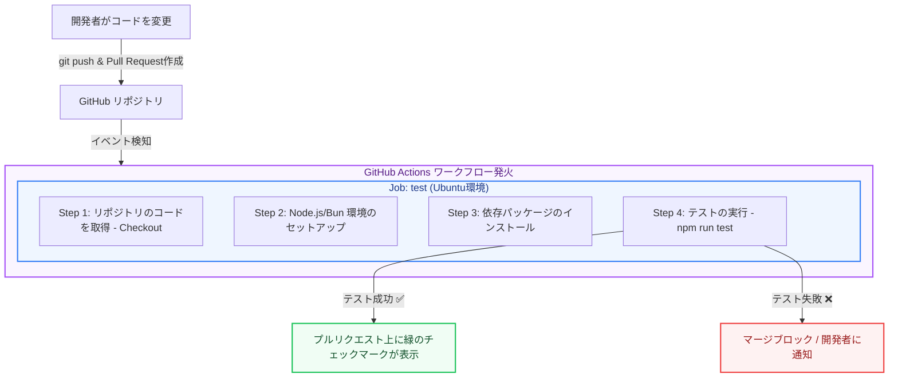

現代のソフトウェア開発では、コードの変更が既存の機能を壊していないかを確認するために、自動化されたテストやビルドの仕組みを導入するのが一般的です。これを **CI/CD（継続的インテグレーション／継続的デリバリー）** と呼びます。

GitHubには、このCI/CDを簡単に構築できる機能 **GitHub Actions（ギットハブ・アクションズ）** が標準搭載されています。

第3章では、GitHub Actionsの基本概念と、プルリクエスト作成時に自動テストを実行するワークフローの作り方を解説します。

---

## 1. CI（継続的インテグレーション）とは？

新しいコードをメインブランチにマージする前に、自動的に「ビルド」「構文チェック（Lint）」「ユニットテスト」を実行し、問題がないことを継続的に検証するプロセスです。

人間による手動テストの漏れを防ぎ、バグの早期発見につながります。

---

## 2. GitHub Actions による自動テストフロー（図解）

開発者がコードをプッシュしてからマージされるまでの自動化の流れです。



---

## 3. ワークフローファイルの基本構成

GitHub Actionsの設定は、リポジトリの特定のフォルダ（`.github/workflows/`）の中に YAML 形式（`.yml`）のファイルとして保存します。

*   **Workflows（ワークフロー）**: 自動化されるプロセス全体。
*   **Events（イベント）**: ワークフローを起動するトリガー（例：`push`、`pull_request`）。
*   **Jobs（ジョブ）**: 同じマシン（仮想環境）で実行されるステップの集まり。デフォルトで並列実行されます。
*   **Steps（ステップ）**: コマンドの実行やアクションの呼び出しを行う最小単位。上から順に実行されます。
*   **Actions（アクション）**: よく使われるステップをパッケージ化した共有モジュール（例：チェックアウト処理など）。

---

## 4. 自動テストを実行する設定ファイルの例

以下は、Node.js プロジェクトでプルリクエストが作成された際に、自動テストを走らせる標準的な設定ファイルです。

```yaml:.github/workflows/ci.yml
name: Node.js CI # ワークフローの名前

# トリガーとなるイベントの定義
on:
  pull_request:
    branches:
      - main # mainブランチ向けのプルリクエストが作成・更新されたときに実行

jobs:
  test:
    runs-on: ubuntu-latest # テストを実行するOS環境（Linux仮想マシン）

    steps:
      # Step 1: 仮想マシンにリポジトリのコードをダウンロード（チェックアウト）
      - name: Checkout repository
        uses: actions/checkout@v4 # 公式が提供するチェックアウト用のアクション

      # Step 2: 仮想マシンに指定バージョンのNode.jsをインストール
      - name: Setup Node.js
        uses: actions/setup-node@v4
        with:
          node-version: '20'
          cache: 'npm' # npmのキャッシュを有効化して高速化

      # Step 3: 依存関係のインストール
      - name: Install dependencies
        run: npm ci

      # Step 4: 構文チェックの実行
      - name: Run lint
        run: npm run lint

      # Step 5: テストの実行
      - name: Run unit tests
        run: npm run test
```

このファイルを `.github/workflows/ci.yml` としてリポジトリにコミットしておくと、GitHubは自動的に検知し、プルリクエストの画面に進捗やテスト結果が表示されるようになります。

---

## まとめ

*   **GitHub Actions** は、GitHubに統合された強力なCI/CDツール。
*   `.github/workflows/` 内の **YAMLファイル** で自動化の手順を定義する。
*   プルリクエスト等の **イベントをトリガー** にして、クラウド上の仮想マシンでテストやビルドを自動実行できる。

自動化を導入することで、コードの品質を保ちながら、安全かつスピーディにチーム開発を進めることができます！
