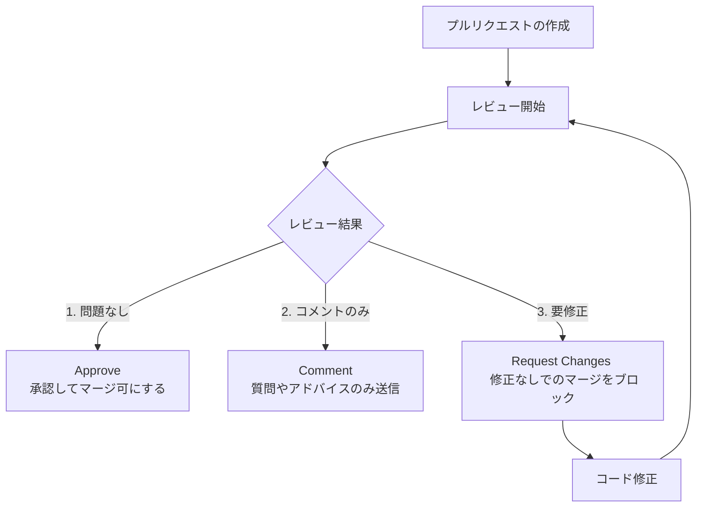

GitHubを用いた共同開発の中心となるのが、**「プルリクエスト（Pull Request: PR）」** と **「コードレビュー（Code Review）」** です。これらは単にソースコードの誤り（バグ）を見つけるだけでなく、コード品質の均一化、知識共有、保守性の高いプロダクト作りにおいて強力な手段となります。

第4章では、開発チームで円滑かつ安全にプルリクエストとコードレビューを回すための手法について学びます。

---

## 1. 良いプルリクエストの作成方法

プルリクエストは、レビュアー（レビューをする人）への手紙のようなものです。レビュアーが「何を」「なぜ」「どのように」変更したかを理解しやすいように記述することが、迅速で正確なマージへの近道です。

* **明確なタイトルと説明**: 目的（ユーザーの課題解決など）を明記し、可能であれば「修正前後のスクリーンショット」や「動作確認手順」を掲載します。
* **小さく分ける（スモールPR）**: 1つのPRにおける変更行数が多すぎると、レビューの精度が落ち、時間もかかります。1つのPRは「1つの課題やタスク」に焦点を当てるように細分化します。

---

## 2. コードレビューの作法とステータス

レビュー担当者は、コードの変更点を確認し、以下のいずれかのステータスを提示します。



* **Approve (承認)**: 変更内容に問題がなく、マージして良いと判断した場合に選択します。
* **Request Changes (要修正)**: バグや規約違反などがあり、マージ前に修正が必要な場合に選択します（これによってPRのマージがブロックされます）。
* **Comment (コメント)**: 承認でも却下でもなく、質問や軽微な提案などを伝える場合に使用します。

### レビューのコミュニケーション
* **敬意と思いやり**: 「〜を修正してください」ではなく、「〜した方がバグを防げそうですが、いかがでしょうか？」のように、人格への攻撃ではなくコードに焦点を当てた前向きなコミュニケーションを心がけます。

---

## 3. ブランチ保護ルール (Branch Protection)

チーム開発において、誰かがうっかり誤ったコードを `main` ブランチに直接プッシュしてしまうと、リリースされているシステムが壊れてしまいます。これを防ぐのが **Branch Protection Rules (ブランチ保護ルール)** です。

```yaml:保護ルールの設定例
- Require a pull request before merging (マージ前に必ずPR作成を必須にする)
  - Require approvals: 1 (少なくとも1人の承認を必須にする)
- Require status checks to pass before merging (マージ前にテストCIが通ることを必須にする)
```

この設定により、ルールに適合しないPRは `Merge` ボタンが非活性となり、不正なコードの本番混入を防ぐガードレールとなります。
