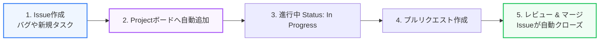

GitHubは単なるソースコードの共有ツールではありません。Issue（課題管理）、Projects（プロジェクト管理ボード）、そしてCodespaces（クラウド開発環境）を組み合わせることで、要件定義からコーディング、進捗追跡までを一元管理する強力なプラットフォームとなります。

第5章では、GitHubによるプロジェクト管理と開発環境の標準化について解説します。

---

## 1. IssueとGitHub Projectsによる進捗管理

ソフトウェア開発を円滑に進めるためには、タスクやバグを追跡可能な形にする必要があります。



### GitHub Issues
バグ報告、新機能の提案、リファクタリングなどを記録するチケットです。Markdownで詳細な要件やチェックリストを記述し、メンバー（Assignee）を割り当てます。

### GitHub Projects
アジャイル開発における「かんばん（Kanban）」ボードとして、Issueやプルリクエストの状況をビジュアル管理します。
* **Todo**: 着手前のタスク
* **In Progress**: 開発中のタスク
* **Done**: 完了したタスク

PRの説明欄に `Closes #12` のように記述しておくと、PRが `main` ブランチにマージされた瞬間に、該当するIssueが自動的にクローズ（解決）され、Projectボードも「Done」へ自動で遷移する仕組みがあります。

---

## 2. GitHub CLI (gh) によるコマンド操作

ターミナルからブラウザを開くことなくGitHubの操作を行えるのが **GitHub CLI (`gh` コマンド)** です。

```bash
# ターミナルから直接Issueを作成
gh issue create --title "認証エラーの修正" --body "ログイン時にエラーが発生します"

# プルリクエストのリストを表示
gh pr list

# プルリクエストを手元でチェックアウトして確認
gh pr checkout 105
```

これにより、開発者のエディタとターミナル間でのコンテキストスイッチ（切り替え）を抑え、コマンドラインで素早く作業を進められます。

---

## 3. GitHub Codespacesによる環境構築の排除

新しいメンバーがチームに入った際、環境構築（Node.jsやDBのインストール、バージョンの違いなど）で何日も浪費してしまうことがあります。この問題を解決するのが **GitHub Codespaces** です。

リポジトリ直下の `.devcontainer/` ディレクトリに設定ファイルを配置することで、クラウド上に標準化された開発コンテナ環境を即時立ち上げることができます。

```json:devcontainer.json
// .devcontainer/devcontainer.json の例
{
  "name": "Node.js & Postgres",
  "image": "mcr.microsoft.com/devcontainers/javascript-node:1-20-bullseye",
  "features": {
    "ghcr.io/devcontainers/features/docker-in-docker:2": {}
  },
  "forwardPorts": [3000, 5432],
  "postCreateCommand": "npm install"
}
```

開発者はGitHubのページで「Create codespace」をクリックするだけで、ブラウザ上のVS Code（またはローカルのVS Code）が起動し、すでに必要なライブラリがインストールされ、ポートのフォワーディングも完了した状態ですぐにコーディングを開始できます。
