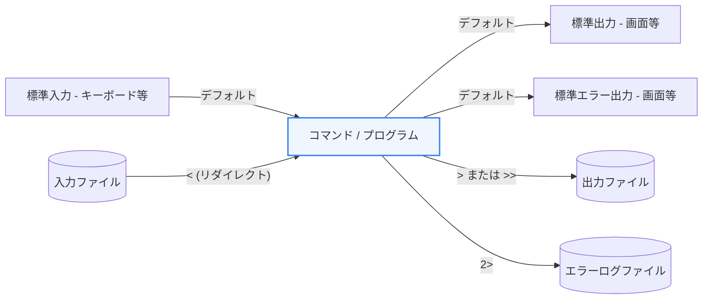

多くのWebシステムはLinuxサーバー上で動作しています。また、開発者が使用するターミナル（macOSのZshやWindowsのWSL）もLinux互換のコマンド群を使用します。本章では、Linuxの基本操作コマンドと、強力な機能である「パイプ」および「リダイレクト」の仕組みを学びます。

---

## 1. ファイルとディレクトリの基本操作

まずは、日々の開発で頻繁に使用する最も基礎的なコマンド群です。

*   **`ls`**: ディレクトリの内容を表示します。オプション `-la` を付けると、隠しファイルを含めて詳細な情報（パーミッションやサイズなど）を表示できます。
*   **`cd`**: ディレクトリを移動します。`cd ..` で1つ上のディレクトリに戻ります。
*   **`cp`**: ファイルやディレクトリをコピーします。ディレクトリを丸ごとコピーする場合は `-r` オプションが必要です。
*   **`mv`**: ファイルやディレクトリを移動、または名前を変更します。
*   **`rm`**: ファイルやディレクトリを削除します。ディレクトリを削除する場合は `rm -rf` を使いますが、警告なしで削除されるため取り扱いには細心の注意が必要です。

---

## 2. 標準入出力とリダイレクト

Linuxのプログラムには、データの出入り口として **標準入力（stdin）**、**標準出力（stdout）**、**標準エラー出力（stderr）** の3つが用意されています。
**リダイレクト** を使うと、これらのデータの出入り口をファイルなどに切り替えることができます。

### データフローとリダイレクト（図解）



### リダイレクトの具体例

*   **新規書き込み (`>`)**: コマンドの実行結果をファイルに保存します（既存のファイル内容は上書きされます）。
    ```bash:redirect-write.sh
    echo "Hello World" > output.txt
    ```
*   **追記書き込み (`>>`)**: ファイルの末尾に実行結果を追記します。
    ```bash:redirect-append.sh
    echo "Line 2" >> output.txt
    ```
*   **入力元切り替え (`<`)**: ファイルの内容をコマンドの入力として渡します。
    ```bash:redirect-input.sh
    cat < output.txt
    ```
*   **標準エラー出力のリダイレクト (`2>`)**: エラーメッセージのみを別ファイルに出力します。
    ```bash:redirect-error.sh
    ls non_existent_file 2> error.log
    ```

---

## 3. パイプライン (`|`) とテキスト処理

**パイプライン (`|`)** は、あるコマンドの実行結果（標準出力）を、別のコマンドの入力（標準入力）として直接渡す仕組みです。コマンドを組み合わせることで、複雑なテキスト処理を1行で行うことができます。

### 代表的なテキスト処理コマンド

*   **`cat`**: ファイルの内容を表示、または連結します。
*   **`grep`**: テキストから特定のパターン（文字列や正規表現）に一致する行を検索します。
*   **`sed`**: テキストの置換や行の削除などのストリーム編集を行います。
*   **`awk`**: テキストを列単位で処理し、高度な集計やフォーマットを行います。

### 実用的なパイプの組み合わせ例

ログファイルから「ERROR」を含む行を抽出し、その数をカウントする例です。

```bash:pipe-example.sh
# access.log の中から "ERROR" を含む行を探し、wc -l でその行数をカウントする
grep "ERROR" access.log | wc -l
```

また、特定のプロセスが実行されているかを確認する際にもパイプラインは頻繁に使われます。

```bash:process-check.sh
# 起動中のプロセス一覧から "node" が含まれる行を抽出する
ps aux | grep node
```

---

## まとめ

*   **`ls`, `cd`, `cp`, `mv`, `rm`** は開発におけるファイル操作の必須コマンド。
*   **リダイレクト (`>`, `>>`, `<`)** を使用して、画面への出力をファイルへ書き込んだり、ファイルを入力にしたりできる。
*   **パイプライン (`|`)** を使って複数のコマンドを連結し、強力なテキスト・データ処理を組み立てる。
