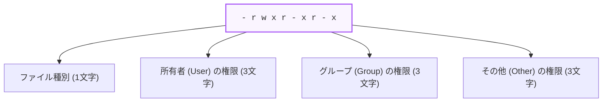

Linuxシステムは、複数のユーザーが同時に利用することを前提とした「マルチユーザーOS」です。そのため、セキュリティを保つための **所有権（Ownership）** と **アクセス権（Permission）** の管理、および実行中のプログラムである **プロセス（Process）** の管理が極めて厳格に設計されています。

---

## 1. ファイルとディレクトリのアクセス権（パーミッション）

Linuxでは、すべてのファイルやディレクトリに対して「誰が」「何をしてよいか」が定義されています。

### パーミッションの表記ルール（図解）

`ls -l` コマンドを実行した際に表示される、先頭の10文字（例: `-rwxr-xr-x`）の意味は以下の通りです。



*   **ファイル種別**: `-` は一般ファイル、`d` はディレクトリ、`l` はシンボリックリンクを示します。
*   **権限の種類**:
    - **`r` (Read)**: 読み取り権限（数値表記: `4`）
    - **`w` (Write)**: 書き込み・変更権限（数値表記: `2`）
    - **`x` (Execute)**: 実行権限（数値表記: `1`）
    - **`-`**: 権限なし（数値表記: `0`）

### パーミッションの変更 (`chmod`)

権限の変更には `chmod` コマンドを使用します。数値の合計値で指定する方法が一般的です。

```bash:chmod-example.sh
# スクリプトファイルに実行権限（755: 所有者はrwx、他はrx）を付与する
chmod 755 run.sh

# 特定のファイルを所有者のみ読み書き可能にする（600: rw-------）
chmod 600 id_rsa
```

### 所有権の変更 (`chown`)

ファイルの所有ユーザーや所有グループを変更するには `chown` コマンドを使用します。この操作には通常管理者権限（`sudo`）が必要です。

```bash:chown-example.sh
# deploy.log の所有者を deploy ユーザーに変更する
sudo chown deploy deploy.log

# 所有者を deploy ユーザー、グループを developers に変更する
sudo chown deploy:developers app/
```

---

## 2. プロセス（Process）の管理

Linux上で実行されている個々のプログラムの実行単位を **プロセス** と呼びます。各プロセスには一意の識別番号である **PID（Process ID）** が割り当てられます。

### プロセスの状態を確認する

*   **`ps`**: 起動中のプロセスの一覧を表示します。
    - `ps aux`: システム上のすべてのプロセスを詳細に表示します。
*   **`top` / `htop`**: CPUやメモリの使用状況と、高負荷なプロセスをリアルタイムで監視します。

### プロセスの終了 (`kill`)

フリーズしたプログラムやバックグラウンドで動作し続けているプロセスを強制終了するには、`kill` コマンドを使用します。

```bash:kill-example.sh
# PID が 12345 のプロセスを正常終了させる
kill 12345

# プロセスが終了しない場合、強制終了シグナル (SIGKILL: -9) を送信する
kill -9 12345

# プロセス名（例: node）を指定して一括で終了させる
killall node
```

---

## まとめ

*   パーミッションは **所有者 (User)**、**グループ (Group)**、**その他 (Other)** に対する **`r (4)`**, **`w (2)`**, **`x (1)`** の組み合わせ。
*   **`chmod`** でアクセス権を設定し、**`chown`** で所有者を変更する。
*   実行中のプログラムは **プロセス** として管理され、**`ps`** や **`top`** で監視し、必要に応じて **`kill`** で終了させる。
