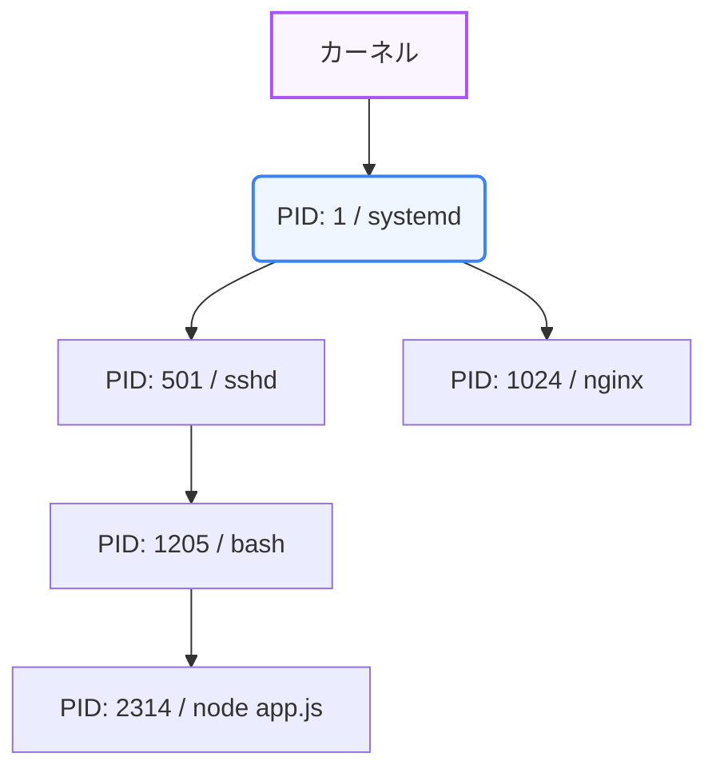

Linuxサーバーの管理やデバッグを行う際、実行されている個々のプログラム（プロセス）の状態を把握し、制御するスキルは不可欠です。暴走したプロセスを発見して停止したり、システムの空きメモリやディスク容量を調査したりするシーンは実務で多々発生します。

第4章では、Linuxのプロセス管理とシステムのリソース監視について学びます。

---

## 1. プロセスの概念とリソース監視

Linuxでは、実行されるプログラムはすべて **「プロセス」** という単位で管理され、それぞれ固有の **「PID (Process ID)」** を持ちます。



### 主要なリソース監視コマンド

* **`ps` (Process Status)**: 現在動作しているプロセスを表示します。
  ```bash
  # 全ユーザーのプロセスを詳細情報付きで表示
  ps aux
  ```
* **`top` / `htop`**: CPUやメモリの使用状況をリアルタイムで監視するインタラクティブなコマンドです（`htop` はよりビジュアルで操作性が高いです）。
* **`free`**: システムの物理メモリとスワップ領域の空き・使用状況を表示します。
* **`df` (Disk Free)**: ディスク（ファイルシステム）の全体容量と空き容量を人間が読みやすい形式 (`-h`) で表示します。

---

## 2. ジョブ制御（バックグラウンド実行）

ターミナルで時間のかかる処理（例: 重いファイルのダウンロードやスクリプト実行）を行うと、その間ターミナルに入力できなくなります。これを制御するために **「ジョブ制御」** を使います。

* **バックグラウンド実行 (`&`)**: コマンドの末尾に `&` を付けると、処理を裏側（バックグラウンド）で動かし、即座に次のコマンドを入力できます。
  ```bash
  ./heavy-script.sh &
  ```
* **ジョブの確認 (`jobs`)**: 現在バックグラウンドで動作しているジョブのリストを表示します。
* **フォアグラウンド切り替え (`fg`)**: バックグラウンドのジョブを手前に戻します（`fg %1` などのようにジョブ番号を指定）。
* **一時停止とバックグラウンド移行**: 実行中の処理を `Ctrl + Z` で一時停止し、`bg` コマンドでバックグラウンド実行へ切り替えることができます。

---

## 3. シグナルとプロセスの終了 (`kill`)

実行中のプロセスに対して外部から挙動を指示する信号を **「シグナル」** と呼びます。最もよく使うのがプロセスの終了を指示するシグナルです。

| シグナル名 | 番号 | コマンドの例 | 意味 |
| :--- | :--- | :--- | :--- |
| **SIGHUP** | 1 | `kill -1 <PID>` | ハングアップ（設定ファイルの再読み込みなどに利用される） |
| **SIGINT** | 2 | `Ctrl + C` | 割り込み（端末からの終了指示） |
| **SIGTERM** | 15 | `kill <PID>` | 終了（プロセスに安全な終了を促す、デフォルト） |
| **SIGKILL** | 9 | `kill -9 <PID>` | 強制終了（クリーンアップを待たず、カーネルが即座にプロセスを抹殺する） |

```bash
# プロセスID (PID) 2314 のプロセスを安全に終了させる
kill 2314

# プロセスが応答しないため、強制終了させる
kill -9 2314
```

システムの動作状態を見極め、適切にプロセスを制御できるようになることで、サーバーの障害対応力やオペレーション効率が大きく向上します。
