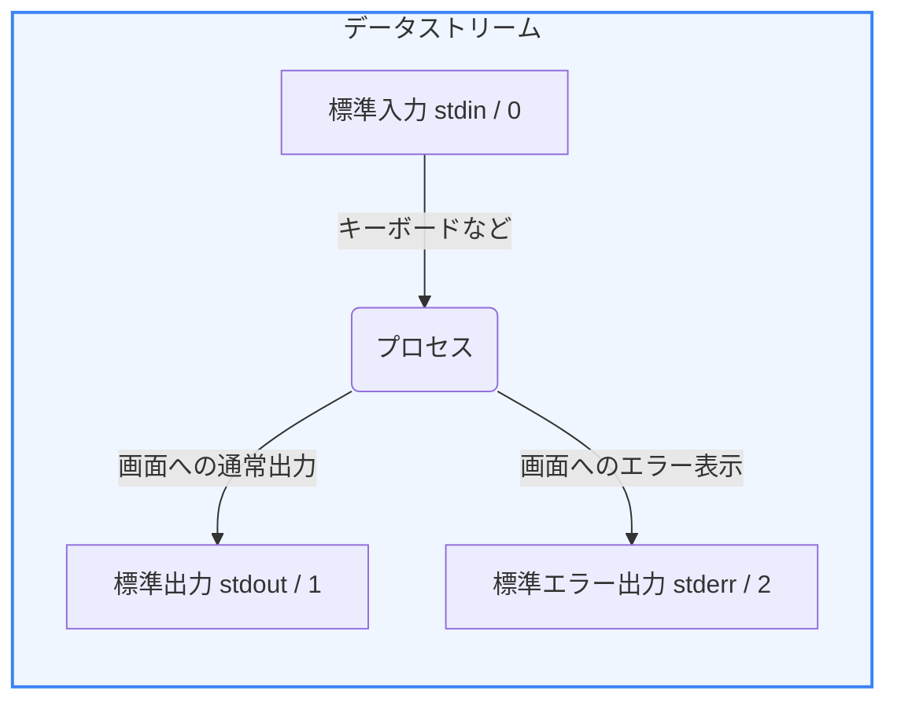

Linuxの真骨頂は、すべてのデータを「テキスト」として扱い、複数の小さなコマンドを連結して複雑な処理を一瞬でこなす点にあります。これを支えるのが **「データストリーム（入出力のストリーム）」** と **「テキスト処理コマンド（フィルタ）」** です。

第5章では、リダイレクトやパイプを用いたデータの流れの制御と、ログ解析等に欠かせないテキスト処理コマンドの応用について学びます。

---

## 1. 標準入出力とリダイレクト

プログラム（プロセス）が起動すると、OSによって自動的に3つの情報の通り道（データストリーム / ファイル記述子）が用意されます。



デフォルトではこれらはキーボードや画面に繋がっていますが、これをファイルや別のプログラムに繋ぎ替える操作を **「リダイレクト (Redirect)」** と呼びます。

### リダイレクトの表記法

* **`>`**: 標準出力をファイルに書き出します（上書き）。
* **`>>`**: 標準出力をファイル末尾に追記します。
* **`2>`**: 標準エラー出力のみをファイルに書き出します。
* **`2>&1`**: 標準エラー出力を標準出力と同じ場所（同じファイルなど）に合流させます。

```bash
# アプリケーションの出力を log.txt に、エラーを err.txt に分けて書き出す
node app.js > log.txt 2> err.txt

# 出力とエラーをすべて同じ log.txt にまとめて追記する
node app.js >> log.txt 2>&1
```

---

## 2. パイプ (`|`) によるコマンドの連結

あるコマンドの「標準出力」を、別のコマンドの「標準入力」としてダイレクトに受け渡す仕組みが **「パイプ (Pipe)」** です。これにより、複数のコマンドを一連の流れ作業（パイプライン）として処理できます。


```bash
# ログファイルから「ERROR」という文字列を含む行だけを抽出し、その行数をカウントする
cat app.log | grep "ERROR" | wc -l
```

---

## 3. 強力なテキスト処理フィルタ

Linuxにはテキストを加工・抽出するためのツール（フィルタコマンド）が標準で用意されています。

1. **`grep` (パターンの検索)**:
   * 指定した文字列や正規表現に一致する行を抽出します。
2. **`cut` (列の切り出し)**:
   * カンマやスペースなどで区切られたテキストから特定の列だけを抽出します。
   * 例: `cut -d',' -f2`（カンマ区切りの2列目を抽出）
3. **`sed` (テキストの置換・編集)**:
   * ストリームエディタと呼ばれ、パターンに一致する文字を置換できます。
   * 例: `sed 's/old/new/g'` (oldをnewにすべて置換)
4. **`awk` (高度なテキスト整形・解析)**:
   * プログラミング言語に近い機能を持つ非常に強力なテキスト処理ツールです。スペース区切りのログファイルの集計等に多用されます。
   * 例: `awk '{print $1, $4}'`（1列目と4列目だけを表示）
5. **`sort` と `uniq` (並び替えと重複排除)**:
   * データをソートし、連続する重複した行を取り除いたり、重複のカウントを行います。
   * 例: `sort | uniq -c` (各行の出現回数をカウント)

### 実践的な組み合わせ例
アクセスログ（`access.log`）から、リクエストの多い上位3つのIPアドレスを抽出します。
```bash
# 1列目のIPアドレスを抽出 -> ソート -> 重複数をカウント -> 数値の降順ソート -> 上位3件表示
cat access.log | awk '{print $1}' | sort | uniq -c | sort -rn | head -n 3
```

これらのツール群を使いこなせるようになると、数ギガバイトある膨大なログファイルから、特定のIPアドレスや特定のエラーメッセージの傾向をほんの数秒で分析・抽出できるようになります。
