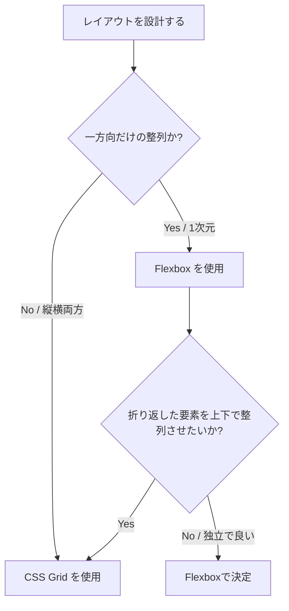

モダンなWebレイアウト設計において、CSSの **Flexbox（Flexible Box Layout）** と **CSS Grid（Grid Layout）** は強力な両輪です。また、近年主流となりつつある **コンテナクエリ（Container Queries）** を使うことで、画面全体（ビューポート）ではなく「親要素の幅」に応じた真のコンポーネント駆動レスポンシブデザインが実現できます。

第1章では、これら3つの主要なレイアウト技術のコンセプトと使い分け、そして具体的な実装パターンを図解を交えて学びます。

---

## 1. Flexbox：1次元のレイアウト

Flexboxは、**「1次元（縦方向または横方向のいずれか一方向）」** のレイアウトを整列・分配するために設計されています。

### 主な用途と特徴
* **ナビゲーションバーやツールバー** の配置（横一列に並べる）
* **カード内のコンテンツの縦並び**（ヘッダー、本文、フッターを縦一列にし、フッターを最下部に固定する）
* **要素の上下左右中央揃え**

```mermaid
graph LR
    subgraph FlexContainer [Flexコンテナ (flex-direction: row)]
        A[Item 1] --> B[Item 2] --> C[Item 3]
    end
    style FlexContainer fill:#eff6ff,stroke:#3b82f6,stroke-width:2px,color:#1e3a8a
```

### 実装例：ナビゲーションバー

```css:style.css
.navbar {
  display: flex;
  justify-content: space-between; /* 両端に寄せる */
  align-items: center;            /* 上下中央揃え */
  padding: 1rem;
}
```

```html:index.html
<header class="navbar">
  <div class="logo">Logo</div>
  <nav class="nav-links">
    <a href="#">Home</a>
    <a href="#">About</a>
  </nav>
</header>
```

---

## 2. CSS Grid：2次元のレイアウト

CSS Gridは、**「2次元（行と列の両方）」** のレイアウトを同時に制御するために設計されています。ページ全体のグリッド構造や、複雑なダッシュボード、カードのタイル状配置に適しています。

### 主な用途と特徴
* **ページ全体のレイアウト（ヘッダー、メイン、サイドバー、フッター）**
* **ギャラリーやカードのタイル配置（レスポンシブな複数列レイアウト）**
* **要素の重なり（grid-areaを重ねることで絶対配置を使わずに重ね表現が可能）**

```mermaid
graph TD
    subgraph GridContainer [Gridコンテナ (行と列)]
        direction TB
        G1[Header / 行1]
        subgraph ColContainer [行2]
            G2[Sidebar / 列1] --- G3[Main / 列2]
        end
        G4[Footer / 行3]
        G1 --- ColContainer --- G4
    end
    style GridContainer fill:#f0fdf4,stroke:#22c55e,stroke-width:2px,color:#14532d
```

### 実装例：オートフィット・タイルレイアウト
メディアクエリを書かずに、画面幅に応じて自動で列数を調整する強力なパターンです。

```css:style.css
.card-grid {
  display: grid;
  /* 最小幅250px、最大幅は等分。入り切らなくなると自動で改行 */
  grid-template-columns: repeat(auto-fit, minmax(250px, 1fr));
  gap: 1.5rem; /* 要素間の余白 */
}
```

---

## 3. Flexbox と CSS Grid の使い分け基準

どちらを使うべきか迷った際は、以下のフローに従って判断します。

| 比較項目 | Flexbox | CSS Grid |
| :--- | :--- | :--- |
| **次元** | 1次元（行 **または** 列） | 2次元（行 **と** 列） |
| **アプローチ** | **コンテンツベース**（中身のサイズに合わせて配置） | **レイアウトベース**（先に枠線を定義し、そこにコンテンツを配置） |
| **折り返し** | 折り返した要素は独立して整列される | 折り返してもグリッドの列・行に厳密に沿って整列される |
| **要素の重ね合わせ** | 困難（z-indexとabsoluteが必要） | 容易（同じgrid-areaに指定するだけ） |



---

## 4. コンテナクエリ（Container Queries）

従来のレスポンシブデザインは、ブラウザの幅（ビューポート）を監視する **メディアクエリ（Media Queries）** を主に使用していました。しかし、コンポーネントがサイドバーに配置されるか、メインエリアに配置されるかによって表示スタイルを変えたい場合、メディアクエリでは対応できません。

**コンテナクエリ**は、親要素（コンテナ）のサイズに応じて、その中にある子要素のスタイルを変更できる最新の仕様です。

```mermaid
graph TD
    subgraph Viewport [ブラウザ幅 1200px]
        subgraph Main [メインエリア (幅800px)]
            C1[カード: 横長表示 / 写真左・テキスト右]
        end
        subgraph Sidebar [サイドバー (幅300px)]
            C2[カード: 縦長表示 / 写真上・テキスト下]
        end
    end
    style Viewport fill:#faf5ff,stroke:#a855f7,stroke-width:2px
```

### 実装方法

コンテナクエリを使用するには、監視対象とする親要素に `container-type` を指定します。

#### 1. 親コンテナの定義
```css:style.css
.card-container {
  /* インラインサイズ（横幅）を監視対象にする */
  container-type: inline-size;
  container-name: card-wrapper; /* 任意の名前（省略可） */
}
```

#### 2. 子要素のスタイル定義
親要素の幅が `400px` 以上のときにスタイルを切り替えます。

```css:style.css
/* デフォルト（コンテナが狭いとき）：縦並び */
.card {
  display: flex;
  flex-direction: column;
}

/* 親コンテナが400px以上のとき：横並び */
@container card-wrapper (min-width: 400px) {
  .card {
    flex-direction: row;
    align-items: center;
  }
}
```

これを使うことで、サイドバー（狭い場所）にカードを置いた時は自動で縦並びになり、メインコンテンツ（広い場所）に置いた時は自動で横並びになるような、**自己完結型で再利用性の高いコンポーネント**を設計できます。

---

## まとめ

* **Flexbox**：ナビゲーションやボタン群など、1次元の並びやアライメント（位置合わせ）に最適。
* **CSS Grid**：ダッシュボードやカードグリッド、ページ全体など、2次元の枠組み設計に最適。
* **コンテナクエリ**：コンポーネント自身が配置された場所の幅を検知してレスポンシブに対応するための次世代技術。

これらを適切に組み合わせることで、無駄なメディアクエリやJavaScriptによる監視を減らし、クリーンで堅牢なスタイルシートを記述できるようになります。

次のチャプターでは、これらのレイアウトを効率的に適用するための **CSS設計（Tailwind CSS vs CSS Modules）** について学びます！
