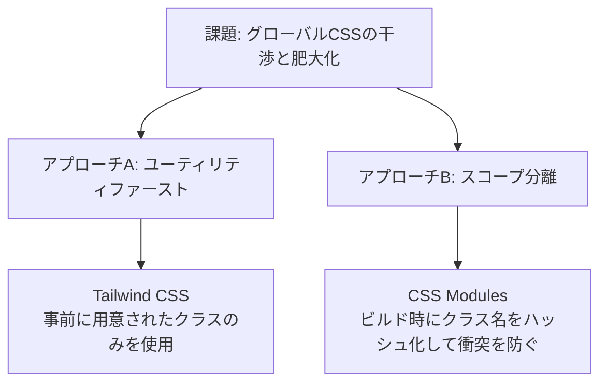
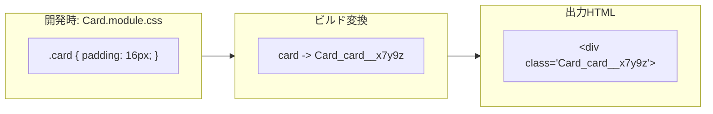

モダンフロントエンド（React, Next.js, Vueなど）におけるスタイリング手法には、大きく分けて **ユーティリティファースト（Tailwind CSSなど）** と **スコープ付きCSS（CSS Modulesなど）** の2つの流派があります。また、以前主流だった CSS-in-JS（styled-components など）から、パフォーマンスやSSR（サーバーサイドレンダリング）との相性の観点から、静的なCSS書き出しが可能な手法へ回帰する傾向も見られます。

第2章では、Tailwind CSS と CSS Modules の設計思想とそれぞれのベストプラクティスについて学びます。

---

## 1. 従来のCSSが抱える課題と解決アプローチ

従来のグローバルCSSでは、**「意図しないスタイルの干渉（グローバル汚染）」** と **「不要なCSSの肥大化」** が問題でした。これらを解決するために、2つの異なるアプローチが誕生しました。



---

## 2. Tailwind CSS (ユーティリティファースト)

Tailwind CSSは、`flex`, `pt-4`, `text-center`, `rotate-90` といった単一の役割を持つユーティリティクラスをHTML/JSX内に組み合わせてスタイルを構築するフレームワークです。

### メリット
* **CSSファイルを自分で書く必要がほとんどない**。
* クラス名（Naming）で悩む必要がない。
* 使用したクラスのみを抽出してビルドするため、**製品のCSSサイズが極めて小さくなる**。
* マークアップ（JSXなど）を見るだけでスタイルが把握できる。

### デメリットと課題
* HTML/JSXのクラス属性が非常に長くなり、可読性が低下する（「クラスの泥沼 / Class Soup」）。
* 条件分岐でのクラス切り替えが複雑になりやすい。

### ベストプラクティス：可読性の維持とリファクタリング

#### 1. クラス結合ユーティリティの使用 (`clsx` や `tailwind-merge`)
条件分岐でクラスを切り替える際、単純な文字列結合だと重複するクラス（例: `p-4` と `p-6`）が衝突して予期しない挙動になります。`tailwind-merge` は重複クラスを綺麗に上書き解決してくれます。

```tsx:Button.tsx
import { clsx, type ClassValue } from 'clsx';
import { twMerge } from 'tailwind-merge';

// クラスを安全に結合する関数
export function cn(...inputs: ClassValue[]) {
  return twMerge(clsx(inputs));
}

interface ButtonProps extends React.ButtonHTMLAttributes<HTMLButtonElement> {
  variant?: 'primary' | 'secondary';
}

export function Button({ variant = 'primary', className, ...props }: ButtonProps) {
  return (
    <button
      className={cn(
        'px-4 py-2 rounded font-medium transition-colors', // ベースクラス
        variant === 'primary' && 'bg-blue-600 text-white hover:bg-blue-700',
        variant === 'secondary' && 'bg-gray-200 text-gray-800 hover:bg-gray-300',
        className // 外部から注入されたクラスで上書き可能にする
      )}
      {...props}
    />
  );
}
```

---

## 3. CSS Modules (スコープ分離)

CSS Modulesは、標準的なCSS（またはSass等）を記述しつつ、JavaScript側でインポートする際にクラス名を一意な文字列（ハッシュ値）に自動変換する仕組みです。



### メリット
* **標準的なCSS記法**（ネスト、カスタムプロパティ、メディアクエリなど）をそのまま使える。
* クラス名がローカルスコープに閉じているため、他のコンポーネントを壊す心配がない。
* HTML/JSX側がシンプルで読みやすい。

### ベストプラクティス：保守性の高いCSS設計

#### 1. CSS Variables（カスタムプロパティ）の活用
テーマ切り替えや共通の値は、JavaScriptで制御するのではなく、CSS Variablesとして定義し、CSS内で直接呼び出すのが最もパフォーマンスが高いアプローチです。

```css:theme.css
:root {
  --color-primary: #3b82f6;
  --radius-main: 8px;
}
[data-theme="dark"] {
  --color-primary: #60a5fa;
}
```

```css:Card.module.css
.card {
  border-radius: var(--radius-main);
  background-color: var(--color-primary);
  padding: 1.5rem;
  transition: background-color 0.3s ease;
}
```

---

## 4. Tailwind vs CSS Modules：どう選ぶべきか？

どちらが優れているかではなく、プロジェクトの要件やチームの特性に合わせて選定します。

| 選定基準 | Tailwind CSS が向いているケース | CSS Modules が向いているケース |
| :--- | :--- | :--- |
| **開発スピード** | プロトタイプや迅速な機能開発が必要な場合 | 緻密なピクセルパーフェクトのデザイン再現 |
| **デザインの標準化** | 規定のデザインシステム（パレット、マージン）に沿う場合 | 独自の変則的なスタイルやアニメーションが多い場合 |
| **マークアップの簡潔さ** | JSXの肥大化が許容できる場合 | HTML/JSXの構造をすっきりと保ちたい場合 |
| **特殊機能の利用** | 特になし | CSS Gridの複雑なエリア名指定や複雑なキーフレーム定義など |

### ハイブリッドアプローチ（両者の組み合わせ）
実際の大規模プロジェクトでは、**「基本レイアウトやユーティリティには Tailwind CSS を使い、複雑な3Dカード、特殊なインタラクション、CSSアート等の局所的な場所には CSS Modules を使う」** というハイブリッド構成が非常に有効です。

---

## まとめ

* **Tailwind CSS** は、クラス名を考える手間を省き、CSSファイルサイズを極限まで抑えるユーティリティファーストの手法。`cn` 関数の活用が綺麗に保つコツ。
* **CSS Modules** は、クラス名をハッシュ化してスコープを保護し、CSSの全表現力をそのまま使える手法。CSS Variablesと相性が良い。

これらを理解し、適材適所で使い分けられるようになることがモダンなWeb開発者に求められます。

次のチャプターでは、Webの体験をさらに引き上げる **CSSアニメーションとマイクロインタラクション** について学びます！
