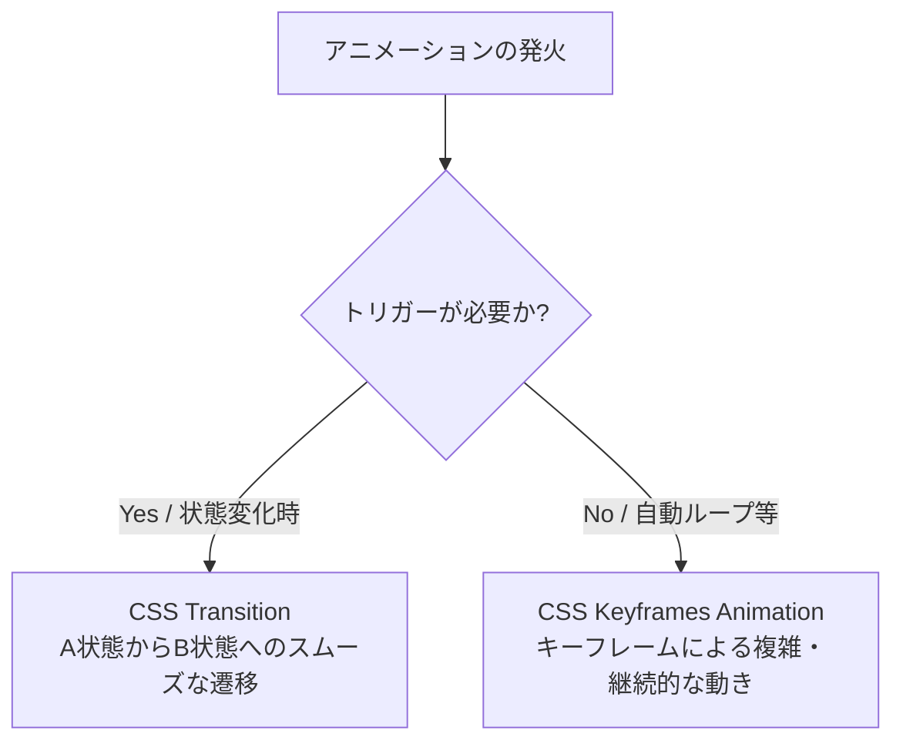
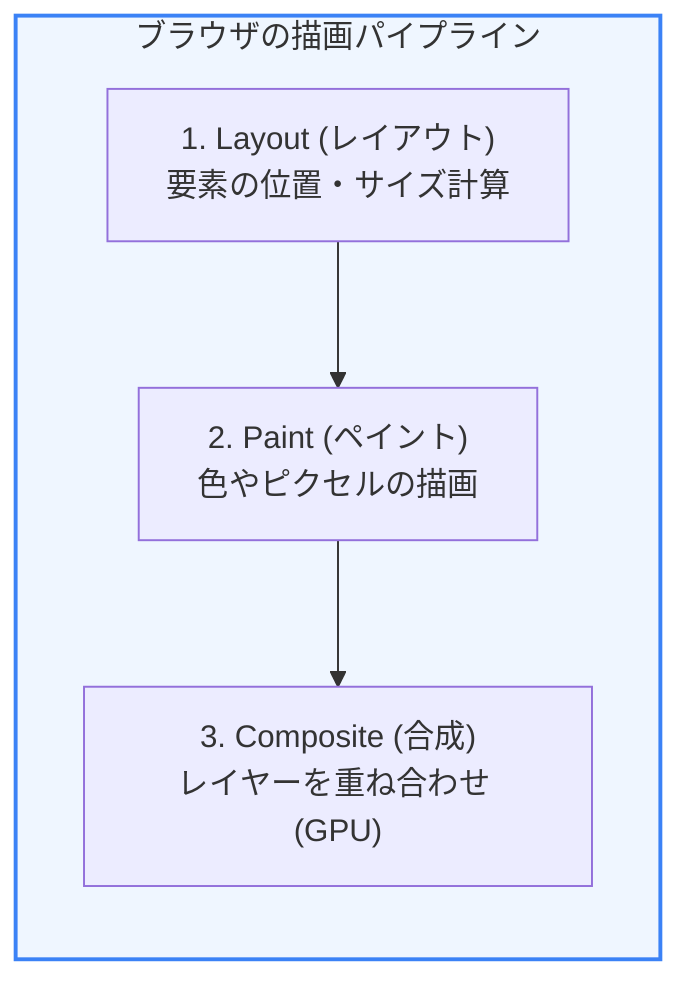

Webサイトにアニメーションや動き（トランジション）を加えることは、ユーザーの関心を惹きつけ、操作に対する心地よいフィードバック（マイクロインタラクション）を返すために不可欠です。しかし、不適切に実装されたアニメーションは、ブラウザのCPU負荷を高め、**「画面のカクつき（Jank）」**の原因になり、UXを著しく損ないます。

第3章では、CSSでのアニメーションの実装手法と、ブラウザの描画処理プロセスに基づいたパフォーマンス最適化（GPUの活用）、およびアクセシビリティについて深く学びます。

---

## 1. Transitions と Keyframe Animations

CSSで動きをつける方法には、`transition` と `animation` の2種類があります。



### 1-1. CSS Transitions（状態の遷移）
ホバー（`:hover`）やアクティブ（`:active`）、あるいはJSによるクラス追加といった「状態の変化」をトリガーにして、プロパティの変更を一定時間かけてスムーズに補間します。

```css:style.css
.btn {
  background-color: #3b82f6;
  /* transition: [プロパティ] [時間] [イージング] [遅延] */
  transition: background-color 0.2s cubic-bezier(0.4, 0, 0.2, 1);
}
.btn:hover {
  background-color: #1d4ed8;
}
```

### 1-2. CSS Keyframe Animations（複雑なアニメーション）
状態の変化に関係なく、開始から終了まで、または無限（`infinite`）に繰り返す複雑なアニメーションを、パーセンテージ（`0%`〜`100%`）のキーフレームで細かく制御します。

```css:style.css
@keyframes bounce {
  0%, 100% {
    transform: translateY(0);
    animation-timing-function: cubic-bezier(0.8, 0, 1, 1);
  }
  50% {
    transform: translateY(-20%);
    animation-timing-function: cubic-bezier(0, 0, 0.2, 1);
  }
}

.bouncing-ball {
  animation: bounce 1s infinite;
}
```

---

## 2. ブラウザのレンダリングパイプラインとパフォーマンス

ブラウザがHTML/CSSを解釈して画面を描画するプロセスは、大きく分けて以下の3つのフェーズに分かれています。どのアニメーションプロパティを使うかによって、ブラウザがやり直さなければならないフェーズの深さが変わり、パフォーマンスに決定的な違いが生じます。



### 2-1. 重いアニメーション（Layout / Paint の再実行）
`width`, `height`, `top`, `left`, `margin` などをアニメーションさせると、ブラウザはレイアウト計算からすべてやり直す必要があり（**リフロー**）、画面全体の描画が著しく重くなります。

### 2-2. 軽いアニメーション（Composite のみ）
**`transform`**（位置・回転・縮小）と **`opacity`**（不透明度）は、ブラウザが要素を個別のレイヤーとして隔離し、**GPU（グラフィックプロセッサ）**に処理を委ねるため、LayoutやPaintをスキップして高速に合成（**コンポジット**）されます。

| 動かすプロパティ | 実行されるフェーズ | パフォーマンス | 評価 |
| :--- | :--- | :--- | :--- |
| `top` / `left` / `margin` | Layout $\rightarrow$ Paint $\rightarrow$ Composite | 🐌 最悪 | ❌ 絶対に避ける |
| `width` / `height` | Layout $\rightarrow$ Paint $\rightarrow$ Composite | 🐌 最悪 | ❌ 絶対に避ける |
| `background-color` | Paint $\rightarrow$ Composite | 🟡 中程度 | 🔺 限定的に使用 |
| **`transform` (translate/scale)** | **Composite のみ** | 🚀 超高速 | ✅ 推奨 |
| **`opacity`** | **Composite のみ** | 🚀 超高速 | ✅ 推奨 |

---

## 3. アニメーション最適化の実践テクニック

### 3-1. `top` / `left` から `transform: translate` への書き換え

```css
/* ❌ パフォーマンスが悪い例（リフロー発生） */
.popup {
  position: absolute;
  top: 10px;
  transition: top 0.3s ease;
}
.popup.active {
  top: 100px;
}

/* ✅ パフォーマンスが良い例（GPU合成のみ） */
.popup {
  position: absolute;
  transform: translateY(0);
  transition: transform 0.3s ease;
}
.popup.active {
  transform: translateY(90px);
}
```

### 3-2. `will-change` の適切な使用
`will-change` は、ブラウザに対し「この要素は近いうちに変化する」と事前に知らせ、レイヤー化を促すプロパティです。しかし、濫用するとメモリを大量に消費するため、**「アニメーションが行われる要素にのみ、ピンポイントで指定する」** のが基本です。

```css
.card-hover-effect {
  /* ホバー時に変化するプロパティを事前に通知 */
  will-change: transform, opacity;
}
```

---

## 4. アクセシビリティ：`prefers-reduced-motion`

一部のユーザー（前庭感覚障害や光過敏性発作などを持つ方）にとって、激しいアニメーションや画面のスクロールエフェクトは、めまいや吐き気を引き起こす要因になります。
OSの「視覚効果を減らす」設定を尊重するために、CSSメディアクエリ `prefers-reduced-motion` を使用して、アニメーションを抑制または無効化することがモダンWeb設計の義務となっています。

```css:accessibility.css
/* ユーザーが「動きを減らす」設定にしている場合 */
@media (prefers-reduced-motion: reduce) {
  * {
    /* トランジション時間を0にして即座に変化させる */
    transition-duration: 0s !important;
    /* アニメーションを停止 */
    animation-duration: 0s !important;
    animation-iteration-count: 1 !important;
    scroll-behavior: auto !important;
  }
}
```

---

## まとめ

* アニメーションは **`transform` と `opacity`** のみで行うのが大原則。
* ブラウザの **Layout / Paint を避けて Composite (GPU) のみ** に抑えることで、カクつきのない 60fps / 120fps の滑らかな動きが実現可能。
* **`prefers-reduced-motion`** メディアクエリを使用して、OSのアニメーション軽減設定を反映するアクセシビリティ対応を必ず組み込む。

これで「モダンCSSレイアウト & 設計」コースの全チャプターは完了です！
適切なレイアウト、クリーンな設計手法、そして快適でパフォーマンスに配慮したアニメーションを用いて、素晴らしいUIを構築してください。
