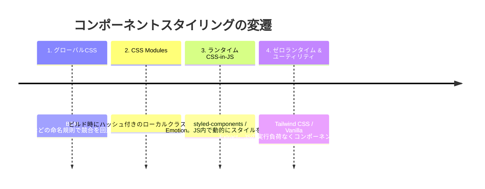
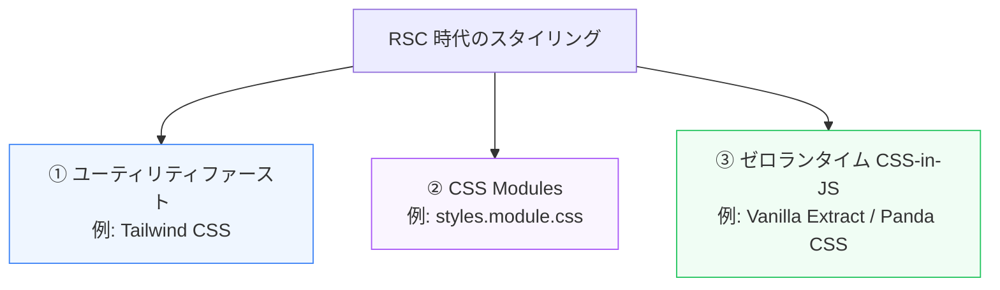

フロントエンド開発において、CSSはWebサイトを装飾するだけのツールから、JavaScriptのコンポーネントシステム（React, Vue等）と深く融合したアセットへと進化しました。

第5章では、近年のコンポーネント駆動開発におけるCSSのアプローチの変遷と、React Server Components時代のスタイリング手法について学びます。

---

## 1. コンポーネント駆動CSSの進化の系譜

WebフロントエンドでCSSをコンポーネントにカプセル化する（スタイルの衝突を防ぐ）ために、さまざまな手法が生まれてきました。

---

## 2. React Server Components (RSC) と CSS-in-JS

Next.js App Router に代表される **React Server Components (RSC)** 環境では、コンポーネントがサーバー側でHTMLにレンダリングされてからクライアントに届きます。

ここで従来の `styled-components` や `Emotion` などのランタイム CSS-in-JS を使うと問題が発生します。
*   **サーバーレンダリングの阻害**: サーバー側にはDOM（`document`）が存在しないため、マウント時に動的に `<style>` タグを注入するランタイム処理が機能しません。
*   **クライアントランタイムの肥大化**: スタイルの計算を行うための重いJSエンジンをブラウザで動かす必要があり、表示パフォーマンス（LCP, INPなど）に悪影響を及ぼします。

---

## 3. RSC時代のモダンな解決策

RSC環境でコンポーネントに閉じつつ、パフォーマンスを損なわないためのアプローチは主に3つあります。

### ① Tailwind CSS / ユーティリティクラス
コンパイル時に使用されているクラス名だけを含む極小のCSSファイルを自動抽出し、ランタイム不要で動作します。RSCでも完全にサーバーサイドで完結するため相性が抜群です。

### ② CSS Modules
Next.jsに標準搭載されているローカルスコープ化の仕組み。JavaScriptファイルでクラス名をオブジェクトとしてimportし、ビルド時に静的CSSとしてファイル出力します。

### ③ ゼロランタイム (Zero-Runtime) CSS-in-JS
`Vanilla Extract` や `Panda CSS` のように、**「コード上はJSで記述するが、ビルド（コンパイル）時に純粋な静的CSSファイルとして抽出され、JSの実行オーバーヘッドがゼロになる」** ライブラリです。型安全なCSS設計とハイパフォーマンスを両立させます。

---

## まとめ

*   従来のランタイム CSS-in-JS は、RSC (React Server Components) のサーバーファーストなレンダリングと相反し、ランタイムコストが高い。
*   RSC時代のスタイリングは、ランタイムでのJS実行を排除した **Tailwind CSS**、**CSS Modules**、あるいはビルド時にCSSを抽出する **ゼロランタイム CSS-in-JS** が主流となっている。
*   コンポーネントのカプセル化と、ブラウザでのCSS実行パフォーマンスの双方を重視する選択が必要である。
