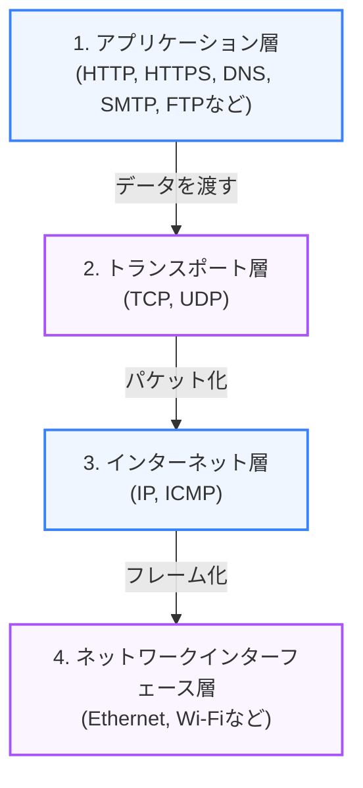

私たちが日常的に利用しているWebサイトやアプリは、コンピュータ同士が複雑な仕組みを介して通信することで動作しています。本章では、ネットワーク通信の土台である **TCP/IP階層モデル** の概念と、データがどのように送信されるかについて解説します。

---

## 1. TCP/IP 4階層モデルとは？

インターネットは、異なる機器やOS同士でも通信できるよう、通信手順をルール化した「プロトコル」の集まりで構成されています。このプロトコル群を4つの役割（階層）に分類した設計モデルを **TCP/IPモデル** と呼びます。

### 階層構造とプロトコル（図解）



---

## 2. 各階層の役割

1.  **アプリケーション層 (Application Layer)**:
    ユーザーが操作するソフトウェア（ブラウザやメールクライアントなど）と直接やり取りする層です。
    - **主なプロトコル**: `HTTP`（Webデータ転送）、`HTTPS`（暗号化Web転送）、`DNS`（ドメイン名前解決）。
2.  **トランスポート層 (Transport Layer)**:
    接続された機器間で「信頼性のあるデータ転送」または「高速なデータ転送」を制御する層です。
    - **TCP (Transmission Control Protocol)**: 相手にデータが正しく届いたか確認（3ウェイハンドシェイク）しながら通信する、信頼性の高いプロトコル。Web閲覧やメールで使用。
    - **UDP (User Datagram Protocol)**: 確認を行わず、一方的にデータを送り続ける高速なプロトコル。動画ストリーミングやオンラインゲームで使用。
3.  **インターネット層 (Internet Layer)**:
    データを最終目的地までルーティング（経路制御）し、届ける役割を持ちます。
    - **主なプロトコル**: `IP (Internet Protocol)`。各機器には「IPアドレス」が割り当てられ、これがネット上の住所になります。
4.  **ネットワークインターフェース層 (Network Interface Layer)**:
    同一ネットワーク内の隣接する物理機器（LANケーブル、Wi-Fiルーターなど）間で電気信号や電波を流し、データを物理的に伝送する層です。

---

## 3. カプセル化と非カプセル化

送信側コンピュータがデータを送信する際、上位層から下位層へデータが渡る過程で、各層に必要な制御情報（ヘッダー）が追加されていきます。これを **カプセル化 (Encapsulation)** と呼びます。

受信側コンピュータでは逆に、下位層から上位層へ渡る過程でヘッダーが取り除かれ、最終的に元のデータのみがアプリケーションに届きます。これを **非カプセル化 (Decapsulation)** と呼びます。

```text
[送信側]
データ (HTTP)
  ↓
[TCPヘッダー] + [データ]                 (セグメント)
  ↓
[IPヘッダー] + [TCPヘッダー] + [データ]   (IPパケット)
  ↓
[イーサネットヘッダー] + [IP] + [TCP] + [データ]  (イーサネットフレーム) → 物理線へ送出
```

---

## まとめ

*   インターネットの通信は、役割が異なる **TCP/IP 4階層モデル** に基づいて行われる。
*   **TCP** は接続の信頼性を担保し、**IP** は住所（IPアドレス）を元にデータを届ける。
*   データ送信時はヘッダーを包み込む **カプセル化** を行い、受信時はヘッダーを剥ぎ取る **非カプセル化** を行う。
