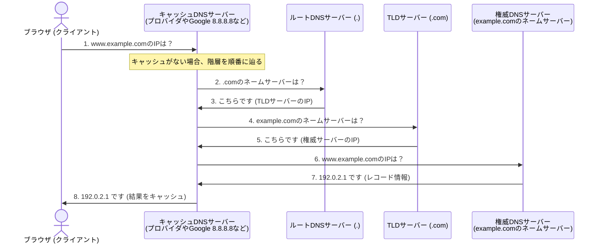

コンピュータは `192.0.2.1` のような「IPアドレス」で通信相手を識別しますが、人間にとって数字の羅列は覚えにくいため、`example.com` のような「ドメイン名」を使用します。このドメイン名をIPアドレスに翻訳するシステムが **DNS (Domain Name System)** です。本章では、DNSの仕組みとレコードの役割について解説します。

---

## 1. DNSの基本概念と構成

DNSは、世界中に分散されたサーバーが連携して動作する、ツリー状の巨大な階層型データベースシステムです。

### DNS名前解決のプロセス（図解）

ブラウザが `www.example.com` のIPアドレスを問い合わせる際、以下のプロセス（反復問い合わせ）が行われます。



1.  **キャッシュDNSサーバー**:
    クライアントからの問い合わせを受け、代わりに名前解決を代行します。一度解決した情報は一定期間（TTL）キャッシュします。
2.  **権威DNSサーバー（ネームサーバー）**:
    自身が管理するドメインの正しいIPアドレス情報を保持しており、問い合わせに対して直接回答を返します。

---

## 2. 主要なDNSレコードの種類

DNSサーバーには、ドメインに関する様々な情報が「リソースレコード」と呼ばれる形式で登録されています。

*   **`A` レコード (Address)**:
    ドメイン名を IPv4 アドレスに対応付けます。
    ```text
    example.com.  IN  A  192.0.2.1
    ```
*   **`AAAA` レコード (Quad-A)**:
    ドメイン名を IPv6 アドレスに対応付けます。
    ```text
    example.com.  IN  AAAA  2001:db8::1
    ```
*   **`CNAME` レコード (Canonical Name)**:
    ドメイン名のエイリアス（別名）を設定します。別のドメイン名に向けて転送したい場合に使用します。
    ```text
    www.example.com.  IN  CNAME  example.com.
    ```
*   **`MX` レコード (Mail Exchange)**:
    そのドメイン宛てのメールを受信するメールサーバー（SMTPサーバー）を指定します。
*   **`TXT` レコード (Text)**:
    ドメインに紐付ける任意の文字列を登録します。主に、ドメインの所有権確認や、スパムメール対策の `SPF` や `DKIM` 設定に使用されます。

---

## まとめ

*   **DNS** はドメイン名（人間用）とIPアドレス（機械用）を変換するシステム。
*   名前解決は、**キャッシュDNSサーバー** が **ルートサーバー** から順に辿って **権威サーバー** に問い合わせることで完了する。
*   **Aレコード**、**CNAMEレコード**、**TXTレコード** などのリソースレコードをDNSサーバーに登録することでドメインの振る舞いを制御する。
