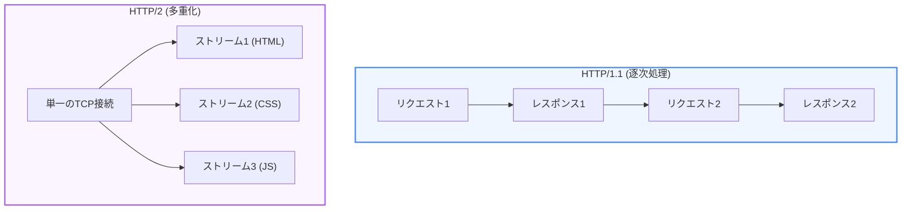

Webの基幹プロトコルである **HTTP（Hypertext Transfer Protocol）** は、Webコンテンツの巨大化や高速化の要求に伴い、劇的な進化を遂げてきました。本章では、HTTP/1.1から現在のHTTP/3に至るまでのプロトコルの変遷と、それぞれの仕組みの違いについて解説します。

---

## 1. HTTP/1.1 の仕組みと課題

1997年に標準化された **HTTP/1.1** は、長い間Webの標準として使われてきました。

### 主な特徴
*   **Keep-Alive**: 一度のTCP接続を確立したあと、複数のリクエスト/レスポンスで使い回せるように接続を維持する仕組み。

### 課題：ヘッドオブラインブロッキング (Head-of-Line Blocking)
HTTP/1.1では、同一の接続上では「リクエストを送信したら、そのレスポンスが返ってくるまで次のリクエストの処理を待たなければならない」という制限がありました。そのため、時間のかかるリソースの読み込みがあると、後ろにある他のリソースの読み込みがすべてストップしてしまいます。

これを回避するため、ブラウザはドメインごとに最大6本程度のTCP接続を同時に張って並列処理していましたが、通信オーバーヘッドが大きく限界がありました。

---

## 2. HTTP/2 による高速化（多重化）

2015年に登場した **HTTP/2** では、通信速度を飛躍的に向上させるため、HTTP/1.1の根本的なデータ転送方式が見直されました。

### 主な特徴
*   **ストリームの多重化**:
    単一のTCP接続の中でデータを「フレーム」と呼ばれる細かい単位に分割し、複数のリクエストとレスポンスを同時に並行して送信できるようにしました。これにより、HTTPレイヤーでのヘッドオブラインブロッキングが完全に解消されました。
*   **ヘッダー圧縮 (HPACK)**:
    重複するヘッダー情報をハッシュ化して圧縮送信することで、無駄な通信量を削減しました。

---

## 3. HTTP/3 と QUIC（TCPからUDPへ）

HTTP/2でHTTPレイヤーの詰まりは解消されましたが、今度は **「TCPレイヤー」でのヘッドオブラインブロッキング** が問題になりました。TCP接続ではパケットロスが発生すると、そのパケットが再送されて順序が揃うまで、カーネルレベルで他のすべてのデータの処理が一時停止してしまうためです。

2022年に標準化された **HTTP/3** では、信頼性を保証する従来の **TCP** を捨て、速度重視の **UDP** の上に新しい信頼性制御レイヤー **QUIC（クイック）** を重ねたプロトコルを採用しました。

### 主な特徴
*   **TCPのヘッドオブラインブロッキング解消**:
    QUIC接続下では、個々のストリームが独立して処理されるため、あるパケットがロスしても、他の無関係なストリームのデータ転送は一切止まりません。
*   **接続確立の高速化 (0-RTT)**:
    TCPの3ウェイハンドシェイクとTLSのハンドシェイクを統合し、通信開始時に必要な往復回数（Round Trip）を劇的に減らすことで、通信開始を高速化しました。

---

## まとめ

*   **HTTP/1.1**: レスポンスを順番に待つ必要があり、**ヘッドオブラインブロッキング** が発生しやすい。
*   **HTTP/2**: 単一のTCP接続で複数のデータを並行送信する **多重化** とヘッダー圧縮を導入。
*   **HTTP/3**: 信頼性の保証をTCPから **UDP/QUIC** に移行し、パケットロス時の停止を回避して接続を高速化。
