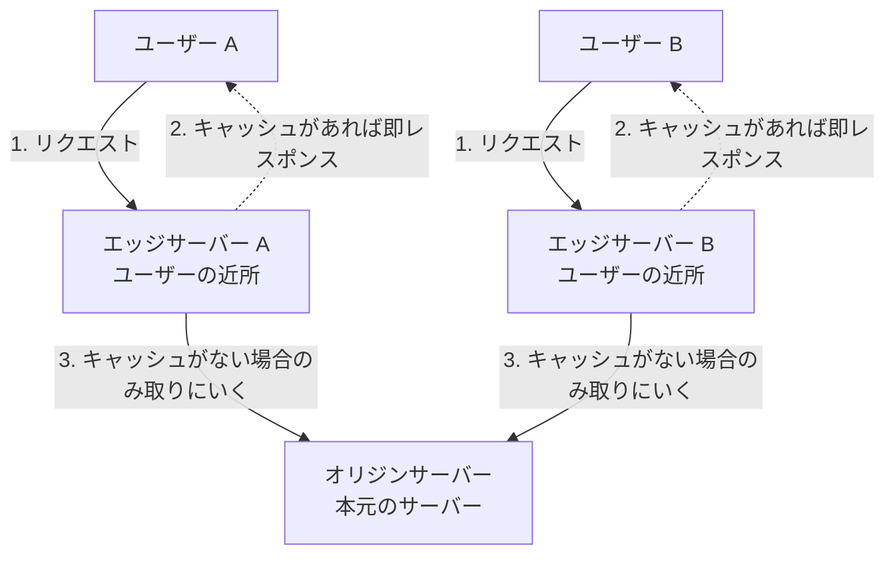

Webサイトやアプリケーションの読み込み速度を圧倒的に高速化し、サーバー（オリジン）の負荷を下げるために欠かせない技術が **「CDN (Content Delivery Network)」** です。CDNを正しく動かすためには、HTTPヘッダーを使用した正確な「キャッシュ制御」の知識が必要になります。

第4章では、CDNの仕組みと、ブラウザやエッジサーバーでのキャッシュ制御方法について学びます。

---

## 1. CDNの仕組み（オリジンとエッジ）

通常、ユーザーがWebサーバーにリクエストを送ると、1つの本番サーバー（オリジンサーバー）がすべてを処理します。しかし、アクセスが集中するとサーバーがダウンしてしまいます。

CDNを導入すると、世界中に配置された複数のキャッシュサーバー **「エッジサーバー（POP: Point of Presence）」** がユーザーに最も近い位置でリクエストを肩代わりします。



1. **キャッシュヒット**: エッジサーバーに要求されたファイル（画像、CSS、JS、HTML等）がある場合、オリジンまで通信せずエッジから超高速に返します。
2. **キャッシュミス**: エッジサーバーにファイルがない場合のみ、オリジンにファイルを取りに行き（フェッチ）、自身に保存（キャッシュ）した上でユーザーに返却します。

---

## 2. HTTPヘッダーによるキャッシュ制御

サーバーは、レスポンスの **`Cache-Control` ヘッダー** を通じて、ブラウザやCDNに対して「このファイルはどのくらいの間、誰がキャッシュして良いか」を指示します。

### 主要なディレクティブ（指示子）

* **`public`**: ブラウザだけでなく、CDNなどの共有キャッシュサーバーにもキャッシュして良いことを示します。
* **`private`**: ログイン後のユーザーページなど、個人向けのレスポンスであるため、ブラウザにのみキャッシュし、CDNにはキャッシュさせないことを指定します。
* **`max-age=<秒数>`**: ブラウザ（クライアント）でのキャッシュ有効期限（秒数）を設定します。
* **`s-maxage=<秒数>`**: CDN（共有キャッシュ）専用の有効期限を設定します。
* **`no-cache`**: キャッシュ自体は作成しても良いですが、利用する前に必ずサーバーへ「ファイルが更新されていないか（`If-None-Match` 等）」を問い合わせる（バリデーションする）ことを強制します。
* **`no-store`**: 個人情報や決済情報など、セキュリティ上一切のキャッシュ（ブラウザ・CDN両方）を禁止します。

```http
# レスポンスヘッダーの例：ブラウザには1時間(3600秒)、CDNには1日(86400秒)キャッシュさせる
Cache-Control: public, max-age=3600, s-maxage=86400
```

---

## 3. キャッシュの破棄（無効化）

一度エッジサーバーやブラウザにキャッシュされたファイルは、有効期限が切れるまでオリジンへの確認なしで表示され続けます。そのため、プログラムを修正してデプロイしても、古いキャッシュのせいでユーザーに反映されない問題（キャッシュスタック）が発生します。

### 解決策

1. **ファイル名にハッシュ値を付与する（ Cache Busting ）**:
   * アプリケーションビルド時に、ファイル名にコンテンツのハッシュ値を埋め込みます（例: `main.a8f9c2.js`）。ファイル内容が変わると名前も変わるため、キャッシュを無視して新しいファイルが必ず読み込まれます（推奨）。
2. **キャッシュパージ（Cache Purging）**:
   * CDNの管理画面やAPIから、エッジサーバーにある特定のキャッシュデータを明示的に削除（パージ）します。

キャッシュ設定を誤ると、全ユーザーの画面に他人の個人情報が表示されてしまうような重大なセキュリティ事故に繋がることがあります。そのため、動的データには `private` や `no-store` を徹底し、静的ファイル（Assets）には長期間の `public` キャッシュを設定するなど、データの性質を見極めた設計が重要です。
