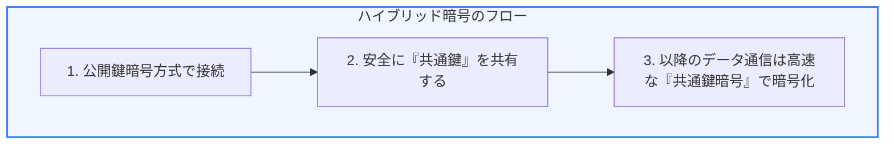
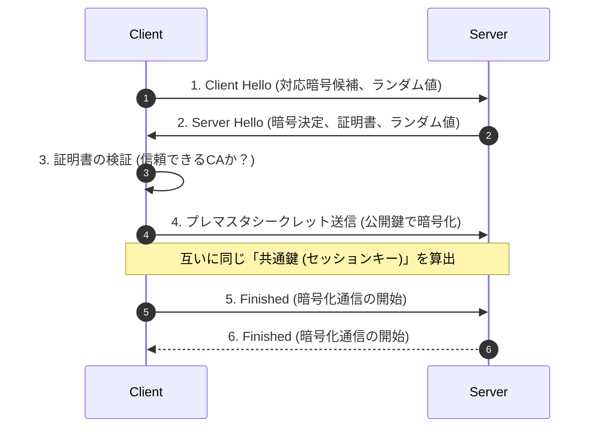

インターネット上でクレジットカード番号やパスワードなどを安全に送受信するために欠かせないのが **「HTTPS（HTTP over TLS/SSL）」** です。HTTPSは「盗聴」「改ざん」「なりすまし」の3つのリスクを防ぐ技術です。

第5章では、HTTPS通信を支える暗号化の仕組みと、接続時に行われる **「TLSハンドシェイク」** の具体的な流れについて学びます。

---

## 1. ハイブリッド暗号方式の仕組み

HTTPSでは、安全にデータを届けるために **「公開鍵暗号」** と **「共通鍵暗号」** の両方のメリットを組み合わせた **「ハイブリッド暗号方式」** を採用しています。

* **共通鍵暗号方式（対称鍵）**: 暗号化と復号に同じ鍵を使う。処理が非常に高速だが、鍵を相手にどうやって安全に渡すか（鍵配送問題）という弱点がある。
* **公開鍵暗号方式（非対称鍵）**: 誰でも使える「公開鍵」で暗号化し、自分だけが持つ「秘密鍵」でしか復号できない。鍵の受け渡しは安全だが、処理が非常に重い。

### ハイブリッド方式の回答
最初に「公開鍵暗号」を使って、その後の通信で使う「共通鍵（セッションキー）」を安全に相手に渡します。鍵が共有された後は、処理が圧倒的に軽い「共通鍵暗号」でデータを暗号化して通信します。

---

## 2. TLSハンドシェイクのステップ

ブラウザとサーバーがHTTPS接続を確立する際、データの送受信を開始する前にお互いの合意をとる儀式が **「TLSハンドシェイク」** です。以下は一般的な TLS 1.2 / 1.3 の基本的な流れを簡略化したものです。

1. **Client Hello**: ブラウザからサーバーへ、サポートしている暗号の種類（暗号スイート）やランダムな数値を送ります。
2. **Server Hello + 証明書送信**: サーバーからブラウザへ、使用する暗号の決定通知、サーバーの公開鍵が含まれた「SSL/TLSデジタル証明書」を送ります。
3. **証明書の検証**: ブラウザは、証明書が信頼できる第三者機関（認証局: CA）によって署名されたものか、ドメイン名が一致しているかを検証します。
4. **鍵共有**: サーバーの公開鍵を使って、共通鍵の元となるデータ（プレマスタシークレット）を暗号化してサーバーへ送ります（サーバーは秘密鍵で復号）。
5. **完了通知 (Finished)**: 互いに同じ共通鍵を算出し、以降の通信を暗号化して完了します。

---

## 3. TLS 1.3 による高速化

2018年に正式策定された **TLS 1.3** は、セキュリティ強度の向上だけでなく、パフォーマンスが劇的に改善されました。

* **1-RTTの実現**: TLS 1.2 ではハンドシェイクに往復（2-RTT）の通信が必要でしたが、TLS 1.3 では鍵交換のプロセスを効率化し、最初の往復（1-RTT）だけで安全な接続を確立できます。
* **0-RTT（Resumption）**: 過去に一度接続したことのあるサーバーに対しては、ハンドシェイクの往復なし（0-RTT）で、最初の最初から暗号化データを送信できる仕組み（Session Resumption）が導入されています。

HTTPSの裏側で行われているこれらの精密なステップにより、私たちは日常的にクレジットカードや個人情報を漏洩の不安なくWebサイトに入力することができています。
